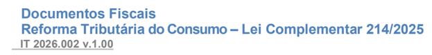

## Metadados
- [Metadados do corpus](metadata.json)
- [Fonte e procedência](../../../../sources/portal_nacional_nfe/reforma-tributaria/informes-tecnicos/it-2026-002-v-1-00-tabela-de-aliquotas-da-cbs/source.json)
- [Dados normalizados](../../../../normalized/reforma-tributaria/informes-tecnicos/it-2026-002-v-1-00-tabela-de-aliquotas-da-cbs/normalized.json)
- [Changelog](../../../../changelog/reforma-tributaria/informes-tecnicos/it-2026-002-v-1-00-tabela-de-aliquotas-da-cbs.md)
- [Proveniência resumida](../../../../sources/provenance/it-2026-002-v-1-00-tabela-de-aliquotas-da-cbs.json)

## Projeto Reforma Tributária do Consumo

Tabelas: Alíquota da CBS

Informe Técnico 2026.002 - Versão 1.00

12 de maio de 2026

Versão 1.00

## Sumário

01.

Objetivo  ...............................................................................................................................................  4

## Versão 1.00 Controle de Versões

|   Versão | Publicação   | Descrição        | HML   | PROD   |
|----------|--------------|------------------|-------|--------|
|     1.00 | Maio/2026    | Publicação do IT |       |        |

## Informação sobre a finalidade do IT -Informe Técnico

De forma geral, o Informe Técnico tem a finalidade de:

- Divulgar orientações e aperfeiçoamentos para os Serviços de Autorização de Uso dos DF-e, que são usados pelas Empresas;
- Divulgar e manter registro da atualização de tabelas de domínio usadas pelo Serviço de  Autorização,  não  significando  obrigatoriamente  a  necessidade  de  alteração  no Sistema de Computação das Empresas;
- Divulgar e manter registro de orientações sobre a prestação de informações no leiaute do DF-e, informando sobre o preenchimento de campo e outros;
- Divulgar e manter registro de comunicados e outras necessidades de comunicação com as empresas.

IT 2026.002 v.1.00

## Versão 1.00 01. Objetivo

O  presente  Informe  Técnico  tem  como  objetivo  divulgar  tabela  de  alíquota  da  CBS  a  ser utilização nos documentos fiscais.

A tabela está disponível no Portal Nacional da NFe, na aba 'Documentos', opção 'Diversos .

## Documentos relacionados
_Nenhum documento relacionado conhecido._
