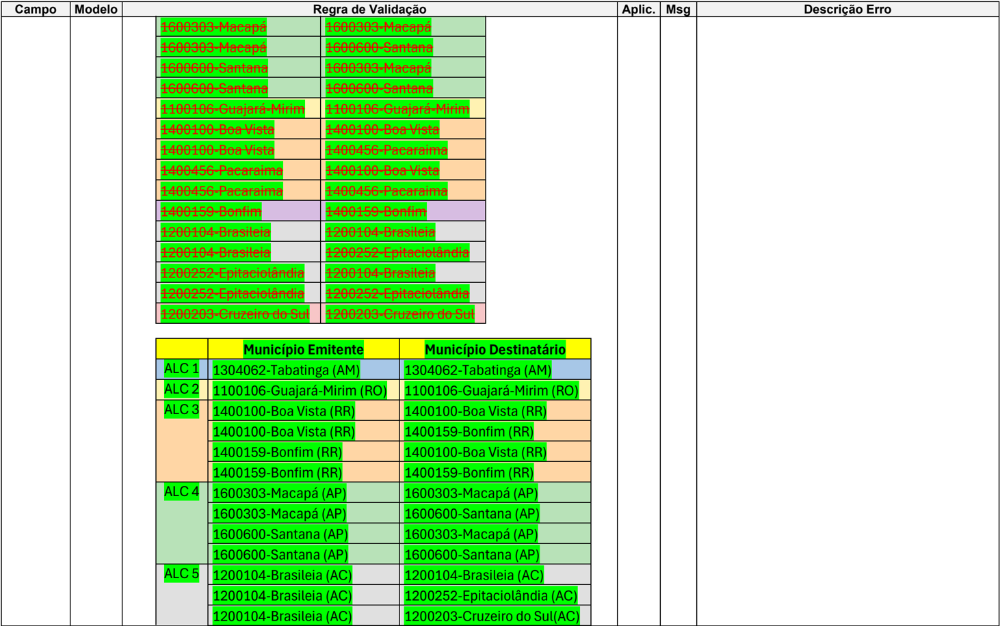
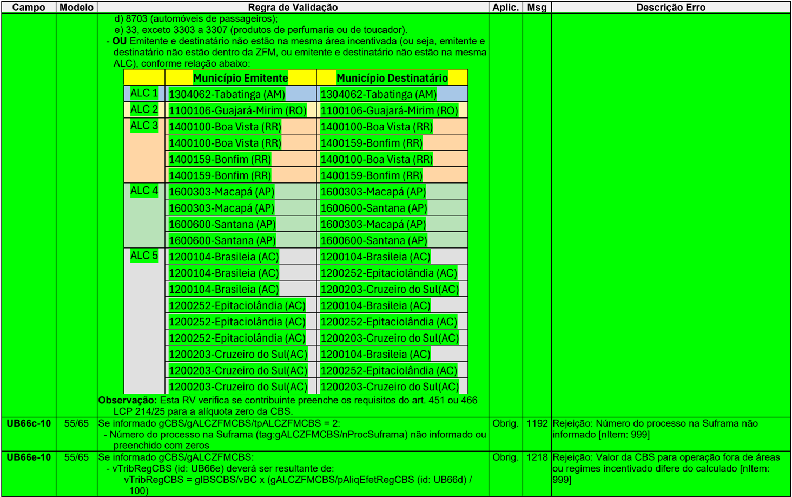
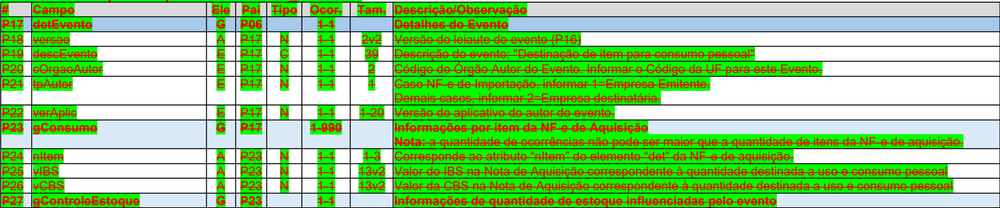
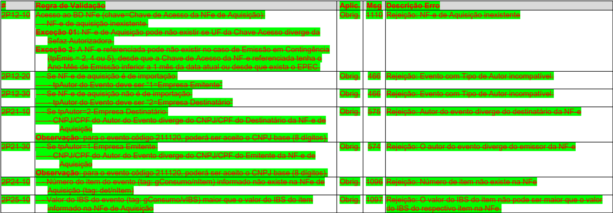
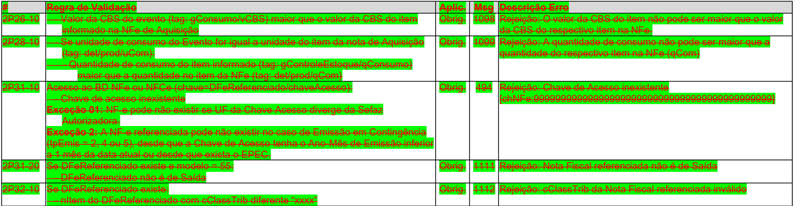

## Reforma Tributária do Consumo -Adequações NF-e / NFC-e

Nota Técnica 2025.002-RTC - Versão 1.40

## Sumário

| 1.                                                                                                                                   | Introdução................................................................................................................................8   |
|--------------------------------------------------------------------------------------------------------------------------------------|-----------------------------------------------------------------------------------------------------------------------------------------------|
| 2. Tipos Básicos da Tributação....................................................................................................9  |                                                                                                                                               |
| 3. Código de Classificação Tributária do IBS/CBS.......................................................................9             |                                                                                                                                               |
| 4. Finalidade Débito e Finalidade Crédito da NF-e.......................................................................9            |                                                                                                                                               |
| 5. Padrões de Numeração.........................................................................................................11   |                                                                                                                                               |
| 5.1. Protocolo de Autorização de Uso e Código do Status da Resposta...............................11                                 |                                                                                                                                               |
| 5.2. Protocolo de Autorização da NF-e / NFC-e - Resposta Síncrona..................................11                                |                                                                                                                                               |
| 5.3. Protocolo de Autorização da NF-e - Resposta Assíncrona (Consulta Recibo) ..............12                                       |                                                                                                                                               |
| 5.4. Protocolo de Autorização do Pedido de Inutilização ......................................................13                     |                                                                                                                                               |
| 5.5. Protocolo de Autorização de Evento..............................................................................14              |                                                                                                                                               |
| 6. Leiaute da NF-e (Modelo 55 e 65) .........................................................................................15      |                                                                                                                                               |
| Grupo B. Identificação da Nota Fiscal eletrônica .......................................................................15           |                                                                                                                                               |
| Grupo BA. Documento Fiscal Referenciado ..............................................................................17             |                                                                                                                                               |
| Grupo BB. Grupo de notas de antecipação de pagamento ==> (movido para 'Grupo BC')                                                    | .......17                                                                                                                                     |
| Grupo BB. Grupo de Compras Governamentais........................................................................17                  |                                                                                                                                               |
| Grupo BC. Grupo de notas de antecipação de pagamento .......................................................17                       |                                                                                                                                               |
| Grupo C. Identificação do Emitente da Nota Fiscal eletrônica ...................................................18                   |                                                                                                                                               |
| Grupo I. Produtos e Serviços da NF-e.......................................................................................18        |                                                                                                                                               |
| Grupo N01. ICMS Normal e ST.................................................................................................18       |                                                                                                                                               |
| Grupo UB. Informações dos tributos IBS / CBS e Imposto Seletivo...........................................18                         |                                                                                                                                               |
| Grupo VB. Total do item da NF-e                                                                                                      | ..............................................................................................26                                              |
| Grupo VC. Referenciamento de item de outro Documento Fiscal Eletrônico - DF-e..................26                                    |                                                                                                                                               |
| Grupo W03. Total da NF-e - IBS / CBS / IS...............................................................................26           |                                                                                                                                               |
| .......................................................................27                                                            |                                                                                                                                               |
| Grupo B. Identificação da Nota Fiscal eletrônica                                                                                     |                                                                                                                                               |
| Grupo BB. Grupo de Compras Governamentais........................................................................30                  |                                                                                                                                               |
| Grupo C. Identificação do Emitente da Nota Fiscal eletrônica                                                                         | ...................................................32                                                                                         |
| Grupo E. Identificação do Destinatário ......................................................................................33      |                                                                                                                                               |
| Grupo I. Produtos e Serviços da NF-e.......................................................................................33        |                                                                                                                                               |
| Grupo LA. Item / Combustível                                                                                                         | ...................................................................................................34                                         |
| Grupo N. Item / Tributo: ICMS...................................................................................................34   |                                                                                                                                               |
| Grupo NA. Item / ICMS para a UF de Destino ...........................................................................35             |                                                                                                                                               |
| Grupo Q. Item / Tributo: PIS......................................................................................................36 |                                                                                                                                               |
| Grupo S. Item / Tributo: COFINS...............................................................................................36     |                                                                                                                                               |
| Grupo VC. Referenciamento de item de outro Documento Fiscal Eletrônico - DF-e..................55                                    |                                                                                                                                               |

NT 2025.002-RTC

| Grupo W03. Total da NF-e - IBS / CBS / IS...............................................................................56                                                  | Grupo W03. Total da NF-e - IBS / CBS / IS...............................................................................56                                                                                         |                                                                                                                |
|-----------------------------------------------------------------------------------------------------------------------------------------------------------------------------|--------------------------------------------------------------------------------------------------------------------------------------------------------------------------------------------------------------------|----------------------------------------------------------------------------------------------------------------|
| Grupo 3A. Banco de Dados: NF-e Referenciada.......................................................................58                                                        | Grupo 3A. Banco de Dados: NF-e Referenciada.......................................................................58                                                                                               |                                                                                                                |
| Grupo 11. Banco de Dados: Notas de antecipação de pagamento ...........................................59                                                                   | Grupo 11. Banco de Dados: Notas de antecipação de pagamento ...........................................59                                                                                                          |                                                                                                                |
| 8. Eventos..................................................................................................................................59                              | 8. Eventos..................................................................................................................................59                                                                     |                                                                                                                |
| 8.1.                                                                                                                                                                        | Lista de eventos                                                                                                                                                                                                   | ............................................................................................................59 |
| 8.2.                                                                                                                                                                        | Registro de Eventos                                                                                                                                                                                                | ......................................................................................................60       |
| 8.3.                                                                                                                                                                        | Evento: Informação de efetivo pagamento integral para liberar crédito presumido adquirente .....................................................................................................................61 | do                                                                                                             |
| 8.4.                                                                                                                                                                        | Evento: Solicitação de Apropriação de crédito presumido                                                                                                                                                            | .............................................62                                                                |
| 8.5.                                                                                                                                                                        | Evento: Destinação de item para consumo pessoal                                                                                                                                                                    | ......................................................64                                                       |
| 8.6.                                                                                                                                                                        | Evento: Aceite de débito na apuração por emissão de nota de crédito..........................66                                                                                                                    |                                                                                                                |
| 8.7.                                                                                                                                                                        | Evento: Imobilização de Item.........................................................................................67                                                                                            |                                                                                                                |
| 8.8.                                                                                                                                                                        | Evento: Solicitação de Apropriação de Crédito de Combustível ....................................68                                                                                                                |                                                                                                                |
| 8.9.                                                                                                                                                                        | Evento: Solicitação de Apropriação de Crédito para bens e serviços que dependem atividade do adquirente .................................................................................................70        | de                                                                                                             |
| 8.10.                                                                                                                                                                       | Evento: Manifestação sobre Pedido de Transferência de Crédito de IBS em Operações de Sucessão..................................................................................................................71  |                                                                                                                |
| 8.11.                                                                                                                                                                       | Evento: Manifestação sobre Pedido de Transferência de Crédito de CBS em Operações de Sucessão..................................................................................................................72  |                                                                                                                |
| 8.12.                                                                                                                                                                       | Evento: Manifestação do Fisco sobre Pedido de Transferência de Crédito de IBS Operações de Sucessão ...............................................................................................73              | em                                                                                                             |
| 8.13.                                                                                                                                                                       | Evento: Manifestação do Fisco sobre Pedido de Transferência de Crédito de CBS Operações de Sucessão ...............................................................................................74              | em                                                                                                             |
| 8.14.                                                                                                                                                                       | Evento: Cancelamento de Evento .................................................................................75                                                                                                 |                                                                                                                |
| 8.15.                                                                                                                                                                       | Evento: Importação em ALC/ZFM não convertida em isenção ......................................76                                                                                                                   |                                                                                                                |
| 8.16.                                                                                                                                                                       | Evento: Perecimento, perda, roubo ou furto durante o transporte contratado adquirente .....................................................................................................................77      | pelo                                                                                                           |
| 8.17.                                                                                                                                                                       | Evento: Perecimento, perda, roubo ou furto durante o transporte contratado fornecedor .....................................................................................................................78      | pelo                                                                                                           |
| 8.18.                                                                                                                                                                       | Evento: Fornecimento não realizado com pagamento antecipado.................................79                                                                                                                     |                                                                                                                |
| 8.19.                                                                                                                                                                       | Evento: Atualização da Data de Previsão de Entrega....................................................80                                                                                                           |                                                                                                                |
| 9. DANFE ..................................................................................................................................81                               | 9. DANFE ..................................................................................................................................81                                                                      |                                                                                                                |
| ANEXO I - NCM DO IMPOSTO SELETIVO..................................................................................82                                                       | ANEXO I - NCM DO IMPOSTO SELETIVO..................................................................................82                                                                                              |                                                                                                                |
| ANEXO II - CÓDIGO DE CLASSIFICAÇÃO TRIBUTÁRIA DO IMPOSTO SELETIVO (cClassTribIS) 82                                                                                         | ANEXO II - CÓDIGO DE CLASSIFICAÇÃO TRIBUTÁRIA DO IMPOSTO SELETIVO (cClassTribIS) 82                                                                                                                                |                                                                                                                |
| ANEXO III - CÓDIGO DE CLASSIFICAÇÃO TRIBUTÁRIA DO IBS E DA CBS (cClassTrib) ........82 ANEXO IV - CÓDIGO DE CLASSIFICAÇÃO DO CRÉDITO PRESUMIDO (cCredPres)...............82 | ANEXO III - CÓDIGO DE CLASSIFICAÇÃO TRIBUTÁRIA DO IBS E DA CBS (cClassTrib) ........82 ANEXO IV - CÓDIGO DE CLASSIFICAÇÃO DO CRÉDITO PRESUMIDO (cCredPres)...............82                                        |                                                                                                                |

## Controle de Versões

|   Versão | Publicação   | Descrição                                                                                                     |
|----------|--------------|---------------------------------------------------------------------------------------------------------------|
|     1.00 | 03/2025      | Inserção de campos de controle e criação de eventos para utilização na apuração do IBS, CBS e IS              |
|     1.01 | 04/2025      | Ajustes e correções                                                                                           |
|     1.10 | 06/2025      | Cria campos, cria e altera regras de validação, cria eventos para apuração do IBS/CBS                         |
|     1.20 | 07/2025      | Detalhamentos do cronograma, novas regras de validação e ajustes diversos                                     |
|     1.30 | 10/2025      | Novos campos, novas regras de validação, alteração no cronograma e ajustes diversos                           |
|     1.31 | 11/2025      | Correção em regras de validação                                                                               |
|     1.32 | 11/2025      | Correção em regras de validação                                                                               |
|     1.33 | 12/2025      | Correção em regras de validação e alteração da data de início de regra de validação                           |
|     1.34 | 12/2025      | Correção em regras de validação                                                                               |
|     1.35 | 03/2026      | Postergada a aplicação das regras de validação vinculadas à Tributação Monofásica no ambiente de Homologação. |
|     1.36 | 04/2026      | Alterações previstas nos Ajustes SINIEF nº 49/25 e 8/26.                                                      |
|     1.40 | 05/2026      | Cria campos, cria e altera regras de validação e ajustes diversos                                             |

## Histórico de Alterações / Cronograma

| Versão   | Histórico de atualizações                                                                                                                                                                                                                                                                   | Implantação Teste             | Implantação Produção   |
|----------|---------------------------------------------------------------------------------------------------------------------------------------------------------------------------------------------------------------------------------------------------------------------------------------------|-------------------------------|------------------------|
| 1.01     | Inserção de campos de controle e criação de eventos para utilização na apuração do IBS, CBS e IS                                                                                                                                                                                            | 01/07/2025                    | 01/10/2025             |
| 1.01     | Aplicação das Regras de Validação                                                                                                                                                                                                                                                           | 01/07/2025                    | 01/2026                |
| 1.10**   | Implantação de novo schema com os campos para apuração do IBS, CBS e IS, com preenchimento opcional, conforme detalhamento do cronograma abaixo.                                                                                                                                            | De 07/07/2025 até 28/07/2025* | 06/10/2025             |
| 1.10**   | Aplicação das regras de validação, conforme detalhamento do cronograma abaixo.                                                                                                                                                                                                              | De 07/07/2025 até 11/08/2025* | 06/10/2025             |
| 1.10     | Implantação dos eventos para utilização na apuração do IBS, CBS e IS.                                                                                                                                                                                                                       | 25/08/2025***                 | 06/10/2025             |
| 1.20     | Detalhamentos do cronograma, novas regras de validação e ajustes diversos.                                                                                                                                                                                                                  | 08/09/2025                    | 06/10/2025             |
| 1.30     | Entrada do schema, das Regras de Validação e dos Eventos, com exceção das Regras de Validação listadas no item a seguir.                                                                                                                                                                    | Até 29/10/2025                | 10/11/2025             |
| 1.30     | Entrada das seguintes Regras de Validação: B10a-10, B10a-20, B10a-30, B10a-40, B10a-50, B25-110, B25-120, I05k-10, I05k-20, UB112-10, UB112-20, UB112-30, UB116-10, UB116-20, UB116-30, UB120-10, UB120-20, UB122-10, UB123-10, UB123-20, UB125-10, UB126-10, UB127-10, UB127-20, UB129-10, | Até 24/11/2025                | 02/02/2026             |

NT 2025.002-RTC

|      | UB130-10, UB131-10, UB131-20, UB131-30, UB131-40, UB131-50, UB132-10, UB133-10, W59f-10, W59g-10                                                                                                                                                                                                                                                                                                                                                                                                                                                                                                                                                                                                                                                                                                                                                                                                                                                                                                                                                                                                                                                                                                                   |                      |                      |
|------|--------------------------------------------------------------------------------------------------------------------------------------------------------------------------------------------------------------------------------------------------------------------------------------------------------------------------------------------------------------------------------------------------------------------------------------------------------------------------------------------------------------------------------------------------------------------------------------------------------------------------------------------------------------------------------------------------------------------------------------------------------------------------------------------------------------------------------------------------------------------------------------------------------------------------------------------------------------------------------------------------------------------------------------------------------------------------------------------------------------------------------------------------------------------------------------------------------------------|----------------------|----------------------|
| 1.30 | Início da obrigatoriedade da informação dos novos tributos (RV UB12-10)                                                                                                                                                                                                                                                                                                                                                                                                                                                                                                                                                                                                                                                                                                                                                                                                                                                                                                                                                                                                                                                                                                                                            | Implementação futura | Implementação futura |
| 1.31 | Correção nas regras de validação B25-80, B25-90, B25-100, Q01- 20, S01-20, UB56-10 e VC02-30. Inclusão de observação explicativa nas regras de validação UB27- 10, UB46-10 e UB65-10, sem impacto nas validações.                                                                                                                                                                                                                                                                                                                                                                                                                                                                                                                                                                                                                                                                                                                                                                                                                                                                                                                                                                                                  | Até 14/11/2025       | 17/11/2025           |
| 1.32 | Correção nas regras de validação B25b-20, 3BA02-10, 3BA02-70 e NA01-20.                                                                                                                                                                                                                                                                                                                                                                                                                                                                                                                                                                                                                                                                                                                                                                                                                                                                                                                                                                                                                                                                                                                                            | Até 01/12/2025       | 04/12/2025           |
| 1.33 | Correção na regra de validação UB56-10, permitindo alíquota zero para a CBS em operações específicas dentro de áreas incentivadas. Ajuste para permitir a informação do grupo de Redução de Alíquota (gRed) somente quando a alíquota for maior que zero (regras de validação: UB26-15, UB26-20, UB45-15, UB45-20, UB64- 15 e UB64-20). Alteração da data de início da aplicação da regra de validação UB12-10.                                                                                                                                                                                                                                                                                                                                                                                                                                                                                                                                                                                                                                                                                                                                                                                                    | Até 10/12/2025       | Até 15/12/2025       |
| 1.34 | Regras de validação desabilitadas: UB26-15, UB45-15 e UB64-15. Regras de validação alteradas: UB26-20, UB45-20, e UB64-20.                                                                                                                                                                                                                                                                                                                                                                                                                                                                                                                                                                                                                                                                                                                                                                                                                                                                                                                                                                                                                                                                                         | Até 10/12/2025       | Até 15/12/2025       |
| 1.35 | Regras de validação alteradas: UB13-40, UB84a-10, UB90-10, UB94-10, UB99-10.                                                                                                                                                                                                                                                                                                                                                                                                                                                                                                                                                                                                                                                                                                                                                                                                                                                                                                                                                                                                                                                                                                                                       | Até 06/04/2026       | Não se aplica        |
| 1.36 | Regras de validação incluídas: I08-141. Regras de validação alteradas: I08-140, I08-144, VC02-07, VC02-10, UB18-10, UB37-10, UB56-10, B25-80 Criação de novo tipo de nota de crédito: 06=Retorno por recusa parcial na entrega.                                                                                                                                                                                                                                                                                                                                                                                                                                                                                                                                                                                                                                                                                                                                                                                                                                                                                                                                                                                    | Até 01/07/2026       | 03/08/2026           |
| 1.40 | Criação do campo para o Código Indicador do Local da Operação de Fornecimento (cIndOp, B25d); Atualização de valores de tpEnteGov (BB02), tpOperGov (BB04) e criação do campo refDFeAnt (BB05); Criação do campo para Inscrição Suframa do Emitente (ISUFemit, C22); Atualização dos grupos de devolução de tributos (gDevTrib) - cashback; Criação do grupo gALCZFMCBS (UB66a); Validações por cClassTrib x tipo de nota de débito e crédito; Alteração da data de início da aplicação da regra de validação UB12-10. Ajuste no layout do Evento 211110; Eliminação do Evento 211120; Regras de validação incluídas: B25d-10, B25d-20, B25d-30, BB05- 10, BB05-20, BB05-30, BB05-40, BB05-50, BB05-60, BB05-70, BB05-80, BB05-90, BB05-100, BB05-110, BB05-120, BB05-130, BB05-140, BB05-150, BB05-160, BB05-170, BB05-180, BB05-190, BB05-200, C22-10, C22-20, UB14-60, UB14-70, UB14-80, UB24-10, UB43-10, UB56-20, UB62-10, UB62a-10, UB63-10, UB66a-10, UB66a-20, UB66c-10, UB66e-10, VC02-40, VC02-50, VC03-20; Regras de validação alteradas: B10a-30, BB02-10, E18-30, UB26- 20, UB45-20, UB56-10, UB64-20, UB82a-10, UB123-10, UB127- 10, UB133-10 , VB01-05, VB01-10, VB01-20, VC02-15, W07-10, UB12-10. | Até 01/07/2026       | 03/08/2026           |
| 1.40 | Na devolução, o referenciamento passa a ser realizado exclusiv amente no grupo 'DFeReferenciado' ( regra de validação VC02-14)                                                                                                                                                                                                                                                                                                                                                                                                                                                                                                                                                                                                                                                                                                                                                                                                                                                                                                                                                                                                                                                                                     | Até 01/07/2026       | 01/09/2026           |

## Nota Fiscal Eletrônica - NF-e Reforma Tributária -Lei Complementar nº 214/2025

NT 2025.002-RTC

- **  A  validade  jurídica  das  informações  dos  novos  tributos  se  dará  conforme  os  prazos  estabelecidos  na  legislação, independentemente de já estarem preenchidos.
- *** O schema dos novos Eventos será disponibilizado até dia 11/08/2025.

## Detalhamento do Cronograma

## Datas para CRT 3=Regime Normal:

|              | Homologação                                                                            | Produção                                                                                                                                                                                                                                                       |
|--------------|----------------------------------------------------------------------------------------|----------------------------------------------------------------------------------------------------------------------------------------------------------------------------------------------------------------------------------------------------------------|
| Julho/2025   | Preenchimento dos campos IBS/CBS é facultativo. Se preenchidos, as RV serão aplicadas. | Campos do IBS/CBS ainda não implantados. Caso informados, ocasionará erro de schema.                                                                                                                                                                           |
| Outubro/2025 | Preenchimento dos campos IBS/CBS é facultativo. Se preenchidos, as RV serão aplicadas. | Preenchimento dos campos IBS/CBS é facultativo. Se preenchidos, as RV serão aplicadas. Sem valor jurídico para os novos tributos.                                                                                                                              |
| Janeiro/2026 | Preenchimento dos campos IBS/CBS é facultativo. Se preenchidos, as RV serão aplicadas. | Preenchimento dos campos IBS/CBS não será exigido por regra de validação, porém permanece obrigatório conforme a legislação vigente. Para as NF-e e NFC-e com IBS/CBS as RV serão aplicadas. Com valor jurídico para os novos tributos a partir de 01/01/2026. |
| 01/07/2026   | Preenchimento dos campos IBS/CBS é obrigatório.                                        | Preenchimento dos campos IBS/CBS não será exigido por regra de validação, porém permanece obrigatório conforme a legislação vigente. Para as NF-e e NFC-e com IBS/CBS as RV serão aplicadas. Com valor jurídico para os novos tributos a partir de 01/01/2026. |
| 03/08/2026   | Preenchimento dos campos IBS/CBS é obrigatório.                                        | Preenchimento dos campos IBS/CBS é obrigatório.                                                                                                                                                                                                                |

As  orientações  para  CRT=1-Simples  Nacional,  CRT=2-Simples  Nacional-Excesso  de  Sublimite, CRT=4-MEI  e  Tributação  Monofásica  serão  publicadas  em  NT  futura,  tendo  em  vista  que  a tributação  do  IBS/CBS/IS  para  estes  contribuintes  ocorre  somente  a  partir  de  2027,  conforme disposto no Art. 348 da LC 214/25.

NT 2025.002-RTC

## 1.  Introdução

A Lei Complementar 214/2025 que institui o Imposto sobre Bens e Serviços (IBS), a Contribuição Social sobre Bens e Serviços (CBS) e o Imposto Seletivo (IS), cria o Comitê Gestor do IBS e altera a legislação tributária, definiu na Seção VIII -Disposições transitórias, Art. 62, a obrigatoriedade para a União, os Estados, o Distrito Federal e os Municípios adaptarem os sistemas autorizadores de  Documentos  Fiscais  Eletrônicos  (DFe)  vigentes  para  utilização  de  leiaute  padronizado,  que permita aos contribuintes informarem os dados relativos ao Imposto sobre Bens e Serviços (IBS), Contribuição sobre Bens e Serviços (CBS) e Imposto Seletivo (IS).

Esta Nota Técnica substitui, no âmbito da NFe/NFCe, a RT NT 2024.002 - IBS/CBS v1.10, que cria novos eventos e modifica o leiaute da NF-e e NFC-e, inserindo os grupos e campos opcionais relacionados à tributação dos novos Impostos, em atendimento às alterações previstas na Emenda Constitucional 132 de 20 de dezembro de 2023 e Lei Complementar 214 de 16 de janeiro de 2025 para implementação da Reforma Tributária, com data de implantação em ambiente de produção prevista para outubro de 2025, de modo a viabilizar sua efetiva operacionalização a partir de janeiro de 2026.

Vale destacar que, em Produção, no ano de 2025 as informações de tributação relativas ao IBS, CBS e IS serão opcionais e somente serão validadas se forem preenchidas. A partir de janeiro de 2026, as novas regras de validação referentes à tributação do IBS e da CBS serão aplicadas.

As  datas  dos  campos  e  das  regras  de  validação  estão  definidas  no  Histórico  de  Alterações  / Cronograma.

Como  as  discussões  envolvendo  a  implantação  da  Reforma  Tributária  ainda  estão  em  curso, esclarecemos que esta NT será ajustada ao longo do seu processo de execução, da mesma forma como ocorre com as demais NT já implementadas.

## 2.  Tipos Básicos da Tributação

Em busca de uma padronização entre os diversos documentos fiscais eletrônicos existentes, esta NT introduz  o  arquivo  'DFeTiposBasicos\_v1.00.xsd'  ao  conjunto  dos  arquivos  que  compõem o 'esquema XML' de todos os Documentos Fiscais Eletrônicos - DF-e, entre eles a NF-e e NFC-e.

Este arquivo define de forma estruturada a previsão de campos a serem informados para o registro das informações referentes a tributação do IBS e da CBS em um tipo complexo referenciado no leiaute padrão da NF-e e NFC-e conforme estrutura demonstrada no item 5 , e também será utilizado nos demais documentos fiscais eletrônicos.

## 3.  Código de Classificação Tributária do IBS/CBS

O grupo de informações do IBS, CBS e IS associado aos itens do documento fiscal contém o Código de Situação Tributária (CST) e Código de Classificação Tributária (cClassTrib) do IBS, CBS e IS.

O Informe Técnico 2025.002 RTC divulga a publicação da tabela com esta codificação, que está disponível  no  Portal  Nacional  da  NFe  (www.nfe.fazenda.gov.br),  na  aba  'Documentos',  opção 'Diversos'.

Cada código 'cClassTrib' corresponde a um dispositivo específico da Lei Complementar 214/ 2025, tornando objetiva a informação do contribuinte sobre como é realizada a tributação do IBS e da CBS para cada item da NF-e. A tabela também contém indicadores que vinculam de forma dinâmica códigos 'CST -IBS/CBS' e  'cClassTrib'  com  as Regras de Validação descritas na Nota Técnica 2025.002 -IBS/CBS/IS, ou que contêm informações necessárias para a preparação das apurações assistidas do IBS e da CBS, em atendimento ao disposto na Lei Complementar 214/ 2025.

Destaca-se  que  a  tabela  poderá  sofrer  alterações  em  virtude  de  aperfeiçoamentos,  novidades introduzidas  em  sede  de  Regulamento,  ou  para  atender  a  necessidades  relacionadas  com  a apuração assistida do IBS e da CBS.

## 4.  Finalidade Débito e Finalidade Crédito da NF-e

Notas de Débito e Crédito são nomes de instrumentos utilizados mundialmente para documentar situações contábeis onde é necessário corrigir informações comerciais que foram registradas em um documento, que no Brasil é a Nota Fiscal.

Esta Nota Técnica cria na NF-e modelo 55 as finalidades de emissões correspondentes. O sentido das palavras 'débito' e 'crédito' sempre se referem ao ponto de vista do emissor:

- Uma nota de débito documenta uma situação na qual o emitente registra um aumento no imposto devido (consequentemente, uma redução no imposto devido pelo adquirente, que é o destinatário);
- Uma nota de crédito documenta uma situação na qual o emitente registra uma redução no imposto devido (consequentemente, um aumento no imposto devido pelo adquirente, que é o destinatário);

As  finalidades  de  emissão  ' Nota  de  Ajuste '  e  'Nota  Complementar',  já  existentes,  são  casos especiais  de  Nota  de  Débito;  uma  nota  de  entrada  emitida  para  documentar,  por  exemplo,  a devolução de mercadoria que havia sido vendida a um consumidor final, é um caso especial de Nota de Crédito.

A regulamentação do IBS e da CBS disporá sobre a utilização de notas de crédito e notas de débito para  lançamentos  de  ajuste,  com  a  finalidade  de  instrumentalizar  a  preparação  da  declaração NT 2025.002-RTC

assistida a ser oferecida para os contribuintes, de maneira automatizada, a partir de documentos fiscais eletrônicos, em cumprimento ao que preconiza a LC 214/2025. A menos que ocorra alteração na regulamentação do ICMS e do IPI, notas de crédito e notas de débito não poderão ser utilizadas para ajustes relativos a estes tributos.

Nos termos do Ajuste SINIEF nº 49/2025, a NF-e passa a admitir essas finalidades em hipóteses específicas, como instrumento formal de documentação de ajustes, produzindo reflexos no ICMS, observado  o  tratamento  próprio  desse  tributo,  sendo  vedada  sua  utilização  fora  das  hipóteses expressamente previstas na legislação aplicável.

## 5.  Padrões de Numeração

## 5.1. Protocolo de Autorização de Uso e Código do Status da Resposta

O sistema da Nota Fiscal tem atingido alguns limites, tornando necessária a ampliação dos campos de código de status de resposta e número do protocolo de autorização.

No caso do código de status de resposta foi aumentado o campo para 4 posições, sendo que essa nova faixa de numeração passará a ser utilizada para as rejeições exclusivas aos novos impostos (IBS, CBS, IS).

Em relação ao número do protocolo, algumas UF estão perto de atingir a capacidade máxima do campo para numeração das NFC-e durante o ano. Ressalta-se que o protocolo de autorização é composto por:

- 1 dígito para Tipo Autorizador;
- 2 dígitos para o código da UF;
- 2 dígitos para o ano;
- 10 dígitos para o número sequencial dos documentos autorizados para o mesmo modelo de DF-e;

No caso do número do protocolo, somente as UF que estiverem perto do esgotamento da numeração vão adotar o número sequencial de documentos autorizados no ano com 12 posições. Dessa forma, o número do protocolo poderá conter 15 ou 17 posições, conforme o modelo de DF-e e a UF.

Os próximos itens documentam a alteração dos leiautes que contém os campos alterados.

Nota: atualmente, somente a SEFAZ-SP irá adotar o protocolo com 17 posições para a NFC-e.

## 5.2. Protocolo de Autorização da NF-e / NFC-e -Resposta Síncrona

Alteração da seção 5.1.2 do MOC - Leiaute Mensagem de Retorno.

## Schema XML: retEnviNFe\_v2.00.xsd

| #     | Campo      | Ele   | Pai   | Tipo   | Ocor.   | Tam.   | Descrição/Observação                                                                                                                                    |
|-------|------------|-------|-------|--------|---------|--------|---------------------------------------------------------------------------------------------------------------------------------------------------------|
| AR01  | retEnviNFe | Raiz  | -     | -      | -       | -      | TAG raiz da Resposta                                                                                                                                    |
| AR02  | versao     | A     | AR01  | N      | 1-1     | 1-2v2  | Versão do leiaute                                                                                                                                       |
| AR03  | tpAmb      | E     | AR01  | N      | 1-1     | 1      | Identificação do Ambiente: 1 - Produção/2 - Homologação                                                                                                 |
| AR04  | verAplic   | E     | AR01  | C      | 1-1     | 1-20   | Versão do Aplicativo que recebeu o Lote. A versão deve ser iniciada com a sigla da UF nos casos de WS próprio ou a sigla SVAN ou SVRS nos demais casos. |
| AR05  | cStat      | E     | AR01  | N      | 1-1     | 3-4    | Código do status da resposta (vide item 5.2)                                                                                                            |
| AR06  | xMotivo    | E     | AR01  | C      | 1-1     | 1-255  | Descrição literal do status da resposta                                                                                                                 |
| AR06a | cUF        | E     | AR01  | N      | 1-1     | 2      | Código da UF que atendeu a solicitação.                                                                                                                 |

NT 2025.002-RTC

| #     | Campo    | Ele   | Pai   | Tipo   | Ocor.   | Tam.   | Descrição/Observação                                                                                                                                                                                                                               |
|-------|----------|-------|-------|--------|---------|--------|----------------------------------------------------------------------------------------------------------------------------------------------------------------------------------------------------------------------------------------------------|
| AR06b | dhRecbto | E     | AR01  | D      | 1-1     |        | Preenchido com a data e hora do processamento (informado também no caso de rejeição). Formato: 'AAAA -MM- DDThh:mm:ssTZD' (UTC - Universal Coordinated Time).                                                                                      |
| AR07  | infRec   | CG    | AR01  | -      | 0-1     | -      | Dados do Recibo do Lote (Só é gerado se o Lote for aceito e o processamento for assíncrono)                                                                                                                                                        |
| AR08  | nRec     | E     | AR07  | N      | 1-1     | 15     | Número do Recibo gerado pelo Portal da Secretaria de Fazenda Estadual (vide item 5.5).                                                                                                                                                             |
| AR10  | tMed     | E     | AR07  | N      | 1-1     | Nv1-4  | Tempo médio de resposta do serviço (em segundos) dos últimos 5 minutos (vide item 5.7). Nota: Caso o tempo médio de resposta fique abaixo de 1 (um) segundo, o tempo será informado como 1 segundo. Arre- dondar as frações de segundos para cima. |
|       | -x-      |       |       |        |         |        |                                                                                                                                                                                                                                                    |
| AR11  | protNFe  | CG    | AR01  | -      | 0-1     | -      | Dados do Protocolo de recebimento da NF-e gerado no caso do processamento síncrono do Lote de NF-e. Ver descrição do 'protNFe' no item 4.2.2.                                                                                                      |

| #              | Campo          | Ele   | Pai   | Tipo   | Ocor.   | Tam.   | Descrição/Observação                                                                                                                                                                                               |
|----------------|----------------|-------|-------|--------|---------|--------|--------------------------------------------------------------------------------------------------------------------------------------------------------------------------------------------------------------------|
| PR01 protNFe   | PR01 protNFe   | Raiz  | -     | -      | -       | -      | TAG raiz do Protocolo de recebimento da NFe                                                                                                                                                                        |
| PR02 versao    | PR02 versao    | A     | PR01  | N      | 1-1     | 2v2    | Versão do leiaute das informações de Protocolo.                                                                                                                                                                    |
| PR03 infProt   | PR03 infProt   | G     | PR01  | -      | 1-1     | -      | Informações do Protocolo de resposta. TAG a ser assinada                                                                                                                                                           |
| PR04 Id        | PR04 Id        | ID    | PR03  | C      | 0-1     | -      | Identificador da TAG a ser assinada, somente precisa ser informado se a UF assinar a resposta. Em caso de assinatura da resposta pela SEFAZ preencher o campo com o Nro do Protocolo, precedido com o literal 'ID' |
| PR05 tpAmb     | PR05 tpAmb     | E     | PR03  | N      | 1-1     | 1      | Identificação do Ambiente: 1 - Produção/2 - Homologação                                                                                                                                                            |
| PR06 verAplic  | PR06 verAplic  | E     | PR03  | C      | 1-1     | 1-20   | Versão do Aplicativo que processou o Lote. A versão deve ser iniciada com a sigla da UF nos casos de WS próprio ou a sigla SVAN ou SVRS nos demais casos.                                                          |
| PR07 chNFe     | PR07 chNFe     | E     | PR03  | N      | 1-1     | 44     | Chave de Acesso da NF-e (vide item 5.4)                                                                                                                                                                            |
| PR08 dhRecbto  | PR08 dhRecbto  | E     | PR03  | D      | 1-1     | -      | Preenchido com a data e hora do processamento (informado também no caso de rejeição). Formato: 'AAAA -MM- DDThh:mm:ssTZD' (UTC - Universal Coordinated Time).                                                      |
| PR09 nProt     | PR09 nProt     | E     | PR03  | N      | 0-1     | 15,17  | Número do Protocolo da NF-e (vide item 5.8)                                                                                                                                                                        |
| PR10 digVal    | PR10 digVal    | E     | PR03  | C      | 0-1     | 28     | Digest Value da NF-e processada. Utilizado para conferir a integridade da NFe original.                                                                                                                            |
| PR11 cStat     | PR11 cStat     | E     | PR03  | N      | 1-1     | 3-4    | Código do status da resposta para a NF-e (vide item 5.2).                                                                                                                                                          |
| PR12 xMotivo   | PR12 xMotivo   | E     | PR03  | C      | 1-1     | 1-255  | Descrição literal do status da resposta para a NF-e.                                                                                                                                                               |
| PR13 Signature | PR13 Signature | G     | PR01  | xml    | 0-1     | -      | Assinatura XML do grupo identificado pelo atributo 'Id' A decisão de assinar a mensagem fica a critério da UF interessada.                                                                                         |

## 5.3. Protocolo de Autorização da NF-e -Resposta Assíncrona (Consulta Recibo)

Alteração da seção 5.2.2 do MOC - Leiaute Mensagem de Retorno.

Retorno: Estrutura XML com o resultado do processamento da mensagem de envio de lote de NF-e.

* Para cada Protocolo de uma NF-e processada teremos o seguinte leiaute:

## Schema XML: retConsReciNFe\_v4.00.xsd

| #    | Campo   | Ele   | Pai   | Tipo   | Ocor.   | Tam.   | Descrição/Observação                          |
|------|---------|-------|-------|--------|---------|--------|-----------------------------------------------|
| PR01 | protNFe | Raiz  | -     | -      | -       |        | - TAG raiz do Protocolo de recebimento da NFe |

NT 2025.002-RTC

| #    | Campo         | Ele   | Pai   | Tipo   | Ocor.   | Tam.   | Descrição/Observação                                                                                                                                                                                 |
|------|---------------|-------|-------|--------|---------|--------|------------------------------------------------------------------------------------------------------------------------------------------------------------------------------------------------------|
| PR02 | versao        | A     | PR01  | N      | 1-1     | 2v2    | Versão do leiaute das informações de Protocolo.                                                                                                                                                      |
| PR03 | infProt       | G     | PR01  | -      | 1-1     | -      | Informações do Protocolo de resposta. TAG a ser assinada                                                                                                                                             |
| PR04 | Id            | ID    | PR03  | C      | 0-1     | -      | Identificador da TAG a ser assinada, somente precisa ser informado se a SEFAZ Autorizadora assinar a resposta. Neste caso, preencher o campo com o Número do Protocolo, precedido com o literal 'ID' |
| PR05 | tpAmb         | E     | PR03  | N      | 1-1     | 1      | Identificação do Ambiente: 1=Produção/2=Homologação                                                                                                                                                  |
| PR06 | verAplic      | E     | PR03  | C      | 1-1     | 1-20   | Versão do Aplicativo que processou o Lote. A versão deve ser iniciada com a sigla da UF nos casos de WS próprio ou a sigla SVAN ou SVRS nos demais casos.                                            |
| PR07 | chNFe         | E     | PR03  | N      | 1-1     | 44     | Chave de Acesso da NF-e                                                                                                                                                                              |
| PR08 | dhRecbto      | E     | PR03  | D      | 1-1     | -      | Preenchido com a data e hora do processamento (informado também no caso de rejeição). Formato: 'AAAA -MM- DDThh:mm:ssTZD' (UTC - Universal Coordinated Time).                                        |
| PR09 | nProt         | E     | PR03  | N      | 0-1     | 15,17  | Número do Protocolo da NF-e, conforme item 4.3.5 do MOC                                                                                                                                              |
| PR10 | digVal        | E     | PR03  | C      | 0-1     | 28     | Digest Value da NF-e processada Utilizado para conferir a integridade da NFe original.                                                                                                               |
| PR11 | cStat         | E     | PR03  | N      | 1-1     | 3-4    | Código do status da resposta                                                                                                                                                                         |
| PR12 | xMotivo       | E     | PR03  | C      | 1-1     | 1-255  | Descrição literal do status da resposta para a NF-e.                                                                                                                                                 |
| PR13 | Sequência XML | G     | PR03  |        | 0-1     |        | Grupo de informações para envio de mensagens do interesse da SEFAZ (Criado na NT 2018.005)                                                                                                           |
| PR14 | cMsg          | E     | PR13  | N      | 0-1     | 1-4    | Código da Mensagem. (Criado na NT 2018.005)                                                                                                                                                          |
| PR15 | xMsg          | E     | PR13  | C      | 1-1     | 1-200  | Mensagem da SEFAZ para o emissor. (Criado na NT 2018.005)                                                                                                                                            |
| PR90 | Signature     | G     | PR01  | xml    | 0-1     | -      | Assinatura XML do grupo identificado pelo atributo 'Id' A decisão de assinar a mensagem fica a critério da UF interessada.                                                                           |

## 5.4. Protocolo de Autorização do Pedido de Inutilização

Alteração da seção 5.3.2 do MOC - Leiaute Mensagem de Retorno.

## Schema XML: retInutNFe\_v4.00.xsd

| #                                                                                                                                                         | Campo                                                                                                                                                     | Ele                                                                                                                                                       | Pai                                                                                                                                                       | Tipo                                                                                                                                                      | Ocor.                                                                                                                                                     | Tam.                                                                                                                                                      | Descrição/Observação                                                                                                                                                                                                   |
|-----------------------------------------------------------------------------------------------------------------------------------------------------------|-----------------------------------------------------------------------------------------------------------------------------------------------------------|-----------------------------------------------------------------------------------------------------------------------------------------------------------|-----------------------------------------------------------------------------------------------------------------------------------------------------------|-----------------------------------------------------------------------------------------------------------------------------------------------------------|-----------------------------------------------------------------------------------------------------------------------------------------------------------|-----------------------------------------------------------------------------------------------------------------------------------------------------------|------------------------------------------------------------------------------------------------------------------------------------------------------------------------------------------------------------------------|
| DR01                                                                                                                                                      | retInutNFe                                                                                                                                                | Raiz                                                                                                                                                      | -                                                                                                                                                         | -                                                                                                                                                         | -                                                                                                                                                         | -                                                                                                                                                         | TAG raiz da Resposta                                                                                                                                                                                                   |
| DR02                                                                                                                                                      | versao                                                                                                                                                    | A                                                                                                                                                         | DR01                                                                                                                                                      | N                                                                                                                                                         | 1-1                                                                                                                                                       | 1-2v2                                                                                                                                                     | Versão do leiaute                                                                                                                                                                                                      |
| DR03                                                                                                                                                      | infInut                                                                                                                                                   | G                                                                                                                                                         | DR01                                                                                                                                                      | -                                                                                                                                                         | 1-1                                                                                                                                                       | -                                                                                                                                                         | Dados da resposta - TAG a ser assinada                                                                                                                                                                                 |
| DR04                                                                                                                                                      | Id                                                                                                                                                        | ID                                                                                                                                                        | DR03                                                                                                                                                      | C                                                                                                                                                         | 0-1                                                                                                                                                       | 17                                                                                                                                                        | Identificador da TAG a ser assinada, somente precisa ser informado se a UF assinar a resposta. Em caso de assina- tura da resposta pela SEFAZ preencher o campo com o Nro do Protocolo, precedido com o literal 'ID' . |
| DR05                                                                                                                                                      | tpAmb                                                                                                                                                     | E                                                                                                                                                         | DR03                                                                                                                                                      | N                                                                                                                                                         | 1-1                                                                                                                                                       | 1                                                                                                                                                         | Identificação do Ambiente: 1 - Produção/2 - Homologação                                                                                                                                                                |
| DR06                                                                                                                                                      | verAplic                                                                                                                                                  | E                                                                                                                                                         | DR03                                                                                                                                                      | C                                                                                                                                                         | 1-1                                                                                                                                                       | 1-20                                                                                                                                                      | Versão do Aplicativo que processou o pedido de inutilização. A versão deve ser iniciada com a sigla da UF nos casos de WS próprio ou a sigla SVAN ou SVRS nos demais casos.                                            |
| DR07                                                                                                                                                      | cStat                                                                                                                                                     | E                                                                                                                                                         | DR03                                                                                                                                                      | N                                                                                                                                                         | 1-1                                                                                                                                                       | 3-4                                                                                                                                                       | Código do status da resposta (vide item 5.2).                                                                                                                                                                          |
| DR08                                                                                                                                                      | xMotivo                                                                                                                                                   | E                                                                                                                                                         | DR03                                                                                                                                                      | C                                                                                                                                                         | 1-1                                                                                                                                                       | 1-255                                                                                                                                                     | Descrição literal do status da resposta.                                                                                                                                                                               |
| DR09                                                                                                                                                      | cUF                                                                                                                                                       | E                                                                                                                                                         | DR03                                                                                                                                                      | N                                                                                                                                                         | 1-1                                                                                                                                                       | 2                                                                                                                                                         | Código da UF que atendeu a solicitação                                                                                                                                                                                 |
| Os campos a seguir são obrigatórios no caso de homologação da inutilização cStat=102. Os campos de dhRecbto e nProt não serão preenchidos em caso de erro | Os campos a seguir são obrigatórios no caso de homologação da inutilização cStat=102. Os campos de dhRecbto e nProt não serão preenchidos em caso de erro | Os campos a seguir são obrigatórios no caso de homologação da inutilização cStat=102. Os campos de dhRecbto e nProt não serão preenchidos em caso de erro | Os campos a seguir são obrigatórios no caso de homologação da inutilização cStat=102. Os campos de dhRecbto e nProt não serão preenchidos em caso de erro | Os campos a seguir são obrigatórios no caso de homologação da inutilização cStat=102. Os campos de dhRecbto e nProt não serão preenchidos em caso de erro | Os campos a seguir são obrigatórios no caso de homologação da inutilização cStat=102. Os campos de dhRecbto e nProt não serão preenchidos em caso de erro | Os campos a seguir são obrigatórios no caso de homologação da inutilização cStat=102. Os campos de dhRecbto e nProt não serão preenchidos em caso de erro | Os campos a seguir são obrigatórios no caso de homologação da inutilização cStat=102. Os campos de dhRecbto e nProt não serão preenchidos em caso de erro                                                              |

NT 2025.002-RTC

| #          | Campo     | Ele   | Pai   | Tipo   | Ocor.   | Tam.   | Descrição/Observação                                                                                                                                          |
|------------|-----------|-------|-------|--------|---------|--------|---------------------------------------------------------------------------------------------------------------------------------------------------------------|
| DR10       | ano       | E     | DR03  | N      | 0-1     | 2      | Ano de inutilização da numeração                                                                                                                              |
| DR11       | CNPJ      | E     | DR03  | C      | 0-1     | 14     | CNPJ do emitente                                                                                                                                              |
| DR12       | mod       | E     | DR03  | N      | 0-1     | 2      | Modelo da NF-e                                                                                                                                                |
| DR13 serie |           | E     | DR03  | N      | 0-1     | 1-3    | Série da NF-e                                                                                                                                                 |
| DR14       | nNFIni    | E     | DR03  | N      | 0-1     | 1-9    | Número da NF-e inicial a ser inutilizada                                                                                                                      |
| DR15       | nNFFin    | E     | DR03  | N      | 0-1     | 1-9    | Número da NF-e final a ser inutilizada                                                                                                                        |
| DR16       | dhRecbto  | E     | DR03  | D      | 1-1     | -      | Preenchido com a data e hora do processamento (informado também no caso de rejeição). Formato: 'AAAA -MM- DDThh:mm:ssTZD' (UTC - Universal Coordinated Time). |
| DR17       | nProt     | E     | DR03  | N      | 0-1     | 15,    | 17 Número do Protocolo de Inutilização (vide item 5.8).                                                                                                       |
| DR18       | Signature | G     | DR01  | xml    | 0-1     | -      | Assinatura XML do grupo identificado pelo atributo 'Id'. A decisão de assinar a mensagem fica a critério da UF interessada.                                   |

## 5.5. Protocolo de Autorização de Evento

Alteração da seção 5.8.2 do MOC - Leiaute Mensagem de Retorno.

## Schema XML: retEnvEvento\_v1.00.xsd

| #   | Campo        | Ele   | Pai   | Tipo   | Ocor.   | Tam.   | Descrição / Observações                                                                                                                                                                             |
|-----|--------------|-------|-------|--------|---------|--------|-----------------------------------------------------------------------------------------------------------------------------------------------------------------------------------------------------|
| R01 | retEnvEvento | Raiz  | -     | -      | -       | -      | TAG raiz                                                                                                                                                                                            |
| R02 | versão       | A     | R01   | N      | 1-1     | 2v2    | Versão do leiaute                                                                                                                                                                                   |
| R03 | idLote       | E     | R01   | N      | 1-1     | 1-15   | Idem a mensagem de entrada                                                                                                                                                                          |
| R04 | tpAmb        | E     | R01   | N      | 1-1     | 1      | Idem a mensagem de entrada                                                                                                                                                                          |
| R05 | verAplic     | E     | R01   | C      | 1-1     | 1-20   | Versão da aplicação que processou o evento.                                                                                                                                                         |
| R06 | cOrgao       | E     | R01   | N      | 1-1     | 2      | Órgão da recepção do Evento, idem a mensagem de entrada.                                                                                                                                            |
| R07 | cStat        | E     | R01   | N      | 1-1     | 3-4    | Código do status da resposta para o Lote de Eventos. Se não tiver erro, será retornado: '128 -Lote de Evento Processado'                                                                            |
| R08 | xMotivo      | E     | R01   | C      | 1-1     | 1-255  | Descrição do status da resposta                                                                                                                                                                     |
| R09 | retEvento    | G     | R01   | -      | 0-20    | -      | Grupo do resultado do processamento para cada Evento                                                                                                                                                |
| R10 | versão       | A     | R09   | N      | 1-1     | 2v2    | Versão do leiaute                                                                                                                                                                                   |
| R11 | infEvento    | G     | R09   | -      | 1-1     | -      | Grupo de informações do registro do Evento.                                                                                                                                                         |
| R12 | id           | ID    | R11   | C      | 0-1     | 17,19  | Identificador da TAG a ser assinada, somente deve ser informado se o órgão de registro assinar a resposta. No caso de assinatura, preencher com o número do protocolo, precedido pela literal 'ID'. |
| R13 | tpAmb        | E     | R11   | C      | 1-1     | 1      | Idem a mensagem de entrada                                                                                                                                                                          |
| R14 | verAplic     | E     | R11   | N      | 1-1     | 1-20   | Versão da aplicação que registrou o Evento, utilizar literal que permita a identificação do órgão, como a sigla da UF ou do órgão.                                                                  |
| R15 | cOrgao       | E     | R11   | N      | 1-1     | 2      | Idem a mensagem de entrada                                                                                                                                                                          |
| R16 | cStat        | E     | R11   | N      | 1-1     | 3-4    | Código do status da resposta.                                                                                                                                                                       |
| R17 | xMotivo      | E     | R11   | C      | 1-1     | 1-255  | Descrição do status da resposta                                                                                                                                                                     |
| R18 | chNFe        | E     | R11   | N      | 1-1     | 44     | Idem a mensagem de entrada                                                                                                                                                                          |
| R19 | tpEvento     | E     | R11   | N      | 0-1     | 6      | Idem a mensagem de entrada                                                                                                                                                                          |
| R20 | xEvento      | E     | R11   | C      | 0-1     | 5-60   | Idem a mensagem de entrada                                                                                                                                                                          |

NT 2025.002-RTC

| #   | Campo       | Ele   | Pai   | Tipo   | Ocor.   | Tam.   | Descrição / Observações                                                                                                                                                                |
|-----|-------------|-------|-------|--------|---------|--------|----------------------------------------------------------------------------------------------------------------------------------------------------------------------------------------|
| R21 | nSeqEvento  | E     | R11   | N      | 0-1     | 1-2    | Idem a mensagem de entrada                                                                                                                                                             |
| R50 | dhRegEvento | E     | R11   | D      | 1-1     | -      | Data e hora de registro do evento no formato AAAA-MM-DDTHH:MM:SS TZD (formato UTC). Se o evento for rejeitado informar a data e hora de recebimento do evento.                         |
| R51 | nProt       | E     | R11   | N      | 0-1     | 15,17  | Número Protocolo do Evento 1 posição (1- Secretaria da Fazenda Estadual, 2-RFB, 3-SVRS), 2 posições para o código da UF, 2 posições para o ano e 10 posições para o sequencial no ano. |
| P91 | Signature   | G     | R09   | XML    | 1-1     | 1      | Assinatura Digital do documento XML, a assinatura deverá ser aplicada no elemento infEvento.                                                                                           |

## 6.  Leiaute da NF-e (Modelo 55 e 65)

## Grupo B. Identificação da Nota Fiscal eletrônica

| #    | ID    | Campo        | Descrição                                                 | Ele   | Pai   | Tipo   | Ocor.   | Tam.   | Observação                                                                                                                                                                                                                                                                                                                        |
|------|-------|--------------|-----------------------------------------------------------|-------|-------|--------|---------|--------|-----------------------------------------------------------------------------------------------------------------------------------------------------------------------------------------------------------------------------------------------------------------------------------------------------------------------------------|
| 14a  | B10a  | dPrevEntrega | Data da previsão de entrega ou disponibilização do bem.   | E     | B01   | D      | 0-1     | 10     | Formato: 'AAAA -MM- DD' Observação: Não informar este campo para a NFC-e.                                                                                                                                                                                                                                                         |
| ...  | ...   | ...          | ...                                                       | ...   | ...   | ...    | ...     | ...    | ...                                                                                                                                                                                                                                                                                                                               |
| 16   | B12   | cMunFG       | Código do Município de Ocorrência do Fato Gerador do ICMS | E     | B01   | N      | 1-1     | 7      | Informar o município de ocorrência do fato gerador do ICMS. Utilizar a Tabela de código de Município do IBGE                                                                                                                                                                                                                      |
| 16a  | B12a  | cMunFGIBS    | Código do Município de consumo, fato gerador do IBS / CBS | E     | B01   | N      | 0-1     | 7      | Informar o município de ocorrência do fato gerador do IBS / CBS. Campo preenchido somente quando 'indPres = 5 (Operação presencial, fora do estabelecimento)', e não estiver preenchido o endereço do destinatário (grupo: E05) nem o local de entrega (grupo: G01).                                                              |
| 29   | B25   | finNFe       | Finalidade de emissão da NF-e                             | E     | B01   | N      | 1-1     | 1      | 1=NF-e normal; 2=NF-e complementar; 3=NF-e de ajuste; 4=Devolução de mercadoria. 5=Nota de crédito; 6=Nota de débito.                                                                                                                                                                                                             |
| 29.1 | B25.1 | tpNFDebito   | Tipo de Nota de Débito                                    | CE    | B01   | N      | 0-1     | 2      | 01=Transferência de créditos para Cooperativas; 02=Anulação de Crédito por Saídas Imunes/Isentas; 03=Débitos de notas fiscais não processadas na apuração; 04=Multa e juros; 05=Transferência de crédito na sucessão; 06=Pagamento antecipado; 07=Perda em estoque (Perecimento, Perda, Furto, Roubo); 08=Desenquadramento do SN. |
| 29.2 | B25.2 | tpNFCredito  | Tipo de Nota de Crédito                                   | CE    | B01   | N      | 0-1     | 2      | 01=Multa e juros; 02=Apropriação de crédito presumido de IBS sobre o saldo devedor na ZFM (art. 450, § 1º, LC 214/25); 03=Retorno por recusa total na entrega ou por não localização do destinatário na tentativa de entrega;                                                                                                     |

NT 2025.002-RTC

| #     | ID   | Campo       | Descrição                                                                              | Ele   | Pai   | Tipo   | Ocor.   |   Tam. | Observação 04=Redução de valores;                                                                                                                                                                                                                                                                                                                                                                                                                                                                                                                                                                                                                                                                       |
|-------|------|-------------|----------------------------------------------------------------------------------------|-------|-------|--------|---------|--------|---------------------------------------------------------------------------------------------------------------------------------------------------------------------------------------------------------------------------------------------------------------------------------------------------------------------------------------------------------------------------------------------------------------------------------------------------------------------------------------------------------------------------------------------------------------------------------------------------------------------------------------------------------------------------------------------------------|
| 29.3  | B25a | indFinal    | Indica operação com Consumidor final                                                   | E     | B01   | N      | 1-1     |      1 | 0=Normal; 1=Consumidor final;                                                                                                                                                                                                                                                                                                                                                                                                                                                                                                                                                                                                                                                                           |
| 29.4  | B25b | indPres     | Indicador de presença do comprador no estabelecimento comercial no momento da operação | E     | B01   | N      | 1-1     |      1 | 0=Não se aplica (por exemplo, Nota Fiscal complementar ou de ajuste); 1=Operação presencial; 2=Operação não presencial, pela Internet; 3=Operação não presencial, Teleatendimento; 4=NFC-e em operação com entrega a domicílio; 5=Operação presencial, fora do estabelecimento; (incluído NT 2016/002) 9=Operação não presencial, outros.                                                                                                                                                                                                                                                                                                                                                               |
| 29.5  | B25c | indIntermed | Indicador de intermediador/marketplace                                                 | E     | B01   | N      | 0-1     |      1 | 0=Operação sem intermediador (em site ou plataforma própria) 1=Operação em site ou plataforma de terceiros (intermediadores/marketplace) • Considera-se intermediador/marketplace os prestadores de serviços e de negócios referentes às transações comerciais ou de prestação de serviços intermediadas, realizadas por pessoas jurídicas inscritas no Cadastro Nacional de Pessoa Jurídica - CNPJ ou pessoas físicas inscritas no Cadastro de Pessoa Física - CPF, ainda que não inscritas no cadastro de contribuintes do ICMS. • Considera-se site/plataforma própria as vendas que não foram intermediadas (por marketplace), como venda em site próprio, teleatendimento. (Criado na NT 2020.006) |
| 29.6  | B25d | cIndOp      | Código indicador do local da operação de fornecimento                                  | E     | B01   | N      | 0-1     |      6 | Preenchimento obrigatório no caso de: - Leilão judicial ou Licitação promovida pelo poder público (cIndOp=010104) - Constatação de irregularidade pela falta de documentação fiscal ou pelo acobertamento por documentação inidônea (cIndOp=010105) Observação: Consultar tabela 'Código Indicador do Local de Operação'.                                                                                                                                                                                                                                                                                                                                                                               |
| 29f   | B31  | gCompraGov  | Grupo de Compra Governamental                                                          | G     | B01   | -      | 0-1     |        | Observação: movido para 'Grupo BB. Grupo de Compras Governamentais', para compatibilização com o esquema XML.                                                                                                                                                                                                                                                                                                                                                                                                                                                                                                                                                                                           |
| 29f.1 | B32  | tpEnteGov   | Tipo de ente governamental                                                             | E     | B31   | N      | 1-1     |      1 | Para administração pública direta e suas autarquias e fundações: 1=União 2=Estado                                                                                                                                                                                                                                                                                                                                                                                                                                                                                                                                                                                                                       |

NT 2025.002-RTC

| #     | ID   | Campo                                               | Descrição        | Ele Pai   | Tipo   | Ocor.   | Tam.   | Observação                                                                                           |
|-------|------|-----------------------------------------------------|------------------|-----------|--------|---------|--------|------------------------------------------------------------------------------------------------------|
| 29f.2 | B33  | pRedutor Percentual de redução                      | da alíquota em E | B31       | N      | 1-1     | 3v2-4  | Conforme o art. 472/370 da LC 214/2025.                                                              |
| 29f.3 | B34  | tpOperGov Tipo de operação com o ente governamental | E                | B31       | N      | 1-1     | 1      | 1=Fornecimento 2=Recebimento do pagamento, conforme fato gerador do IBS/CBS definido no Art. 10 § 2º |

## Grupo BA. Documento Fiscal Referenciado

Sem alterações.

## Grupo BB. Grupo de notas de antecipação de pagamento ==&gt; (movido para 'Grupo BC')

## Grupo BB. Grupo de Compras Governamentais

| #     | ID   | Campo      | Descrição                                                 | Ele   | Pai   | Tipo   | Ocor.   | Tam.   | Observação                                                                                                                                                                                          |
|-------|------|------------|-----------------------------------------------------------|-------|-------|--------|---------|--------|-----------------------------------------------------------------------------------------------------------------------------------------------------------------------------------------------------|
| 29.z1 | BB01 | gCompraGov | Grupo de Compra Governamental                             | G     | B01   | -      | 0-1     |        |                                                                                                                                                                                                     |
| 29.z2 | BB02 | tpEnteGov  | Tipo de ente governamental                                | E     | BB01  | N      | 1-1     | 1      | Para administração pública direta e suas autarquias e fundações: 1=União 2=Estado 3=Distrito Federal 4=Município 5=Consórcio Público 6=Comitê Gestor do IBS                                         |
| 29.z3 | BB03 | pRedutor   | Percentual de redução da alíquota em compra governamental | E     | BB01  | N      | 1-1     | 3v2-4  | Conforme o art. 472/370 da LC 214/2025.                                                                                                                                                             |
| 29.z4 | BB04 | tpOperGov  | Tipo de operação com o ente governamental                 | E     | BB01  | N      | 1-1     | 1      | 1=Fornecimento com pagamento posterior; 2=Recebimento do pagamento com fornecimento já realizado; 3=Fornecimento com pagamento já realizado; 4=Recebimento do pagamento com fornecimento posterior; |
| 29.z5 | BB05 | refDFeAnt  | Chave de acesso do documento fiscal anterior              | E     | BB01  | C      | 0-99    | 44     |                                                                                                                                                                                                     |

## Grupo BC. Grupo de notas de antecipação de pagamento

| #     | ID        | Campo          | Descrição                                           | Ele   | Pai       | Tipo   | Ocor.   | Tam. Observação                                                                              |
|-------|-----------|----------------|-----------------------------------------------------|-------|-----------|--------|---------|----------------------------------------------------------------------------------------------|
| 29.y1 | BB01 BC01 | gPagAntecipado | Grupo de notas de antecipação de pagamento          | G     | B01       | -      | 0-1     | Informado para abater as parcelas de antecipação de pagamento, conforme Art. 10. § 4º        |
| 29.y2 | BB02 BC02 | refNFe         | Chave de acesso da NF-e de antecipação de pagamento | E     | BB01 BC01 | C      | 1-99    | 44 Referência a uma NF-e (modelo 55) emitida anteriormente, referente a pagamento antecipado |

## Grupo C. Identificação do Emitente da Nota Fiscal eletrônica

| #   | ID   | Campo    | Descrição                        | Ele   | Pai   | Tipo   | Ocor.   | Tam. Observação                                                                                                                                                                                                                                    |
|-----|------|----------|----------------------------------|-------|-------|--------|---------|----------------------------------------------------------------------------------------------------------------------------------------------------------------------------------------------------------------------------------------------------|
| 49d | C22  | ISUFEmit | Inscrição do emitente da Suframa | E     | C01   | C      | 0-1     | 8-9 Informar o número do Cadastro do emitente na Suframa. Campo obrigatório nas operações que se beneficiam de incentivos fiscais existentes nas áreas sob controle da SUFRAMA com alíquota zero da CBS referente aos arts. 451 e 466 da LC 214/25 |

## Grupo I. Produtos e Serviços da NF-e

| #      | ID   | Campo            | Descrição                                    | Ele   | Pai   | Tipo   | Ocor.   | Tam.   | Observação                                                                                                                                                                                                                                                                                             |
|--------|------|------------------|----------------------------------------------|-------|-------|--------|---------|--------|--------------------------------------------------------------------------------------------------------------------------------------------------------------------------------------------------------------------------------------------------------------------------------------------------------|
| 104.11 | I05k | tpCredPresIBSZFM | Classificação para subapuração do IBS na ZFM | E     | I01   | N      | 0-1     | 1      | Classificação conforme percentuais definidos no art. 450, § 1º, da LC 214/25 para o cálculo do crédito presumido: 0 - Sem Crédito Presumido 1 - Bens de consumo final (55%) 2 - Bens de capital (75%) 3 - Bens intermediários (90,25%) 4 - Bens de informática e outros definidos em legislação (100%) |
| ...    | ...  | ...              | ...                                          | ...   | ...   | ...    | ...     | ...    | ...                                                                                                                                                                                                                                                                                                    |
| 116c   | I17c | indBemMovelUsado | Indicador de fornecimento de bem móvel usado | E     | I01   | N      | 0-1     | 1      | Somente para fornecimentos de bem móvel usado adquirido de pessoa física que não seja contribuinte ou que seja inscrita como MEI. 1 - Bem Móvel Usado                                                                                                                                                  |

## Grupo N01. ICMS Normal e ST

|   # | ID   | Campo   | Descrição                                    | Ele   | Pai   | Tipo   | Ocor.   | Tam.   | Observação                                                                       |
|-----|------|---------|----------------------------------------------|-------|-------|--------|---------|--------|----------------------------------------------------------------------------------|
| 164 | N01  | ICMS    | Informações do ICMS da Operação própria e ST | CG    | M01   | -      | 0-1     | -      | Informar apenas um dos grupos de tributação do ICMS (ICMS00, ICMS10, ...) (v2.0) |

## Grupo UB. Informações dos tributos IBS / CBS e Imposto Seletivo

|      # | ID   | Campo            | Descrição                                                            | Ele   | Pai   | Tipo   | Ocor.   | Tam.   | Observação                              |
|--------|------|------------------|----------------------------------------------------------------------|-------|-------|--------|---------|--------|-----------------------------------------|
| 324.01 | UB01 | IS               | Informações do Imposto Seletivo                                      | G     | M01   | -      | 0-1     | -      |                                         |
| 324.02 | UB02 | CSTIS            | Código de Situação Tributária do Imposto Seletivo                    | E     | UB01  | N      | 1-1     | 3      | Utilizar tabela CST do Imposto Seletivo |
| 324.03 | UB03 | cClassTribIS     | Código de Classificação Tributária do Imposto Seletivo               | E     | UB01  | N      | 1-1     | 6      | Utilizar tabela cClassTribIS            |
| 324.04 | UB04 | -x-              | Sequência XML                                                        | G     | UB01  | -      | 0-1     | -      |                                         |
| 324.05 | UB05 | vBCIS            | Valor da Base de Cálculo do Imposto Seletivo                         | E     | UB04  | N      | 1-1     | 13v2   |                                         |
| 324.06 | UB06 | pIS              | Alíquota do Imposto Seletivo (em percentual)                         | E     | UB04  | N      | 1-1     | 3v2-4  |                                         |
| 324.07 | UB07 | pISEspec adRemIS | Alíquota específica por unidade de medida apropriada (em percentual) | E     | UB04  | N      | 0-1     | 3v2-4  |                                         |
| 324.08 | UB08 | -x-              | Sequência XML                                                        | G     | UB04  | -      | 0-1     | -      |                                         |
| 324.09 | UB09 | uTrib            | Unidade de Medida Tributável                                         | E     | UB08  | C      | 1-1     | 1-6    |                                         |
| 324.10 | UB10 | qTrib            | Quantidade Tributável                                                | E     | UB08  | N      | 1-1     | 11v0-4 |                                         |

NT 2025.002-RTC

| #       | ID    | Campo      | Descrição                                                                                                            | Ele   | Pai   | Tipo   | Ocor.   | Tam.   | Observação                                                                                                                                                        |
|---------|-------|------------|----------------------------------------------------------------------------------------------------------------------|-------|-------|--------|---------|--------|-------------------------------------------------------------------------------------------------------------------------------------------------------------------|
| 324.11  | UB11  | vIS        | Valor do Imposto Seletivo                                                                                            | E     | UB04  | N      | 1-1     | 13v2   |                                                                                                                                                                   |
| 324.12  | UB12  | IBSCBS     | Informações do Imposto de Bens e Serviços - IBS e da Contribuição de Bens e Serviços - CBS                           | G     | M01   | -      | 0-1     | -      |                                                                                                                                                                   |
| 324.13  | UB13  | CST        | Código de Situação Tributária do IBS e CBS                                                                           | E     | UB12  | N      | 1-1     | 3      | Utilizar tabela CST do IBS/CBS                                                                                                                                    |
| 324.14  | UB14  | cClassTrib | Código de Classificação Tributária do IBS e CBS                                                                      | E     | UB12  | N      | 1-1     | 6      | Utilizar tabela cClassTrib                                                                                                                                        |
| 324.14a | UB14a | indDoacao  | Indica a natureza da operação de doação, orientando a apuração e a geração de débitos ou estornos conforme o cenário | E     | UB12  | N      | 0-1     | 1      | Informar '1' quando doação.                                                                                                                                       |
| 324.14k | UB14k | -x-        | Sequência XML                                                                                                        | G     | UB12  | -      | 0-1     |        |                                                                                                                                                                   |
| 324.15  | UB15  | gIBSCBS    | Grupo de Informações do IBS e da CBS                                                                                 | CG    | UB14k | -      | 1-1     |        |                                                                                                                                                                   |
| 324.16  | UB16  | vBC        | Base de cálculo do IBS e CBS                                                                                         | E     | UB15  | N      | 1-1     | 13v2   |                                                                                                                                                                   |
| 324.17  | UB17  | gIBSUF     | Grupo de Informações do IBS para a UF                                                                                | G     | UB15  | -      | 1-1     | -      |                                                                                                                                                                   |
| 324.18  | UB18  | pIBSUF     | Alíquota do IBS de competência das UF (em percentual)                                                                | E     | UB17  | N      | 1-1     | 3v2-4  | Alíquota vigente do IBS da UF. Preencher de acordo com a tabela de alíquotas do IBS e CBS.                                                                        |
| 324.21  | UB21  | gDif       | Grupo de Informações do Diferimento                                                                                  | G     | UB17  | -      | 0-1     | -      | Observação: a obrigatoriedade ou vedação do preenchimento deste grupo está condicionada ao indicador 'ind_gDif' da tabela de CST do IBS e da CBS.                 |
| 324.22  | UB22  | pDif       | Percentual do diferimento                                                                                            | E     | UB21  | N      | 1-1     | 3v2-4  |                                                                                                                                                                   |
| 324.23  | UB23  | vDif       | Valor do Diferimento                                                                                                 | E     | UB21  | N      | 1-1     | 13v2   |                                                                                                                                                                   |
| 324.24  | UB24  | gDevTrib   | Grupo de Informações da devolução de tributos                                                                        | G     | UB17  | -      | 0-1     | -      | Grupo usado para registrar a devolução de tributos no fornecimento de energia elétrica, água, esgoto, gás natural e em outras hipóteses definidas no regulamento. |
| 324.24a | UB24a | pDevTrib   | Percentual de devolução do IBS da UF                                                                                 | E     | UB24  | N      | 0-1     | 3v2-4  | Percentual de devolução do IBS da UF, conforme LC 214/25 art. 118.                                                                                                |
| 324.25  | UB25  | vDevTrib   | Valor do tributo devolvido                                                                                           | E     | UB24  | N      | 1-1     | 13v2   | Valor do tributo devolvido ('cashback' de desconto na própria Nota Fiscal / Fatura)                                                                               |
| 324.26  | UB26  | gRed       | Grupo de informações da redução da alíquota                                                                          | G     | UB17  | -      | 0-1     | -      | Observação: a obrigatoriedade ou vedação do preenchimento deste grupo está condicionada ao indicador 'ind_gRed' da tabela de CST do IBS e da CBS.                 |
| 324.27  | UB27  | pRedAliq   | Percentual da redução de alíquota do cClassTrib                                                                      | E     | UB26  | N      | 1-1     | 3v2-4  |                                                                                                                                                                   |
| 324.28  | UB28  | pAliqEfet  | Alíquota Efetiva do IBS de competência das UF que será aplicada à Base de Cálculo (em percentual)                    | E     | UB26  | N      | 1-1     | 3v2-4  | Alíquota efetiva, após aplicação da redução de alíquota, incluindo o gCompraGov/pRedutor, se houver.                                                              |
|         |       | -x-        |                                                                                                                      |       |       |        |         |        |                                                                                                                                                                   |
| 324.35  | UB35  | vIBSUF     | Valor do IBS de competência da UF                                                                                    | E     | UB17  | N      | 1-1     | 13v2   |                                                                                                                                                                   |
| 324.36  | UB36  | gIBSMun    | Grupo de Informações do IBS para o município                                                                         | G     | UB15  | -      | 1-1     | -      |                                                                                                                                                                   |
| 324.37  | UB37  | pIBSMun    | Alíquota do IBS de competência do Município (em percentual)                                                          | E     | UB36  | N      | 1-1     | 3v2-4  | Alíquota vigente do IBS do Município. Preencher de acordo com a tabela de alíquotas do IBS e CBS.                                                                 |

NT 2025.002-RTC

| #       | ID    | Campo     | Descrição                                                                                               | Ele   | Pai   | Tipo   | Ocor.   | Tam.   | Observação                                                                                                                                                        |
|---------|-------|-----------|---------------------------------------------------------------------------------------------------------|-------|-------|--------|---------|--------|-------------------------------------------------------------------------------------------------------------------------------------------------------------------|
| 324.40  | UB40  | gDif      | Grupo de Informações do Diferimento                                                                     | G     | UB36  |        | 0-1     |        | Observação: a obrigatoriedade ou vedação do preenchimento deste grupo está condicionada ao indicador 'ind_gDif' da tabela de CST do IBS e da CBS.                 |
| 324.41  | UB41  | pDif      | Percentual do diferimento                                                                               | E     | UB40  | N      | 1-1     | 3v2-4  |                                                                                                                                                                   |
| 324.42  | UB42  | vDif      | Valor do Diferimento                                                                                    | E     | UB40  | N      | 1-1     | 13v2   |                                                                                                                                                                   |
| 324.43  | UB43  | gDevTrib  | Grupo de Informações da devolução de tributos                                                           | G     | UB36  |        | 0-1     |        | Grupo usado para registrar a devolução de tributos no fornecimento de energia elétrica, água, esgoto, gás natural e em outras hipóteses definidas no regulamento. |
| 324.43a | UB43a | pDevTrib  | Percentual de devolução do IBS do Município                                                             | E     | UB43  | N      | 0-1     | 3v2-4  | Percentual de devolução do IBS do Município, conforme LC 214/25 art. 118.                                                                                         |
| 324.44  | UB44  | vDevTrib  | Valor do tributo devolvido                                                                              | E     | UB43  | N      | 1-1     | 13v2   | Valor do tributo devolvido ('cashback' de desconto na própria Nota Fiscal / Fatura)                                                                               |
| 324.45  | UB45  | gRed      | Grupo de informações da redução da alíquota                                                             | G     | UB36  | -      | 0-1     | -      | Observação: a obrigatoriedade ou vedação do preenchimento deste grupo está condicionada ao indicador 'ind_gRed' da tabela de CST do IBS e da CBS.                 |
| 324.46  | UB46  | pRedAliq  | Percentual da redução de alíquota do cClassTrib                                                         | E     | UB45  | N      | 1-1     | 3v2-4  |                                                                                                                                                                   |
| 324.47  | UB47  | pAliqEfet | Alíquota Efetiva do IBS de competência do Município que será aplicada à Base de Cálculo (em percentual) | E     | UB45  | N      | 1-1     | 3v2-4  | Alíquota efetiva, após aplicação da redução de alíquota, incluindo o gCompraGov/pRedutor, se houver.                                                              |
|         |       | -x-       |                                                                                                         |       |       |        |         |        |                                                                                                                                                                   |
| 324.53  | UB54  | vIBSMun   | Valor do IBS de competência do Município                                                                | E     | UB36  | N      | 1-1     | 13v2   |                                                                                                                                                                   |
|         |       | -x-       |                                                                                                         |       |       |        |         |        |                                                                                                                                                                   |
| 324.54  | UB54a | vIBS      | Valor do IBS                                                                                            | E     | UB15  | N      | 1-1     | 13v2   | Valor do IBS (soma de vIBSUF e vIBSMun). Quando houver crédito presumido com indicador 'IndDeduzCredPres=1', o vCredPres deve ser abatido desse valor.            |
| 324.55  | UB55  | gCBS      | Grupo de Informações da CBS                                                                             | G     | UB15  | -      | 1-1     | -      |                                                                                                                                                                   |
| 324.56  | UB56  | pCBS      | Alíquota da CBS (em percentual)                                                                         | E     | UB55  | N      | 1-1     | 3v2-4  | Alíquota vigente da CBS. Preencher de acordo com a tabela de alíquotas do IBS e CBS.                                                                              |
| 324.59  | UB59  | gDif      | Grupo de Informações do Diferimento                                                                     | G     | UB55  | -      | 0-1     |        | Observação: a obrigatoriedade ou vedação do preenchimento deste grupo está condicionada ao indicador 'ind_gDif' da tabela de CST do IBS e da CBS.                 |
| 324.60  | UB60  | pDif      | Percentual do diferimento                                                                               | E     | UB59  | N      | 1-1     | 3v2-4  |                                                                                                                                                                   |
| 324.61  | UB61  | vDif      | Valor do Diferimento                                                                                    | E     | UB59  | N      | 1-1     | 13v2   |                                                                                                                                                                   |
| 324.62  | UB62  | gDevTrib  | Grupo de Informações da devolução de tributos                                                           | G     | UB55  | -      | 0-1     |        | Grupo usado para registrar a devolução de tributos no fornecimento de energia elétrica, água, esgoto, gás natural e em outras hipóteses definidas no regulamento. |

NT 2025.002-RTC

| #       | ID    | Campo           | Descrição                                                                   | Ele   | Pai   | Tipo   | Ocor.   | Tam.   | Observação                                                                                                                                                                                                                                                                                                                                                                                                                                                                  |
|---------|-------|-----------------|-----------------------------------------------------------------------------|-------|-------|--------|---------|--------|-----------------------------------------------------------------------------------------------------------------------------------------------------------------------------------------------------------------------------------------------------------------------------------------------------------------------------------------------------------------------------------------------------------------------------------------------------------------------------|
| 324.62a | UB62a | pDevTrib        | Percentual de devolução da CBS                                              | E     | UB62  | N      | 0-1     | 3v2-4  | Percentual de devolução da CBS, conforme LC 214/25 art. 118.                                                                                                                                                                                                                                                                                                                                                                                                                |
| 324.63  | UB63  | vDevTrib        | Valor do tributo devolvido                                                  | E     | UB62  | N      | 1-1     | 13v2   | Valor do tributo devolvido ('cashback' de desconto                                                                                                                                                                                                                                                                                                                                                                                                                          |
| 324.64  | UB64  | gRed            | Grupo de informações da redução da alíquota                                 | G     | UB55  | -      | 0-1     | -      | Observação: a obrigatoriedade ou vedação do preenchimento deste grupo está condicionada ao indicador 'ind_gRed' da tabela de CST do IBS e da CBS.                                                                                                                                                                                                                                                                                                                           |
| 324.65  | UB65  | pRedAliq        | Percentual da redução de alíquota do cClassTrib                             | E     | UB64  | N      | 1-1     | 3v2-4  |                                                                                                                                                                                                                                                                                                                                                                                                                                                                             |
| 324.66  | UB66  | pAliqEfet       | Alíquota Efetiva da CBS que será aplicada à Base de Cálculo (em percentual) | E     | UB64  | N      | 1-1     | 3v2-4  | Alíquota efetiva, após aplicação da redução de alíquota, incluindo o gCompraGov/pRedutor, se houver.                                                                                                                                                                                                                                                                                                                                                                        |
| 324.66a | UB66a | gALCZFMCBS      | Grupo de operações em áreas incentivadas (ALC/ZFM) - CBS (alíquota zero)    | G     | UB55  |        | 0-1     |        | Grupo de informações para identificação de operações em áreas incentivadas (ALC/ZFM) com alíquota zero da CBS, conforme arts. 451 e 466 da LC 214/2025, quando fornecedor e destinatário estiverem nessas áreas, distinguindo a existência de processo aprovado na Suframa.                                                                                                                                                                                                 |
| 324.66b | UB66b | tpALCZFMCBS     | Tipo de aplicação da alíquota zero da CBS                                   | E     | UB66a | N      | 1-1     | 1      | Deve ser informado: 1 - quando o fornecedor e o destinatário estiverem localizados em área incentivada, a operação estiver amparada por alíquota zero da CBS e não se tratar de operação industrial com processo aprovado na Suframa para o item; 2 - quando o fornecedor e o destinatário estiverem localizados em área incentivada, a operação estiver amparada por alíquota zero da CBS e se tratar de operação industrial com processo aprovado na Suframa para o item. |
| 324.66c | UB66c | nProcSuframa    | Número do processo na Suframa para o item comercializado                    | E     | UB66a | C      | 0-1     | 8-12   | Inscrição específica e aprovação de projeto técnico- econômico pelo Conselho de Administração da Suframa, nos termos do Art. 442. II (ZFM) e Art. 459. II (ALC) da LC 214/2025.                                                                                                                                                                                                                                                                                             |
| 324.66d | UB66d | pAliqEfetRegCBS | Percentual efetivo sem a redução                                            | E     | UB66a | N      | 1-1     | 3v2-4  | Alíquota efetiva de referência da CBS aplicável à operação fora de áreas ou regimes incentivados.                                                                                                                                                                                                                                                                                                                                                                           |
| 324.66e | UB66e | vTribRegCBS     | Valor efetivo sem a redução                                                 | E     | UB66a | N      | 1-1     | 13v2   | Valor da CBS calculado para a operação fora de áreas ou regimes incentivado                                                                                                                                                                                                                                                                                                                                                                                                 |
|         |       | -x-             |                                                                             |       |       |        |         |        |                                                                                                                                                                                                                                                                                                                                                                                                                                                                             |
| 324.67  | UB67  | vCBS            | Valor da CBS                                                                | E     | UB55  | N      | 1-1     | 13v2   |                                                                                                                                                                                                                                                                                                                                                                                                                                                                             |
| 324.68  | UB68  | gTribRegular    | Grupo de informações da Tributação Regular                                  | G     | UB15  | -      | 0-1     | -      | Grupo de informações da Tributação Regular. Informar como seria a tributação caso não cumprida a condição resolutória/suspensiva.                                                                                                                                                                                                                                                                                                                                           |

NT 2025.002-RTC

| #       | ID    | Campo              | Descrição                                                                                          | Ele   | Pai   | Tipo   | Ocor.   | Tam.   | Observação                                                                                                                                                      |
|---------|-------|--------------------|----------------------------------------------------------------------------------------------------|-------|-------|--------|---------|--------|-----------------------------------------------------------------------------------------------------------------------------------------------------------------|
| 324.69  | UB69  | CSTReg             | Código de Situação Tributária do IBS e CBS                                                         | E     | UB68  | N      | 1-1     | 3      | cClassTrib do IBS e da CBS. Utilizar tabela CST do IBS/CBS                                                                                                      |
| 324.70  | UB70  | cClassTribReg      | Código de Classificação Tributária do IBS e CBS                                                    | E     | UB68  | N      | 1-1     | 6      | Utilizar tabela cClassTrib                                                                                                                                      |
| 324.71  | UB71  | pAliqEfetRegIBSUF  | Valor da alíquota do IBS da UF (em percentual)                                                     | E     | UB68  | N      | 1-1     | 3v2-4  |                                                                                                                                                                 |
| 324.72  | UB72  | vTribRegIBSUF      | Valor do Tributo do IBS da UF                                                                      | E     | UB68  | N      | 1-1     | 13v2   |                                                                                                                                                                 |
| 324.72a | UB72a | pAliqEfetRegIBSMun | Valor da alíquota do IBS do Município (em percentual)                                              | E     | UB68  | N      | 1-1     | 3v2-4  |                                                                                                                                                                 |
| 324.72b | UB72b | vTribRegIBSMun     | Valor do Tributo do IBS do Município                                                               | E     | UB68  | N      | 1-1     | 13v2   |                                                                                                                                                                 |
| 324.72c | UB72c | pAliqEfetRegCBS    | Valor da alíquota da CBS (em percentual)                                                           | E     | UB68  | N      | 1-1     | 3v2-4  |                                                                                                                                                                 |
| 324.72d | UB72d | vTribRegCBS        | Valor do Tributo da CBS                                                                            | E     | UB68  | N      | 1-1     | 13v2   |                                                                                                                                                                 |
| 324.82a | UB82a | gTribCompraGov     | Grupo de informações da composição do valor do IBS e da CBS em compras governamentais              | G     | UB15  | -      | 0-1     | -      | Informar somente para compras governamentais                                                                                                                    |
| 324.82b | UB82b | pAliqIBSUF         | Alíquota do IBS de competência do Estado (em percentual)                                           | E     | UB82a | N      | 1-1     | 3v2-4  |                                                                                                                                                                 |
| 324.82c | UB82c | vTribIBSUF         | Valor do Tributo do IBS da UF calculado                                                            | E     | UB82a | N      | 1-1     | 13v2   | Valor que seria devido a UF, sem aplicação do Art. 473. da LC 214/2025                                                                                          |
| 324.82d | UB82d | pAliqIBSMun        | Alíquota do IBS de competência do Município (em percentual)                                        | E     | UB82a | N      | 1-1     | 3v2-4  |                                                                                                                                                                 |
| 324.82e | UB82e | vTribIBSMun        | Valor do Tributo do IBS do Município calculado                                                     | E     | UB82a | N      | 1-1     | 13v2   | Valor que seria devido ao município, sem aplicação do Art. 473. da LC 214/2025                                                                                  |
| 324.82f | UB82f | pAliqCBS           | Alíquota da CBS (em percentual)                                                                    | E     | UB82a | N      | 1-1     | 3v2-4  |                                                                                                                                                                 |
| 324.82g | UB82g | vTribCBS           | Valor do Tributo da CBS calculado                                                                  | E     | UB82a | N      | 1-1     | 13v2   | Valor que seria devido a CBS, sem aplicação do Art. 473. da LC 214/2025                                                                                         |
| 324.84  | UB84  | gIBSCBSMono        | Grupo de Informações do IBS e CBS em operações com imposto monofásico                              | CG    | UB14k |        | 1-1 0-1 |        | Observação: a obrigatoriedade ou vedação do preenchimento deste grupo está condicionada ao indicador 'ind_gIBSCBSMono' da tabela de CST do IBS e da CBS.        |
| 324.84a | UB84a | gMonoPadrao        | Grupo de informações da Tributação Monofásica Padrão [ Observação: sequence substituído por grupo] | G     | UB84  |        |         |        | Observação: a obrigatoriedade ou vedação do preenchimento deste grupo está condicionada ao indicador 'ind_gMonoPadrao' da tabela de cClassTrib do IBS e da CBS. |
| 324.85  | UB85  | qBCMono            | Quantidade tributada na monofasia                                                                  | E     | UB84a | N      | 1-1     | 11v0-4 | Informar a BC quantidade conforme unidade de medida estabelecida na legislação para o produto.                                                                  |
| 324.86  | UB86  | adRemIBS           | Alíquota ad rem do IBS                                                                             | E     | UB84a | N      | 1-1     | 3v2-4  |                                                                                                                                                                 |
| 324.87  | UB87  | adRemCBS           | Alíquota ad rem da CBS                                                                             | E     | UB84a | N      | 1-1     | 3v2-4  |                                                                                                                                                                 |
| 324.88  | UB88  | vIBSMono           | Valor do IBS monofásico                                                                            | E     | UB84a | N      | 1-1     | 13v2   | O valor do imposto é obtido pela multiplicação da alíquota ad rem pela quantidade do produto                                                                    |

NT 2025.002-RTC

| #       | ID    | Campo         | Descrição                                                                                                        | Ele   | Pai   | Tipo   | Ocor.   | Tam.   | Observação conforme unidade de medida estabelecida na                                                                                                                                                                                                                                                                                              |
|---------|-------|---------------|------------------------------------------------------------------------------------------------------------------|-------|-------|--------|---------|--------|----------------------------------------------------------------------------------------------------------------------------------------------------------------------------------------------------------------------------------------------------------------------------------------------------------------------------------------------------|
| 324.89  | UB89  | vCBSMono      | Valor da CBS monofásica                                                                                          | E     | UB84a | N      | 1-1     | 13v2   | O valor do imposto é obtido pela multiplicação da alíquota ad rem pela quantidade do produto conforme unidade de medida estabelecida na legislação.                                                                                                                                                                                                |
| 324.90  | UB90  | gMonoReten    | Grupo de informações da Tributação Monofásica Sujeita à Retenção [ Observação: sequence substituído por grupo]   | G     | UB84  |        | 0-1     |        | Uso em operações com combustíveis derivados de petróleo (Gasolina A) [ou *Óleo Diesel A*] para retenção do imposto sobre o biocombustível a ser misturado. Art. 178 da LC 214/2025. Observação: a obrigatoriedade ou vedação do preenchimento deste grupo está condicionada ao indicador 'ind_gMonoReten' da tabela de cClassTrib do IBS e da CBS. |
| 324.91  | UB91  | qBCMonoReten  | Quantidade tributada sujeita à retenção na monofasia                                                             | E     | UB90  | N      | 1-1     | 11v0-4 | Informar a BC sujeita à retenção em quantidade conforme unidade de medida estabelecida na legislação para o produto.                                                                                                                                                                                                                               |
| 324.92  | UB92  | adRemIBSReten | Alíquota ad rem do IBS sujeito à retenção                                                                        | E     | UB90  | N      | 1-1     | 3v2-4  |                                                                                                                                                                                                                                                                                                                                                    |
| 324.93  | UB93  | vIBSMonoReten | Valor do IBS monofásico sujeito à retenção                                                                       | E     | UB90  | N      | 1-1     | 13v2   | Valor do IBS com retenção, a ser somado ao valor de IBS a ser recolhido.                                                                                                                                                                                                                                                                           |
| 324.93a | UB93a | adRemCBSReten | Alíquota ad rem da CBS sujeito à retenção                                                                        | E     | UB90  | N      | 1-1     | 3v2-4  |                                                                                                                                                                                                                                                                                                                                                    |
| 324.93b | UB93b | vCBSMonoReten | Valor da CBS monofásica sujeita à retenção                                                                       | E     | UB90  | N      | 1-1     | 13v2   | Valor da CBS com retenção, a ser somado ao valor de CBS a ser recolhido.                                                                                                                                                                                                                                                                           |
| 324.94  | UB94  | gMonoRet      | Grupo de informações da Tributação Monofásica Retida Anteriormente [ Observação: sequence substituído por grupo] | G     | UB84  |        | 0-1     |        | Tributação monofásica própria sobre combustíveis cobrada anteriormente Observação: a obrigatoriedade ou vedação do preenchimento deste grupo está condicionada ao indicador 'ind_gMonoRet' da tabela cClassTrib do IBS e da CBS.                                                                                                                   |
| 324.95  | UB95  | qBCMonoRet    | Quantidade tributada retida anteriormente                                                                        | E     | UB94  | N      | 1-1     | 11v0-4 | Informar a BC do IBS em quantidade conforme unidade de medida estabelecida na legislação.                                                                                                                                                                                                                                                          |
| 324.96  | UB96  | adRemIBSRet   | Alíquota ad rem do IBS retido anteriormente                                                                      | E     | UB94  | N      | 1-1     | 3v2-4  | Alíquota ad rem do IBS, estabelecida na legislação para o produto.                                                                                                                                                                                                                                                                                 |
| 324.97  | UB97  | vIBSMonoRet   | Valor do IBS retido anteriormente                                                                                | E     | UB94  | N      | 1-1     | 13v2   | O valor do IBS é obtido pela multiplicação da alíquota ad rem pela quantidade do produto conforme unidade de medida estabelecida na legislação.                                                                                                                                                                                                    |
| 324.98  | UB98  | adRemCBSRet   | Alíquota ad rem da CBS retida anteriormente                                                                      | E     | UB94  | N      | 1-1     | 3v2-4  | Alíquota ad rem da CBS, estabelecida na legislação para o produto.                                                                                                                                                                                                                                                                                 |
| 324.98a | UB98a | vCBSMonoRet   | Valor da CBS retida anteriormente                                                                                | E     | UB94  | N      | 1-1     | 13v2   | O valor da CBS é obtido pela multiplicação da alíquota ad rem pela quantidade do produto                                                                                                                                                                                                                                                           |

NT 2025.002-RTC

|       # | ID    | Campo               | Descrição                                                                                                  | Ele   | Pai   | Tipo   | Ocor.   | Tam.   | Observação conforme unidade de medida estabelecida na                                                                                                                                                                                                                                                                                  |
|---------|-------|---------------------|------------------------------------------------------------------------------------------------------------|-------|-------|--------|---------|--------|----------------------------------------------------------------------------------------------------------------------------------------------------------------------------------------------------------------------------------------------------------------------------------------------------------------------------------------|
|  324.99 | UB99  | gMonoDif            | Grupo de informações do Diferimento da Tributação Monofásica [ Observação: sequence substituído por grupo] | G     | UB84  |        | 0-1     |        | legislação. Operações com diferimento, aplicado aos biocombustíveis. Exemplo: operação do produtor de biocombustível (usina). Observação: a obrigatoriedade ou vedação do preenchimento deste grupo está condicionada ao indicador 'ind_gMonoDif' da tabela cClassTrib do IBS e da CBS.                                                |
| 324.100 | UB100 | pDifIBS             | Percentual do diferimento do imposto monofásico.                                                           | E     | UB99  | N      | 1-1     | 3v2-4  | A ser aplicado em vIBSMono.                                                                                                                                                                                                                                                                                                            |
| 324.101 | UB101 | vIBSMonoDif         | Valor do IBS monofásico diferido.                                                                          | E     | UB99  | N      | 1-1     | 13v2   | A ser deduzido do valor do IBS.                                                                                                                                                                                                                                                                                                        |
| 324.102 | UB102 | pDifCBS             | Percentual do diferimento do imposto monofásico                                                            | E     | UB99  | N      | 1-1     | 3v2-4  | A ser aplicado em vCBSMono                                                                                                                                                                                                                                                                                                             |
| 324.103 | UB103 | vCBSMonoDif         | Valor da CBS Monofásica diferida.                                                                          | E     | UB99  | N      | 1-1     | 13v2   | A ser deduzido do valor da CBS.                                                                                                                                                                                                                                                                                                        |
| 324.104 | UB104 | -x- vTotIBSMonoItem | Total de IBS Monofásico.                                                                                   | E     | UB84  | N      | 1-1     | 13v2   |                                                                                                                                                                                                                                                                                                                                        |
| 324.105 | UB105 | vTotCBSMonoItem     | Total da CBS Monofásica.                                                                                   | E     | UB84  | N      | 1-1     | 13v2   |                                                                                                                                                                                                                                                                                                                                        |
| 324.106 | UB106 | gTransfCred         | Transferências de Crédito                                                                                  | CG    | UB14k |        | 1-1     |        |                                                                                                                                                                                                                                                                                                                                        |
| 324.107 | UB107 | vIBS                | Valor do IBS a ser transferido                                                                             | E     | UB106 | N      | 1-1     | 13v2   |                                                                                                                                                                                                                                                                                                                                        |
| 324.108 | UB108 | vCBS                | Valor da CBS a ser transferida                                                                             | E     | UB106 | N      | 1-1     | 13v2   |                                                                                                                                                                                                                                                                                                                                        |
| 324.112 | UB112 | gAjusteCompet       | Ajuste de Competência                                                                                      | CG    | UB14k | -      | 1-1     | -      | Observação: a obrigatoriedade ou vedação do preenchimento deste grupo está condicionada ao indicador 'ind_gAjusteCompet' da tabela de CST do IBS e da CBS.                                                                                                                                                                             |
| 324.113 | UB113 | competApur          | Ano e mês referência do período de apuração (AAAA-MM)                                                      | E     | UB112 | C      | 1-1     | 7      | Informar período atual ou retroativo.                                                                                                                                                                                                                                                                                                  |
| 324.114 | UB114 | vIBS                | Valor do IBS                                                                                               | E     | UB112 | N      | 1-1     | 13v2   |                                                                                                                                                                                                                                                                                                                                        |
| 324.115 | UB115 | vCBS                | Valor da CBS                                                                                               | E     | UB112 | N      | 1-1     | 13v2   |                                                                                                                                                                                                                                                                                                                                        |
| 324.116 | UB116 | gEstornoCred        | Estorno de Crédito                                                                                         | G     | UB12  | -      | 0-1     | -      | Observação: a obrigatoriedade ou vedação do preenchimento deste grupo está condicionada ao indicador 'ind_gEstornoCred' da tabela de cClassTrib do IBS e da CBS.                                                                                                                                                                       |
| 324.117 | UB117 | vIBSEstCred         | Valor do IBS a ser estornado                                                                               | E     | UB116 | N      | 1-1     | 13v2   |                                                                                                                                                                                                                                                                                                                                        |
| 324.118 | UB118 | vCBSEstCred         | Valor da CBS a ser estornada                                                                               | E     | UB116 | N      | 1-1     | 13v2   |                                                                                                                                                                                                                                                                                                                                        |
| 324.119 | UB119 | -x-                 | Sequência XML                                                                                              | G     | UB12  | -      | 0-1     | -      |                                                                                                                                                                                                                                                                                                                                        |
| 324.120 | UB120 | gCredPresOper       | Crédito Presumido da Operação                                                                              | CG    | UB119 | -      | 1-1     | -      | Observação 1: a permissão ou vedação do preenchimento deste grupo está condicionada ao indicador 'ind_gCredPresOper' da tabela de cClassTrib do IBS e da CBS. Observação 2: O valor "1" do indicador 'ind_gCredPresOper' significa que o contribuinte pode utilizar o crédito presumido, sem obrigatoriedade (permite, mas não exige). |

NT 2025.002-RTC

|       # | ID    | Campo            | Descrição                                                                                                   | Ele   | Pai   | Tipo   | Ocor.   | Tam.   | Observação                                                                                                                                                                                                                                                                                                                                     |
|---------|-------|------------------|-------------------------------------------------------------------------------------------------------------|-------|-------|--------|---------|--------|------------------------------------------------------------------------------------------------------------------------------------------------------------------------------------------------------------------------------------------------------------------------------------------------------------------------------------------------|
| 324.121 | UB121 | vBCCredPres      | Valor da Base de Cálculo do Crédito Presumido da Operação                                                   | E     | UB120 | N      | 1-1     | 13v2   |                                                                                                                                                                                                                                                                                                                                                |
| 324.122 | UB122 | cCredPres        | Código de Classificação do Crédito Presumido                                                                | E     | UB120 | N      | 1-1     | 2      | Utilizar tabela cCredPres (Anexo IV). Exemplos: 1 - Aquisição de Produtor Rural não contribuinte. 2 - Tomador de serviço de transporte de TAC PF não contrib. 3 - Aquisição de pessoa física com destino à reciclagem. 4 - Aquisição de bens móveis de PF não contrib. para revenda (veículos / brechó). 5 - Regime opcional para cooperativa. |
| 324.123 | UB123 | gIBSCredPres     | Grupo de Informações do Crédito Presumido referente ao IBS                                                  | G     | UB120 | -      | 0-1     | -      | Grupo de Informações do Crédito Presumido do IBS, quando aproveitado pelo emitente do documento. Observação: a obrigatoriedade ou vedação do preenchimento deste grupo está condicionada ao indicador 'ind_gIBSCredPres' da tabela de cCredPres do IBS e da CBS.                                                                               |
| 324.124 | UB124 | pCredPres        | Percentual do Crédito Presumido                                                                             | E     | UB123 | N      | 1-1     | 3v2-4  |                                                                                                                                                                                                                                                                                                                                                |
| 324.125 | UB125 | vCredPres        | Valor do Crédito Presumido                                                                                  | CE    | UB123 | N      | 1-1     | 13v2   |                                                                                                                                                                                                                                                                                                                                                |
| 324.126 | UB126 | vCredPresCondSus | Valor do Crédito Presumido em condição suspensiva.                                                          | CE    | UB123 | N      | 1-1     | 13v2   | Valor do Crédito Presumido em Condição Suspensiva. Preencher apenas para cCredPres com indicação de Condição Suspensiva.                                                                                                                                                                                                                       |
| 324.127 | UB127 | gCBSCredPres     | Grupo de Informações do Crédito Presumido referente a CBS                                                   | G     | UB120 | -      | 0-1     |        | Grupo de Informações do Crédito Presumido da CBS, quando aproveitado pelo emitente do documento. Observação: a obrigatoriedade ou vedação do preenchimento deste grupo está condicionada ao indicador 'ind_gCBSCredPres' da tabela de cCredPres do IBS e da CBS.                                                                               |
| 324.128 | UB128 | pCredPres        | Percentual do Crédito Presumido                                                                             | E     | UB127 | N      | 1-1     | 3v2-4  |                                                                                                                                                                                                                                                                                                                                                |
| 324.129 | UB129 | vCredPres        | Valor do Crédito Presumido                                                                                  | CE    | UB127 | N      | 1-1     | 13v2   |                                                                                                                                                                                                                                                                                                                                                |
| 324.130 | UB130 | vCredPresCondSus | Valor do Crédito Presumido em condição suspensiva.                                                          | CE    | UB127 | N      | 1-1     | 13v2   | Valor do Crédito Presumido em Condição Suspensiva. Preencher apenas para cCredPres com indicação de Condição Suspensiva.                                                                                                                                                                                                                       |
| 324.131 | UB131 | gCredPresIBSZFM  | Grupo para apropriação de crédito presumido de IBS sobre o saldo devedor na ZFM (art. 450, § 1º, LC 214/25) | CG    | UB119 | -      | 1-1     | -      | Observação: a obrigatoriedade ou vedação do preenchimento deste grupo está condicionada ao indicador 'ind_gCredPresIBSZFM' da tabela de CST do IBS e da CBS.                                                                                                                                                                                   |
| 324.132 | UB132 | competApur       | Ano e mês referência do período de apuração (AAAA-MM)                                                       | E     | UB131 | C      | 1-1     | 7      | Informar período atual ou retroativo.                                                                                                                                                                                                                                                                                                          |

|       # | ID    | Campo            | Descrição                                                                                                     | Ele   | Pai   | Tipo   | Ocor.   | Tam.   | Observação                                                                                                                                                                                                                                                                                             |
|---------|-------|------------------|---------------------------------------------------------------------------------------------------------------|-------|-------|--------|---------|--------|--------------------------------------------------------------------------------------------------------------------------------------------------------------------------------------------------------------------------------------------------------------------------------------------------------|
| 324.133 | UB133 | tpCredPresIBSZFM | Tipo de classificação de acordo com o art. 450, § 1º, da LC 214/25 para o cálculo do crédito presumido na ZFM | E     | UB131 | N      | 1-1     | 1      | Classificação conforme percentuais definidos no art. 450, § 1º, da LC 214/25 para o cálculo do crédito presumido: 0 - Sem Crédito Presumido 1 - Bens de consumo final (55%) 2 - Bens de capital (75%) 3 - Bens intermediários (90,25%) 4 - Bens de informática e outros definidos em legislação (100%) |
| 324.134 | UB134 | vCredPresIBSZFM  | Valor do crédito presumido calculado sobre o saldo devedor apurado                                            | E     | UB131 | N      | 1-1     | 13v2   |                                                                                                                                                                                                                                                                                                        |

## Grupo VB. Total do item da NF-e

| #    | ID   | Campo   | Descrição                   | Ele   | Pai   | Tipo   | Ocor.   | Tam. Observação                                                                                                                      |
|------|------|---------|-----------------------------|-------|-------|--------|---------|--------------------------------------------------------------------------------------------------------------------------------------|
| 325h | VB01 | vItem   | Valor Total do Item da NF-e | E     | H01   | N      | 0-1     | 13v2 Valor total do Item, correspondente à sua participação no total da nota. A soma dos itens deverá corresponder ao total da nota. |

## Grupo VC. Referenciamento de item de outro Documento Fiscal Eletrônico - DF-e

| #    | ID   | Campo           | Descrição                                 | Ele   | Pai   | Tipo   | Ocor.   |   Tam. | Observação                                                                                                                                                                                                        |
|------|------|-----------------|-------------------------------------------|-------|-------|--------|---------|--------|-------------------------------------------------------------------------------------------------------------------------------------------------------------------------------------------------------------------|
| 325i | VC01 | DFeReferenciado | Documento Fiscal Eletrônico Referenciado  | G     | H01   |        | 0-1     |        | Grupo para referenciamento de itens de outro DF-e.                                                                                                                                                                |
| 325j | VC02 | chaveAcesso     | Chave de acesso do DF-e referenciado      | E     | VC01  | N      | 1-1     |     44 | Chave de acesso do DF-e referenciado.                                                                                                                                                                             |
| 325k | VC03 | nItem           | Número do item do documento referenciado. | E     | VC01  | N      | 0-1     |      3 | Corresponde ao atributo 'nItem' do elemento 'det' do documento original. Observação: tag opcional apenas para Nota de Débito (tpNFDebito) = 03-Débitos de notas fiscais não processadas na apuração (RV VC03-20). |

## Grupo W03. Total da NF-e - IBS / CBS / IS

|     # | ID   | Campo     | Descrição                         | Ele   | Pai   | Tipo   | Ocor.   | Tam.   | Observação                                                                                                                                                                                               |
|-------|------|-----------|-----------------------------------|-------|-------|--------|---------|--------|----------------------------------------------------------------------------------------------------------------------------------------------------------------------------------------------------------|
| 355.1 | W31  | ISTot     | Grupo total do imposto seletivo   | G     | W01   | -      | 0-1     | -      | O grupo de valores totais da NF-e deve ser informado com o somatório do campo correspondente dos itens. O IS é 'por fora' , por isso portanto seu valor deve ser adicionado ao valor total da NF.        |
| 355.3 | W33  | vIS       | Total do imposto seletivo         | E     | W31   | N      | 1-1     | 13v2   |                                                                                                                                                                                                          |
| 355.4 | W34  | IBSCBSTot | Totais da NF-e com IBS e CBS      | G     | W01   | -      | 0-1     | -      | O grupo de valores totais da NF-e deve ser informado com o somatório do campo correspondente dos itens. O IBS e a CBS são 'por fora' , por isso seus valores devem ser adicionados ao valor total da NF. |
| 355.5 | W35  | vBCIBSCBS | Valor total da BC do IBS e da CBS | E     | W34   | N      | 1-1     | 13v2   |                                                                                                                                                                                                          |

NT 2025.002-RTC

| #            | ID           | Campo            | Descrição                                                | Ele   | Pai   | Tipo   | Ocor.   | Tam.   | Observação   |
|--------------|--------------|------------------|----------------------------------------------------------|-------|-------|--------|---------|--------|--------------|
| 355.6        | W36          | gIBS             | Grupo total do IBS                                       | G     | W34   | -      | 0-1     | -      |              |
| 355.7        | W37          | gIBSUF           | Grupo total do IBS da UF                                 | G     | W36   | -      | 1-1     | -      |              |
| 355.8        | W38          | vDif             | Valor total do diferimento                               | E     | W37   | N      | 1-1     | 13v2   |              |
| 355.9        | W39          | vDevTrib         | Valor total de devolução de tributos                     | E     | W37   | N      | 1-1     | 13v2   |              |
| 355.11       | W41          | vIBSUF           | Valor total do IBS da UF                                 | E     | W37   | N      | 1-1     | 13v2   |              |
| 355.12       | W42          | gIBSMun          | Grupo total do IBS do Município                          | G     | W36   | -      | 1-1     | -      |              |
| 355.13       | W43          | vDif             | Valor total do diferimento                               | E     | W42   | N      | 1-1     | 13v2   |              |
| 355.14       | W44          | vDevTrib         | Valor total de devolução de tributos                     | E     | W42   | N      | 1-1     | 13v2   |              |
| 355.16       | W46          | vIBSMun          | Valor total do IBS do Município                          | E     | W42   | N      | 1-1     | 13v2   |              |
|              |              | -x-              |                                                          |       |       |        |         |        |              |
| 355.17       | W47          | vIBS             | Valor total do IBS                                       | E     | W36   | N      | 1-1     | 13v2   |              |
| 355.18       | W48          | vCredPres        | Valor total do crédito presumido                         | E     | W36   | N      | 1-1     | 13v2   |              |
| 355.19       | W49          | vCredPresCondSus | Valor total do crédito presumido em condição suspensiva. | E     | W36   | N      | 1-1     | 13v2   |              |
| 355.20       | W50          | gCBS             | Grupo total da CBS                                       | G     | W34   | -      | 0-1     | -      |              |
| 355.23       | W53          | vDif             | Valor total do diferimento                               | E     | W50   | N      | 1-1     | 13v2   |              |
| 355.24       | W54          | vDevTrib         | Valor total de devolução de tributos                     | E     | W50   | N      | 1-1     | 13v2   |              |
| 355.26       | W56          | vCBS             | Valor total da CBS                                       | E     | W50   | N      | 1-1     | 13v2   |              |
|              | 355.26aW56a  | vCredPres        | Valor total do crédito presumido                         | E     | W50   | N      | 1-1     | 13v2   |              |
| 355.26bW56b  |              | vCredPresCondSus | Valor total do crédito presumido em condição suspensiva. | E     | W50   | N      | 1-1     | 13v2   |              |
| 355.27       | W57          | gMono            | Grupo total da Monofasia                                 | G     | W34   | -      | 0-1     | -      |              |
| 355.28       | W58          | vIBSMono         | Total do IBS monofásico                                  | E     | W57   | N      | 1-1     | 13v2   |              |
| 355.29       | W59          | vCBSMono         | Total da CBS monofásica                                  | E     | W57   | N      | 1-1     | 13v2   |              |
| 355.29aW59a  | 355.29aW59a  | vIBSMonoReten    | Total do IBS monofásico sujeito à retenção               | E     | W57   | N      | 1-1     | 13v2   |              |
| 355.29bW59b  | 355.29bW59b  | vCBSMonoReten    | Total da CBS monofásica sujeita à retenção               | E     | W57   | N      | 1-1     | 13v2   |              |
| 355.29c W59c | 355.29c W59c | vIBSMonoRet      | Total do IBS monofásico retido anteriormente             | E     | W57   | N      | 1-1     | 13v2   |              |
| 355.29dW59d  | 355.29dW59d  | vCBSMonoRet      | Total da CBS monofásica retida anteriormente             | E     | W57   | N      | 1-1     | 13v2   |              |
| 355.29eW59e  | 355.29eW59e  | gEstornoCred     | Grupo total do Estorno de Crédito                        | G     | W34   | -      | 0-1     | -      |              |
| 355.29f      | W59f         | vIBSEstCred      | Valor total do IBS estornado                             | E     | W59e  | N      | 1-1     | 13v2   |              |
| 355.29gW59g  |              | vCBSEstCred      | Valor total da CBS estornada                             | E     | W59e  | N      | 1-1     | 13v2   |              |
|              |              | -x-              |                                                          |       |       |        |         |        |              |
| 355.30       | W60          | vNFTot           | Valor total da NF-e com IBS / CBS / IS                   | E     | W01   | N      | 0-1     | 13v2   |              |

## 7.  Regras de Validação

## Grupo B. Identificação da Nota Fiscal eletrônica

| Campo   |   Modelo | Regra de Validação                                                  | Aplic. Msg Descrição Erro                                   |
|---------|----------|---------------------------------------------------------------------|-------------------------------------------------------------|
| B10a-10 |       65 | NFC-e com data de previsão de entrega (tag: dPrevEntrega, id: B10a) | Obrig. 1153 Rejeição: NFC-e com data de previsão de entrega |

NT 2025.002-RTC

| Campo   |   Modelo | Regra de Validação                                                                                                                                                                                                                                                                                                                                                                                         | Aplic.   |   Msg | Descrição Erro                                                                             |
|---------|----------|------------------------------------------------------------------------------------------------------------------------------------------------------------------------------------------------------------------------------------------------------------------------------------------------------------------------------------------------------------------------------------------------------------|----------|-------|--------------------------------------------------------------------------------------------|
| B10a-20 |       55 | Se informado data de previsão de entrega (tag: dPrevEntrega, id: B10a): - Data de previsão de entrega (dPrevEntrega) superior a 3 meses a partir da data de saída da nota (tag: dhSaiEnt, id: B10) Observação: caso a data de saída (dhSaiEnt) não esteja preenchida, considerar a data de emissão (tag: dhEmi, id: B09).                                                                                  | Obrig.   |  1154 | Rejeição: Data de previsão de entrega posterior ao permitido                               |
| B10a-30 |       55 | Se informado data de previsão de entrega (tag: dPrevEntrega, id: B10a): - Data de previsão de entrega (dPrevEntrega) anterior a data de saída da nota (tag: dhSaiEnt, id: B10) Observação 01: caso a data de saída (dhSaiEnt) não esteja preenchida, considerar a data de emissão (tag: dhEmi, id: B09). Observação 02: não considerar a hora nesta validação, somente a data.                             | Obrig.   |  1155 | Rejeição: Data de previsão de entrega anterior ao permitido                                |
| B10a-40 |       55 | Se informado data de previsão de entrega (tag: dPrevEntrega, id: B10a): - Finalidade de emissão (tag: finNFe , id: B25) difere de '1' (NF - e normal) e '4' (Devolução de mercadoria)                                                                                                                                                                                                                      | Obrig.   |  1156 | Rejeição: Data de previsão de entrega não permitida para a finalidade de emissão informada |
| B10a-50 |       55 | Se modalidade do frete (tag: modFrete, id: X02) igual "1" (Contratação do Frete por conta do Destinatário - FOB), "4" (Transporte Próprio por conta do Destinatário) ou "9" (Sem Ocorrência de Transporte): - Proibido informar data de previsão de entrega (tag: dPrevEntrega, id: B10a)                                                                                                                  | Obrig.   |  1157 | Rejeição: Data de previsão de entrega não permitida para a modalidade de frete informada   |
| B25-30  |       55 | Se NF-e complementar (tag: finNFe=2) ou NF-e de Crédito do tipo 1-Multa e Juros (tag: tpNFCredito=1) ou do tipo 3-Retorno (tag: tpNFCredito=3) ou do tipo 4-Redução de Valores (tag: tpNFCredito=4): - Não informado NF referenciada (tag: NFref)                                                                                                                                                          | Obrig.   |   254 | Rejeição: NF-e não possui NF referenciada                                                  |
| B25-40  |       55 | Se NF-e complementar (tag:finNFe=2) ou NF-e de Crédito do tipo 1-Multa e Juros (tag: tpNFCredito=1) ou do tipo 3-Retorno (tag: tpNFCredito=3) ou do tipo 4-Redução de Valores (tag: tpNFCredito=4): - NF referenciada com mais de uma ocorrência (tag: NFref)                                                                                                                                              | Obrig.   |   255 | Rejeição: NF-e possui mais de uma NF referenciada                                          |
| B25-50  |       55 | Se NF-e complementar (tag:finNFe=2) ou NF-e de Crédito do tipo 3-Retorno (tag: tpNFCredito=3) ou do tipo 4-Redução de Valores (tag: tpNFCredito=4): - CNPJ/CPF emitente da NF Referenciada difere do CNPJ/CPF emitente desta NF-e (NT 2018.001)                                                                                                                                                            | Obrig.   |   269 | Rejeição: CNPJ/CPF Emitente da NF-e difere do CNPJ/CPF da NF Referenciada                  |
| B25-60  |       55 | Se NF-e complementar (tag: finNFe=2) ou NF-e de Crédito do tipo 3-Retorno (tag: tpNFCredito=3) ou do tipo 4-Redução de Valores (tag: tpNFCredito=4): - UF da NF-e referenciada diferente da UF do emitente (NT 2013/003)                                                                                                                                                                                   | Obrig.   |   678 | Rejeição: NF referenciada com UF diferente desta NF-e                                      |
| B25-65  |       55 | Se NF-e de Crédito do tipo 2-Apropriação de Crédito Presumido de IBS sobre o saldo devedor na ZFM (tag: tpNFCredito=2): - Informado NF referenciada (tag: NFref)                                                                                                                                                                                                                                           | Obrig.   |  1027 | Rejeição: NF referenciada informada indevidamente                                          |
| B25-80  |       55 | Se finalidade da NF-e igual a crédito ou débito (tag:finNFe=5 ou 6) ou tpOperGov=2- Recebimento do pagamento: - Informado ICMS (tag: ICMS), ISSQN (tag: ISSQN), IPI (tag: IPI), II (tag: II), PIS (tag: PIS), PIS ST (tag: PISST), COFINS (tag: COFINS), COFINS ST (tag: COFINSST), ICMS UF Destino (tag: ICMSUFDest) ou Imposto Devolvido (tag: impostoDevol). Exceção: a regra acima não se aplica para: | Obrig.   |  1001 | Rejeição: NF-e com finalidade de débito ou crédito somente para IBS/CBS                    |

NT 2025.002-RTC

| Campo    | Modelo   | Regra de Validação                                                                                                                                                                                                                                                                | Aplic.        | Msg       | Descrição Erro                                                                                              |
|----------|----------|-----------------------------------------------------------------------------------------------------------------------------------------------------------------------------------------------------------------------------------------------------------------------------------|---------------|-----------|-------------------------------------------------------------------------------------------------------------|
| B25-90   | 55/65    | - tpNFCredito=03-Retorno por Recusa Total na Entrega ou Por Não Localização do Destinatário na Tentativa de Entrega; - tpNFCredito=04-Redução de valores; - tpNFCredito=06-Retorno por recusa parcial na entrega; - tpNFDebito=07-Perda em estoque;                               | Obrig.        | 1002      | Rejeição: NF-e sem informação de ICMS / ISSQN                                                               |
| B25-100  |          | Se finalidade da NF-e diferente de crédito e débito (tag:finNFe <> 5 e 6): - Não informado ICMS (tag: ICMS) e não informado ISSQN (tag: ISSQN). Exceção: A regra acima não se aplica caso tpOperGov=2-Recebimento do pagamento. NF-e de crédito (tag: finNFe = 5-NFe de Crédito): | Obrig.        |           |                                                                                                             |
| B25-110  | 55       | Se - NF-e referenciada (tag: NFref/refNfe) com modelo <> 55. Exceção: caso tpNFCredito="03- Retorno', permite também NFref modelo 65.                                                                                                                                             |               | 1003      | Rejeição: NF-e de crédito faz referência a documento fiscal diferente de NF-e modelo 55                     |
|          | 55       | Se NF-e de crédito (tag: finNFe = 5-NFe de Crédito): - Tipo de Operação diferente de 'Entrada' (tag: tpNF <> 0)                                                                                                                                                                   | Obrig.        | 1161      | Rejeição: Tipo de Operação incompatível com NF-e de Crédito                                                 |
| B25-120  | 55       | Se NF-e de débito (tag: finNFe = 6): - Tipo de Operação diferente de 'Saída' (tag: tpNF <> '1')                                                                                                                                                                                   | Obrig.        | 1162      | Rejeição: Tipo de Operação incompatível com NF-e de Débito                                                  |
| B25.1-10 | 55       | Se informado tipo de nota de débito (tag: tpNFDebito) - Finalidade <> 6-Nota de débito (tag:finNFe)                                                                                                                                                                               | Obrig.        | 1139      | Rejeição: Tipo de nota de débito informado indevidamente                                                    |
| B25.1-20 | 55       | Se finalidade = 6-Nota de débito (tag:finNFe) - Não informado tipo de nota de débito (tag: tpNFDebito)                                                                                                                                                                            | Obrig.        | 1009      | Rejeição: Não informado tipo de nota de débito                                                              |
| B25.2-10 | 55       | Se informado tipo de nota de crédito (tag: tpNFCredito) - Finalidade <> 5-Nota de crédito (tag:finNFe)                                                                                                                                                                            | Obrig.        | 1163      | Rejeição: Tipo de nota de crédito informado indevidamente                                                   |
| B25.2-20 | 55       | Se finalidade = 5-Nota de crédito (tag:finNFe) - Não informado tipo de nota de crédito (tag: tpNFCredito)                                                                                                                                                                         | Obrig.        | 1164      | Rejeição: Não informado tipo de nota de crédito                                                             |
| B25.2-30 | 55       | Se tipo de nota de crédito (tag: tpNFCredito) igual a 02-Apropriação de crédito presumido de IBS sobre o saldo devedor na ZFM (art. 450, § 1º, LC 214/25) - Ano de emissão < 2029                                                                                                 | Obrig.        | 1145      | Rejeição: Tipo de nota de crédito só pode ser usado a partir de janeiro/2029.                               |
| B25.2-40 | 55       | Se tipo de nota de crédito (tag: tpNFCredito) igual a 03-Retorno: - Tipo de Operação diferente de 'Entrada' (tag: tpNF)                                                                                                                                                           | Obrig.        | 1152      | Rejeição: Tipo de Operação incompatível com NF-e de Crédito do tipo Retorno                                 |
| B25b-20  | 65       | NFC-e em uma operação não presencial (tag:indPres<>1, 4 e 5)                                                                                                                                                                                                                      | Obrig.        | 717       | Rejeição: NFC-e em operação não presencial                                                                  |
| B25b-60  | 65       | Se informado município do fato gerador IBS (tag: cMunFGIBS) - Não é operação presencial fora do estabelecimento (tag: indPres <> 5)                                                                                                                                               | Obrig. Obrig. | 1000 1005 | Rejeição: Município do fato gerador do IBS informado indevidamente                                          |
| B25b-70  | 65       | Se não informado município do fato gerador IBS (tag: cMunFGIBS) - É operação presencial fora do estabelecimento (tag: indPres = 5)                                                                                                                                                |               | 1099      | Rejeição: Operação presencial fora do estabelecimento sem informação do município do fato gerador do IBS    |
| B25d-10  | 65       | Se informado o código indicador do local da operação de fornecimento (tag: cIndOp): - Modelo DFe = 65-NFCe                                                                                                                                                                        | Obrig.        |           | Rejeição: Não é permitido o uso do código indicador do local da operação de fornecimento na NFC-e modelo 65 |
| B25d-20  | 55       | Se informado o código indicador do local da operação de fornecimento (tag: cIndOp): - cIndOp informado possui indicador que não permite ser utilizado na NF-e (indNFe = 0) Observação: Consultar tabela 'Código Indicador de Local da Operação' .                                 | Obrig.        | 1102      | Rejeição: Código indicador do local de operação de fornecimento não permitido neste modelo de DFe           |
| B25d-30  | 55       | Se informado o código indicador do local da operação de fornecimento (tag: cIndOp) e cIndOp = '010104' ou '010105': - Local de Retirada não informado (grupo: retirada, id: F01)                                                                                                  | Obrig.        | 1110      | Rejeição: Local de Retirada não informado                                                                   |

NT 2025.002-RTC

## Grupo BB. Grupo de Compras Governamentais

| Campo          |   Modelo | Regra de Validação                                                                                                                                                                                                                                                                                                                                                                                                                                                                                                                                                                                                                                                                                                                                                                                                                                                                                                                                                                                                                                                                                                                                                                                                                                                                                                                               | Aplic.   |   Msg | Descrição Erro                                                                                                                                                                         |
|----------------|----------|--------------------------------------------------------------------------------------------------------------------------------------------------------------------------------------------------------------------------------------------------------------------------------------------------------------------------------------------------------------------------------------------------------------------------------------------------------------------------------------------------------------------------------------------------------------------------------------------------------------------------------------------------------------------------------------------------------------------------------------------------------------------------------------------------------------------------------------------------------------------------------------------------------------------------------------------------------------------------------------------------------------------------------------------------------------------------------------------------------------------------------------------------------------------------------------------------------------------------------------------------------------------------------------------------------------------------------------------------|----------|-------|----------------------------------------------------------------------------------------------------------------------------------------------------------------------------------------|
| B31-10 BB01-10 |       65 | Informado gCompraGov na NFCe                                                                                                                                                                                                                                                                                                                                                                                                                                                                                                                                                                                                                                                                                                                                                                                                                                                                                                                                                                                                                                                                                                                                                                                                                                                                                                                     | Obrig.   |  1006 | Rejeição: NFCe com grupo de compra governamental                                                                                                                                       |
| B32-10 BB02-10 |       55 | Se informado tpEnteGov (nota de compra governamental), verificar se alíquota de outros entes está preenchida durante o período de transição: Se ano de emissão = 2027 a 2032, e tpEnteGov diferente de 5 e 6: - Se compra da união (tag: tpEnteGov = 1) - Alíquota do IBS da UF (tag: pIBSUF) MAIOR QUE ZERO OU - Alíquota do IBS do Município (tag: pIBSMun) MAIOR QUE ZERO - Se compra estadual (tag: tpEnteGov = 2): - Alíquota do IBS do Município (tag: pIBSMun) MAIOR QUE ZERO - Se compra do DF (tag: tpEnteGov = 3): - Alíquota do IBS do Município (tag: pIBSMun) MAIOR QUE ZERO - Se compra municipal (tag: tpEnteGov = 4): - Alíquota do IBS da UF (tag: pIBSUF) MAIOR QUE ZERO Se ano de emissão = 2033 ou superior, e tpEnteGov diferente de 5 e 6: - Se compra da união (tag: tpEnteGov = 1) - Alíquota do IBS da UF (tag: pIBSUF) MAIOR QUE ZERO OU - Alíquota do IBS do Município (tag: pIBSMun) MAIOR QUE ZERO - Se compra estadual (tag: tpEnteGov = 2): - Alíquota da CBS (tag: pCBS) MAIOR QUE ZERO OU - Alíquota do IBS do Município (tag: pIBSMun) MAIOR QUE ZERO - Se compra do DF (tag: tpEnteGov = 3): - Alíquota da CBS (tag: pCBS) MAIOR QUE ZERO OU - Alíquota do IBS do Município (tag: pIBSMun) MAIOR QUE ZERO - Se compra municipal (tag: tpEnteGov = 4): - Alíquota do IBS da UF (tag: pIBSUF) MAIOR QUE ZERO OU | Obrig.   |  1008 | Rejeição: Nota de compra governamental e alíquota dos outros entes informada incorretamente 1=União 2=Estado 3=Distrito Federal 4=Município 5=Consórcio Público 6=Comitê Gestor do IBS |
| BB05-10        |       55 | Se o tipo da operação com ente governamental for igual a 1-Fornecimento com pagamento posterior (tpOperGov=1): - Chave de acesso do DFe anterior (gCompraGov/refDFeAnt) informada indevidamente                                                                                                                                                                                                                                                                                                                                                                                                                                                                                                                                                                                                                                                                                                                                                                                                                                                                                                                                                                                                                                                                                                                                                  | Obrig.   |  1195 | Rejeição: Referenciado indevidamente DFe anterior em operação com ente governamental na operação de fornecimento com pagamento posterior                                               |
| BB05-20        |       55 | Se o tipo da operação com ente governamental for igual a 2-Recebimento do pagamento com fornecimento já realizado (tpOperGov=2): - Chave de acesso do DFe anterior (gCompraGov/refDFeAnt) não informada                                                                                                                                                                                                                                                                                                                                                                                                                                                                                                                                                                                                                                                                                                                                                                                                                                                                                                                                                                                                                                                                                                                                          | Obrig.   |  1196 | Rejeição: Não referenciado DFe anterior em operação com ente governamental na operação de recebimento do pagamento com fornecimento já realizado                                       |
| BB05-30        |       55 | Se o tipo da operação com ente governamental for igual a 2-Recebimento do pagamento com fornecimento já realizado (tpOperGov=2): - Informado indevidamente mais de uma chave de acesso do DFe anterior (refDFeAnt)                                                                                                                                                                                                                                                                                                                                                                                                                                                                                                                                                                                                                                                                                                                                                                                                                                                                                                                                                                                                                                                                                                                               | Obrig.   |  1197 | Rejeição: Referenciado mais de um DFe anterior em operação com ente governamental na operação de recebimento do pagamento com fornecimento já realizado                                |
| BB05-40        |       55 | Se o tipo da operação com ente governamental for igual a 3-Fornecimento com pagamento já realizado (tpOperGov=3): - Chave de acesso do DFe anterior (gCompraGov/refDFeAnt) não informada                                                                                                                                                                                                                                                                                                                                                                                                                                                                                                                                                                                                                                                                                                                                                                                                                                                                                                                                                                                                                                                                                                                                                         | Obrig.   |  1198 | Rejeição: Não referenciado DFe anterior em operação com ente governamental na operação de fornecimento com pagamento já realizado                                                      |

NT 2025.002-RTC

| Campo    |   Modelo | Regra de Validação                                                                                                                                                                                                                                                                                                                                                                                                                                                               | Aplic.   |   Msg | Descrição Erro                                                                                                                                          |
|----------|----------|----------------------------------------------------------------------------------------------------------------------------------------------------------------------------------------------------------------------------------------------------------------------------------------------------------------------------------------------------------------------------------------------------------------------------------------------------------------------------------|----------|-------|---------------------------------------------------------------------------------------------------------------------------------------------------------|
| BB05-50  |       55 | Se o tipo da operação com ente governamental for igual a 4-Recebimento do pagamento com fornecimento posterior (tpOperGov=4): - Chave de acesso do DFe anterior (gCompraGov/refDFeAnt) informada indevidamente                                                                                                                                                                                                                                                                   | Obrig.   |  1199 | Rejeição: Referenciado indevidamente DFe anterior em operação com ente governamental na operação de recebimento do pagamento com fornecimento posterior |
| BB05-60  |       55 | Se informado chave de acesso do documento fiscal anterior no grupo de compras governamentais (gCompraGov/refDFeAnt): - Para cada chave de acesso referenciada (refDFeAnt): - Chave de acesso com tamanho diferente de 44 caracteres                                                                                                                                                                                                                                              | Obrig.   |  1203 | Rejeição: DFe referenciado em operação com ente governamental com tamanho inválido [nOcor:nnn]                                                          |
| BB05-70  |       55 | Se informado chave de acesso do documento fiscal anterior no grupo de compras governamentais (gCompraGov/refDFeAnt): - Para cada chave de acesso referenciada (refDFeAnt): - Dígito Verificador da Chave de Acesso inválido                                                                                                                                                                                                                                                      | Obrig.   |  1204 | Rejeição: DFe referenciado em operação com ente governamental com Dígito Verificador inválido [nOcor:nnn]                                               |
| BB05-80  |       55 | Se informado chave de acesso do documento fiscal anterior no grupo de compras governamentais (gCompraGov/refDFeAnt): - Para cada chave de acesso referenciada (refDFeAnt): - Chave de Acesso referenciada com UF inválida                                                                                                                                                                                                                                                        | Obrig.   |  1205 | Rejeição: DFe referenciado em operação com ente governamental com UF inválida [nOcor:nnn]                                                               |
| BB05-90  |       55 | Se informado chave de acesso do documento fiscal anterior no grupo de compras governamentais (gCompraGov/refDFeAnt): - Para cada chave de acesso referenciada (refDFeAnt): - Chave de Acesso referenciada com Ano Emissão < 06 ou > que o Ano corrente                                                                                                                                                                                                                           | Obrig.   |  1206 | Rejeição: DFe referenciado em operação com ente governamental com Ano inválido [nOcor:nnn]                                                              |
| BB05-100 |       55 | Se informado chave de acesso do documento fiscal anterior no grupo de compras governamentais (gCompraGov/refDFeAnt): - Para cada chave de acesso referenciada (refDFeAnt): - Chave de Acesso referenciada com Mês Emissão < 01 ou > 12                                                                                                                                                                                                                                           | Obrig.   |  1207 | Rejeição: DFe referenciado em operação com ente governamental com Mês inválido [nOcor:nnn]                                                              |
| BB05-110 |       55 | Se informado chave de acesso do documento fiscal anterior no grupo de compras governamentais (gCompraGov/refDFeAnt): - Para cada chave de acesso referenciada (refDFeAnt): - Série = [0-909] e CNPJ zerado ou dígito inválido, ou - Série = [910-969] e CPF zerado ou dígito inválido Observação: Caso tpEmis = 3-NFF, considerar o 5º dígito do número da nota (nNF) para determinar se CNPJ/CPF na Chave de Acesso: CNPJ: 5º dígito do nNF = '1' , CPF: 5º dígito do nNF = '2' | Obrig.   |  1208 | Rejeição: DFe referenciado em operação com ente governamental com CNPJ/CPF inválido [nOcor:nnn]                                                         |
| BB05-120 |       55 | Se informado chave de acesso do documento fiscal anterior no grupo de compras governamentais (gCompraGov/refDFeAnt): - Para cada chave de acesso referenciada (refDFeAnt): - Modelo da NF-e referenciada diferente de 55                                                                                                                                                                                                                                                         | Obrig.   |  1209 | Rejeição: DFe referenciado em operação com ente governamental com Modelo inválido [nOcor:nnn]                                                           |
| BB05-130 |       55 | Se informado chave de acesso do documento fiscal anterior no grupo de compras governamentais (gCompraGov/refDFeAnt): - Para cada chave de acesso referenciada (refDFeAnt): - Chave de Acesso referenciada com Número zerado                                                                                                                                                                                                                                                      | Obrig.   |  1210 | Rejeição: DFe referenciado em operação com ente governamental com Número inválido [nOcor:nnn]                                                           |
| BB05-140 |       55 | Se informado chave de acesso do documento fiscal anterior no grupo de compras governamentais (gCompraGov/refDFeAnt): - Para cada chave de acesso referenciada (refDFeAnt): - Verificar duplicidade da NF-e referenciada (duplicidade de chave de acesso)                                                                                                                                                                                                                         | Obrig.   |  1211 | Rejeição: DFe referenciado em operação com ente governamental em duplicidade [nOcor:nnn]                                                                |

NT 2025.002-RTC

| Campo    |   Modelo | Regra de Validação                                                                                                                                                                                                                                                                                                                                                                                                                                                     | Aplic.   | Msg Descrição Erro                                                                                                                             |
|----------|----------|------------------------------------------------------------------------------------------------------------------------------------------------------------------------------------------------------------------------------------------------------------------------------------------------------------------------------------------------------------------------------------------------------------------------------------------------------------------------|----------|------------------------------------------------------------------------------------------------------------------------------------------------|
| BB05-150 |       55 | Se informado chave de acesso do documento fiscal anterior no grupo de compras governamentais (gCompraGov/refDFeAnt): - Para cada chave de acesso referenciada (refDFeAnt): - Nota Fiscal referenciada com a mesma Chave de Acesso da Nota Fiscal atual                                                                                                                                                                                                                 | Obrig.   | 1212 Rejeição: DFe referenciado em operação com ente governamental com a mesma Chave de Acesso da Nota Fiscal atual [nOcor:nnn]                |
| BB05-160 |       55 | Se informado chave de acesso do documento fiscal anterior no grupo de compras governamentais (gCompraGov/refDFeAnt): - Para cada chave de acesso referenciada (refDFeAnt): - Se Mês-Ano da Chave de Acesso superior a Abril/11: - Chave de Acesso referenciada com Tipo de Emissão Inválido (diferente de 1, 2, 3, 4, 5, 6, 7, 9)                                                                                                                                      | Obrig.   | 1213 Rejeição: DFe referenciado em operação com ente governamental com tipo de emissão inválido [nOcor:nnn]                                    |
| BB05-170 |       55 | Se informado chave de acesso do documento fiscal anterior no grupo de compras governamentais (gCompraGov/refDFeAnt): - Para cada chave de acesso referenciada (refDFeAnt): - Acessar BD com Chave de Acesso referenciada: - Chave de acesso deve existir e não estar cancelada                                                                                                                                                                                         | Obrig.   | 1214 Rejeição: DFe referenciado em operação com ente governamental deve existir e não estar cancelada [nOcor:nnn]                              |
| BB05-180 |       55 | Se informado chave de acesso do documento fiscal anterior no grupo de compras governamentais (gCompraGov/refDFeAnt): - Para cada chave de acesso referenciada (refDFeAnt): - O emitente do DFe referenciado deve ter o mesmo CNPJ Base ou CPF do emitente deste documento fiscal Observação: No caso de Nota Fiscal Avulsa (NFA) com CNPJ da SEFAZ na Chave de Acesso deve ser considerado o CNPJ Base ou CPF do Emitente.                                             | Obrig.   | 1215 Rejeição: DFe referenciado em operação com ente governamental deve possuir o mesmo CNPJ base ou CPF do emitente do documento [nOcor:nnn]  |
| BB05-190 |       55 | Se o tipo da operação com ente governamental for igual a 2-Recebimento do pagamento com fornecimento já realizado (tpOperGov=2): - Se informado chave de acesso do documento fiscal anterior no grupo de compras governamentais (gCompraGov/refDFeAnt): - Para cada chave de acesso referenciada (refDFeAnt): - O DFe referenciado deve ser de operação com ente governamental e possuir tipo de operação igual a 1-Fornecimento com pagamento posterior (tpOperGov=1) | Obrig.   | 1216 Rejeição: DFe referenciado em operação com ente governamental deve ser de fornecimento com pagamento posterior [nOcor:nnn]                |
| BB05-200 |       55 | Se o tipo da operação com ente governamental for igual a 3-Fornecimento com pagamento já realizado (tpOperGov=3): - Se informado chave de acesso do documento fiscal anterior no grupo de compras governamentais (gCompraGov/refDFeAnt): - Para cada chave de acesso referenciada (refDFeAnt): - O DFe referenciado deve ser de operação com ente governamental e possuir tipo de operação igual a 4-Recebimento do pagamento com fornecimento posterior (tpOperGov=4) | Obrig.   | 1217 Rejeição: DFe referenciado em operação com ente governamental deve ser de recebimento do pagamento com fornecimento posterior [nOcor:nnn] |

## Grupo C. Identificação do Emitente da Nota Fiscal eletrônica

| Campo Modelo   | Regra de Validação                                                                                                                                                                            | Aplic. Msg Descrição Erro                                                         |
|----------------|-----------------------------------------------------------------------------------------------------------------------------------------------------------------------------------------------|-----------------------------------------------------------------------------------|
| C22-10         | 55/65 Se Inscrição do emitente na SUFRAMA (emit/ISUFemit) informada: - Município do Emitente (tag:emit/cMun) diferente de: ZFM: 1302603-Manaus, 1303569-Rio Preto da Eva, 1301902-Itacoatiara | Obrig. 1185 Rejeição: Município do Emitente não pertence à área incentivada - CBS |

NT 2025.002-RTC

| Campo   | Modelo   | Regra de Validação                                                                                                                                                                                                                 | Aplic. Msg                                                                             |
|---------|----------|------------------------------------------------------------------------------------------------------------------------------------------------------------------------------------------------------------------------------------|----------------------------------------------------------------------------------------|
|         |          | ALC: 1304062-Tabatinga (AM), 1600303-Macapá (AP), 1600600-Santana (AP), 1100106-Guajará-Mirim (RO), 1400100-Boa Vista (RR), 1400159-Bonfim (RR), 1200104-Brasileia (AC), 1200252-Epitaciolândia (AC), 1200203-Cruzeiro do Sul (AC) | Descrição Erro                                                                         |
| C22-20  | 55/65    | Se Inscrição do emitente na SUFRAMA (emit/ISUFemit) informada: - Inscrição com dígito verificador inválido                                                                                                                         | Obrig. 1186 Rejeição: Inscrição do emitente na Suframa com dígito verificador inválido |

## Grupo E. Identificação do Destinatário

| Campo Modelo   |   Campo Modelo | Regra de Validação Aplic. Msg                                                                                                                                                                                                     | Descrição Erro                                             |
|----------------|----------------|-----------------------------------------------------------------------------------------------------------------------------------------------------------------------------------------------------------------------------------|------------------------------------------------------------|
| E18-30         |             55 | Se Inscrição SUFRAMA do Destinatário informada (tag:dest/ISUF): - UF destinatário difere de AC-Acre, ou AM-Amazonas, ou RO-Rondônia, ou RR- Roraima, ou AP-Amapá (só para municípios 1600303-Macapá e 1600600-Santana) Obrig. 251 | Rejeição: UF/Município destinatário não pertence a SUFRAMA |

## Grupo I. Produtos e Serviços da NF-e

| Campo   |   Modelo | Regra de Validação                                                                                                                                                                                                                                                                                                                                                                                                                                                                                                                                                                                                                                                                                                                                                                                                                                                                                                                                                                                                                               | Aplic.   |   Msg | Descrição Erro                                                                                                    |
|---------|----------|--------------------------------------------------------------------------------------------------------------------------------------------------------------------------------------------------------------------------------------------------------------------------------------------------------------------------------------------------------------------------------------------------------------------------------------------------------------------------------------------------------------------------------------------------------------------------------------------------------------------------------------------------------------------------------------------------------------------------------------------------------------------------------------------------------------------------------------------------------------------------------------------------------------------------------------------------------------------------------------------------------------------------------------------------|----------|-------|-------------------------------------------------------------------------------------------------------------------|
| I05k-10 |       65 | Se informada a Classificação para subapuração do IBS na ZFM (tag: tpCredPresIBSZFM, id:I05k): - Modelo igual a 65                                                                                                                                                                                                                                                                                                                                                                                                                                                                                                                                                                                                                                                                                                                                                                                                                                                                                                                                | Obrig.   |  1165 | Rejeição: Não é permitido informar a classificação para subapuração do IBS na ZFM na NFC-e modelo 65 [nItem: 999] |
| I05k-20 |       55 | Se informada a Classificação para subapuração do IBS na ZFM (tag: tpCredPresIBSZFM, id:I05k): - UF do Emitente difere de AC-Acre, ou AM-Amazonas, ou RO-Rondônia, ou RR- Roraima, ou AP-Amapá (só para municípios 1600303-Macapá e 1600600-Santana)                                                                                                                                                                                                                                                                                                                                                                                                                                                                                                                                                                                                                                                                                                                                                                                              | Obrig.   |  1166 | Rejeição: Classificação para subapuração do IBS na ZFM informado indevidamente. [nItem: 999]                      |
| I05k-30 |       55 | Se não informada a Classificação para subapuração do IBS na ZFM (tag: tpCredPresIBSZFM, id:I05k): - Código da UF do Emitente do Documento Fiscal (tag:ide/cUF) igual a 13-AM e emitente com inscrição de indústria incentivada. Observação 01: Regra de Validação se aplica somente ao Amazonas. Observação 02: Implementação futura.                                                                                                                                                                                                                                                                                                                                                                                                                                                                                                                                                                                                                                                                                                            | Obrig.   |  1167 | Rejeição: Classificação para subapuração do IBS na ZFM não informada [nItem: 999]                                 |
| I08-140 |       55 | Para NF-e com finalidade de devolução de mercadoria (tag: finNFe = 4) ou de Nota de Crédito (tag: finNFe =5) do tipo '03=Retorno por Recusa Total na Entrega ou Por Não Localização do Destinatário na Tentativa de Entrega' (tag: tpNFCredito=03) ou do tipo '06=Retorno por Recusa Parcial na Entrega' (tag: tpNFCredito=06), somente serão aceitos CFOPs de devolução de mercadoria. Observação 1: Vide relação de CFOP de devolução de mercadoria na tabela de apoio publicada no Portal da NF-e (Tabela CFOP, indDevol=1). Observação 2: A partir de 01/07/2024 em homologação e 01/04/2025 em produção, se CRT (id:C21) igual 4 com finalidade de devolução de mercadoria (tag:finNFe=4), somente serão aceitos CFOP 1.202, 1.553, 2.202,2.553, 5.202 e 6.202. (Regra substituída pela RV I08-141, com alteração na redação) Exceção 1: Aceitar os CFOP 1.949 e 2.949 na devolução de venda para não Contribuinte. Para estes CFOP verificar a condição: - tag:finNFe = 4 (devolução) e tag:indIEDest = 9 (não Contribuinte) (NT 2015.002) | Obrig.   |   327 | Rejeição: CFOP inválido para Nota Fiscal de devolução ou de retorno de mercadoria [nItem:nnn]                     |

NT 2025.002-RTC

| Campo   |   Modelo | Regra de Validação                                                                                                                                                                                                                                                                                                                                                                                                                                                                                                                                                                                   | Aplic.   | Msg Descrição Erro                                                                                                     |
|---------|----------|------------------------------------------------------------------------------------------------------------------------------------------------------------------------------------------------------------------------------------------------------------------------------------------------------------------------------------------------------------------------------------------------------------------------------------------------------------------------------------------------------------------------------------------------------------------------------------------------------|----------|------------------------------------------------------------------------------------------------------------------------|
|         |          | Exceção 2: Aceitar os CFOP 5.949 e 6.949 na devolução simbólica- de gás natural (NCM 27112100) nos termos do Ajuste SINIEF nº 22/21 (NT 2021.004)                                                                                                                                                                                                                                                                                                                                                                                                                                                    |          |                                                                                                                        |
| I08-141 |       55 | Se informado CRT (id:C21) igual 4-MEI e idDest<>3: - Se finalidade de devolução de mercadoria (tag:finNFe=4) ou tipo de nota de crédito igual a ' 03-Retorno por Recusa Total na Entrega ou Por Não Localização do Destinatário na Tentativa de Entrega' (tag: tpNFCredito=03) ou igual a ' 06-Retorno por Recusa Parcial na Entrega' (tag: tpNFCredito=06): - Somente serão aceitos CFOP 1.202, 1.553, 2.202,2.553, 5.202 e 6.202                                                                                                                                                                   | Obrig.   | 1179 Rejeição: CFOP inválido para Nota Fiscal de devolução ou de retorno de mercadoria emitida por MEI [nItem:nnn]     |
| I08-144 |       55 | Para as NF-e que não tem a finalidade de devolução de mercadoria (tag:finNFe não é '2" nem '4"), não serão aceitos CFOP de devolução de mercadoria. (NT 2013/005) Exceção: Esta regra não se aplica para Nota de Crédito (tag:finNFe =5) do '03 -Retorno por Recusa Total na Entrega ou Por Não Localização do Destinatário na Tentativa de Entrega' (tag: tpNFCredito=03) ou '06 - Retorno por Recusa Parcial na Entrega' (tag: tpNFCredito=06). Observação: Vide relação de CFOP de devolução de mercadoria natabela de apoio publicada no Portal da NF-e (Tabela CFOP, indDevol=1). (NT 2015.002) | Obrig.   | 328 Rejeição: CFOP de devolução de mercadoria para NF-e que não é de devolução ou de retorno de mercadoria [nItem:nnn] |

## Grupo LA. Item / Combustível

| Campo   | Modelo   | Regra de Validação                                                                                                                                | Aplic. Msg   | Descrição Erro                                                                           |
|---------|----------|---------------------------------------------------------------------------------------------------------------------------------------------------|--------------|------------------------------------------------------------------------------------------|
| LA01-30 | 55/65    | Não informado o grupo de combustível (tag: comb, id:LA01) e cClassTrib vinculado combustível (cClassTrib=410013 ou cClassTrib iniciado por '620') | Obrig. 1106  | Rejeição: Não informado grupo de combustível para cClassTrib de Combustível [nItem: 999] |

## Grupo N. Item / Tributo: ICMS

| Campo   | Modelo   | Regra de Validação                                                                                                                                                                                                                                                                                                                                                                                                                                                                                                                                                                                                                                               | Aplic.   | Msg Descrição Erro                                                                                                  |
|---------|----------|------------------------------------------------------------------------------------------------------------------------------------------------------------------------------------------------------------------------------------------------------------------------------------------------------------------------------------------------------------------------------------------------------------------------------------------------------------------------------------------------------------------------------------------------------------------------------------------------------------------------------------------------------------------|----------|---------------------------------------------------------------------------------------------------------------------|
| N11-10  | 55/65    | Se informado o grupo 'ICMS' (id: N01) e CRT (id:C21) diferente de 4 e não informado o campo orig (ou valor "nulo") (id: N11): - Obrigatório o preenchimento da origem da mercadoria (id: N11) Exceção: A regra acima não se aplica para a NF-e de Crédito (finNFe=5) e para NF-e de Débito (finNFe=6).                                                                                                                                                                                                                                                                                                                                                           | Obrig.   | 966 Rejeição: Obrigatório o preenchimento da origem da mercadoria [nItem:nnn]                                       |
| N12-110 | 55/65    | Se produto (tag: cProdANP) está presente na Tabela de Combustíveis Sujeitos à Tributação Monofásica (coluna cProdANP): - Obrigatório o preenchimento de CST de tributação monofásica sobre combustíveis (CST= 02, 15, 53, 61) Exceção: A regra acima não se aplica para a NF-e de Crédito (finNFe=5) e NF-e de Débito (finNFe=6). Observação 1: Tabela de Combustíveis Sujeitos à Tributação Monofásica publicada na aba 'Documentos', opção 'Diversos' do Portal Nacional da Nota Fiscal Eletrônica Observação 2: Regra válida a partir de 25/09/2023 em homologação e 30/10/2023 em produção. Observação 3: Também poderão ser aceitos os CST 40, 41, 50 e 90. | Obrig.   | 960 Rejeição: Obrigatório o preenchimento de Grupo de Tributação do ICMS monofásica sobre combustíveis. [nItem:999] |

NT 2025.002-RTC

## Grupo NA. Item / ICMS para a UF de Destino

| Campo   |   Modelo | Regra de Validação                                                                                                                                                                                                                                                                                                                                                                                                                                                                                                                                                                                                                                                                                                                                                                                                                                                                                                                                                                                                                                                                                                                                                                                                                                                                                                                                                                                                                                                                                                                                                                                                                                                                                                                                                                                                                                                                                                                                                                                                                                                                                                                                                                                                                                                                                                                                                                                         | Aplic.   |   Msg | Descrição Erro                                                            |
|---------|----------|------------------------------------------------------------------------------------------------------------------------------------------------------------------------------------------------------------------------------------------------------------------------------------------------------------------------------------------------------------------------------------------------------------------------------------------------------------------------------------------------------------------------------------------------------------------------------------------------------------------------------------------------------------------------------------------------------------------------------------------------------------------------------------------------------------------------------------------------------------------------------------------------------------------------------------------------------------------------------------------------------------------------------------------------------------------------------------------------------------------------------------------------------------------------------------------------------------------------------------------------------------------------------------------------------------------------------------------------------------------------------------------------------------------------------------------------------------------------------------------------------------------------------------------------------------------------------------------------------------------------------------------------------------------------------------------------------------------------------------------------------------------------------------------------------------------------------------------------------------------------------------------------------------------------------------------------------------------------------------------------------------------------------------------------------------------------------------------------------------------------------------------------------------------------------------------------------------------------------------------------------------------------------------------------------------------------------------------------------------------------------------------------------------|----------|-------|---------------------------------------------------------------------------|
| NA01-20 |       55 | Não informado grupo de ICMS para a UF de Destino (tag:ICMSUFDest): - Operação Interestadual (idDest=2) e - Operação com Consumidor Final (indFinal=1) e - Operação com Não Contribuinte (indIEDest=9) e - Não é operação de prestação de serviços (não existe tag 'ISSQN"). Exceção 1: Esse grupo não deve ser exigido se o Grupo de Partilha do ICMS (campo ICMSPart) estiver preenchido. Exceção 2: A regra de validação não se aplica, em produção, para Nota Fiscal com data de emissão anterior a 01/07/2016. Exceção 3: A regra de validação não se aplica para Devolução de Mercadoria (finNFe=4) que referencie Nota Fiscal com chave de acesso anterior a 2016. Exceção 4: A regra de validação acima não se aplica para as operações com CFOP de Retorno de Mercadorias (Tabela CFOP, indRetor=1). Exceção 5: A regra de validação acima não se aplica nas NF-e de entrada (tpNF=0). Exceção 6: A regra de validação acima não se aplica nas operações com combustíveis (tag:comb) derivados de petróleo: código ANP diferente de: 820101001, 820101010, 810102001, 810102004, 810102002, 810102003, 810101002, 810101001, 810101003, 220101003, 220101004, 220101002, 220101001, 220101005, 220101006, 560101001. Exceção 7: A regra de validação acima não se aplica se informada UF do local de entrega (tag: entrega/UF) igual à UF do emitente (tag: emit/enderEmit/UF). Exceção 8: A regra de validação acima não se aplica para as operações com CFOP de Remessa de Mercadoria (Tabela CFOP, indRemes=1). Exceção 9: A regra de validação acima não se aplica para os CFOP: - 6.552 - Transferência de bem do ativo imobilizado; - 6.922 - Lançamento efetuado a título de simples faturamento decorrente de venda p/ entrega futura; - 6.929 - Lançamento relativo a Cupom Fiscal. Exceção 10: Esta regra de validação não se aplica nas operações isentas (CST=40-Isenta ou CSOSN=103-Isento), imunes ou não tributadas (CST=41-Não tributada, ou CSOSN=300-Imune, ou CSOSN=400-Não tributada pelo Simples Nacional). Exceção 11: A regra de validação acima não se aplica às seguintes Finalidades de NF-e: - Complementar (finNFe=2) - Ajuste (finNFe=3) - Crédito (finNFe=5) - Débito (finNFe=6) - tpOperGov=2-Recebimento do pagamento Exceção 12: A regra de validação acima não se aplica para emitentes optantes pelo Simples Nacional (CRT=1 ou 4). (NT 2017.002 / NT 2015.003) | Obrig.   |   694 | Rejeição: Não informado o grupo de ICMS para a UF de destino [nItem: 999] |

## Grupo Q. Item / Tributo: PIS

| Campo   |   Modelo | Regra de Validação                                                                                                                                                                              | Aplic.   |   Msg | Descrição Erro                              |
|---------|----------|-------------------------------------------------------------------------------------------------------------------------------------------------------------------------------------------------|----------|-------|---------------------------------------------|
| Q01-20  |       55 | NF-e sem o grupo de tributação pelo PIS (id:Q01). Exceção: A regra acima não se aplica para: - NF-e de Crédito (finNFe=5); - NF-e de Débito (finNFe=6); - tpOperGov=2-Recebimento do pagamento. | Obrig.   |   745 | Rejeição: NF-e sem grupo do PIS [nItem:nnn] |

## Grupo S. Item / Tributo: COFINS

| Campo   |   Modelo | Regra de Validação                                                                                                                                                                                 | Aplic.   |   Msg | Descrição Erro                                 |
|---------|----------|----------------------------------------------------------------------------------------------------------------------------------------------------------------------------------------------------|----------|-------|------------------------------------------------|
| S01-20  |       55 | NF-e sem o grupo de tributação pela COFINS (id:S01). Exceção: A regra acima não se aplica para: - NF-e de Crédito (finNFe=5); - NF-e de Débito (finNFe=6); - tpOperGov=2-Recebimento do pagamento. | Obrig.   |   748 | Rejeição: NF-e sem grupo da COFINS [nItem:nnn] |

## Grupo UB. Informações dos tributos IBS / CBS e Imposto Seletivo

| Campo   | Modelo   | Regra de Validação                                                                                                                                                                        | Aplic.   | Msg Descrição Erro                                                                                                     |
|---------|----------|-------------------------------------------------------------------------------------------------------------------------------------------------------------------------------------------|----------|------------------------------------------------------------------------------------------------------------------------|
| UB01-10 | 55/65    | Não é permitido uso do Imposto Seletivo (grupo: imposto/IS) para este cClassTribIS. Nota: Implementação Futura.                                                                           | Obrig.   | 1011 Rejeição: Não é permitido uso do Imposto Seletivo para esta classificação da operação [nItem: 999]                |
| UB01-20 | 55/65    | É exigido uso do Imposto Seletivo (grupo: imposto/IS) para este cClassTribIS. Nota: Implementação Futura.                                                                                 | Obrig.   | 1012 Rejeição: É exigido o uso do Imposto Seletivo para esta classificação da operação [nItem: 999]                    |
| UB01-30 | 55/65    | É exigido uso do Imposto Seletivo (grupo: imposto/IS) para este NCM. Nota: Implementação Futura.                                                                                          | Obrig.   | 1013 Rejeição: É exigido o uso do Imposto Seletivo para esta classificação da operação para este NCM [nItem: 999]      |
| UB02-10 | 55/65    | Se CST do Imposto Seletivo for informado, este deve existir na tabela de Código de Situação Tributária (tag: imposto/IS/CSTIS). Nota: Implementação Futura.                               | Obrig.   | 1014 Rejeição: CST do Imposto Seletivo informado inexistente [nItem: 999]                                              |
| UB03-10 | 55/65    | Se cClassTribIS for informado, este deve existir na tabela de Classificação Tributária do Imposto Seletivo (tag: imposto/IS/cClassTribIS) Nota: Implementação Futura.                     | Obrig.   | 1015 Rejeição: Classificação Tributária do Imposto Seletivo informada inexistente [nItem: 999]                         |
| UB05-10 | 55/65    | -Valor da Base de cálculo do Imposto Seletivo (vBCIS) deve ser igual ao somatório de: (+) vProd (+) vServ (+) vFrete (+) vSeg (+) vOutro (+) vII (-) vDesc (-) vPIS (-) vCOFINS (-) vICMS | Obrig    | 1103 Rejeição: Valor da Base de cálculo do Imposto Seletivo difere do somatório dos valores que a compõem [nItem: 999] |

NT 2025.002-RTC

| Campo   | Modelo   | Regra de Validação                                                                                                                                                                                                                                                                                                                                                                                                                                                                                                                                                                                                                                                                                                                                                                                            | Aplic.   |   Msg | Descrição Erro                                                                                                       |
|---------|----------|---------------------------------------------------------------------------------------------------------------------------------------------------------------------------------------------------------------------------------------------------------------------------------------------------------------------------------------------------------------------------------------------------------------------------------------------------------------------------------------------------------------------------------------------------------------------------------------------------------------------------------------------------------------------------------------------------------------------------------------------------------------------------------------------------------------|----------|-------|----------------------------------------------------------------------------------------------------------------------|
|         |          | (-) vICMSUFDest (-) vFCP (-) vFCPUFDest (-) vICMSMono (-) vISSQN Exceção 1: Não subtrair o valor do PIS por Substituição Tributária (PIST/vPIS) quando compor o valor total da NF-e (se indSomaPISST=1); Exceção 2: Não subtrair o valor do COFINS por Substituição Tributária (COFINSST/vCOFINS) quando compor o valor total da NF-e (se indSomaCOFINSST=1). Nota: Implementação Futura.                                                                                                                                                                                                                                                                                                                                                                                                                     |          |       |                                                                                                                      |
| UB06-10 | 55/65    | Se CSTIS informado exigir grupo do Imposto Seletivo e exigir a alíquota (tag: pIS) diferente de Zero, mas informada alíquota (tag: pIS) do imposto seletivo igual a zero. (tag: imposto/IS/pIS). Nota: Implementação Futura.                                                                                                                                                                                                                                                                                                                                                                                                                                                                                                                                                                                  | Obrig.   |  1016 | Rejeição: CST do Imposto Seletivo obriga informação de alíquota de Imposto Seletivo [nItem: 999]                     |
| UB07-10 | 55-65    | Se CSTIS informado exigir grupo do Imposto Seletivo e exigir a alíquota específica (tag: imposto/IS/pISEspec) diferente de Zero e NCM do item for 2401, 2402, 2403, 2404, 2203, 2204, 2205, 2206, 2208. Nota: Implementação Futura.                                                                                                                                                                                                                                                                                                                                                                                                                                                                                                                                                                           | Obrig.   |  1017 | Rejeição: Obrigatório informação de alíquota específica de Imposto Seletivo [nItem: 999]                             |
| UB08-10 | 55/65    | Se CSTIS informado exigir grupo do Imposto Seletivo (grupo: imposto/IS) e unidade tributável (tag: imposto/IS/uTrib) e quantidade tributável (tag: imposto/IS/qTrib) não informadas ou iguais a zero. Nota: Implementação Futura.                                                                                                                                                                                                                                                                                                                                                                                                                                                                                                                                                                             | Obrig.   |  1018 | Rejeição: Unidade tributável (uTrib) e Quantidade tributável (qTrib) do imposto seletivo não informados [nItem: 999] |
| UB11-10 | 55/65    | Se informado imposto seletivo (tag: imposto/IS): Valor do IS (vIS) = BC (tag: vBCIS) * (Alq (tag: pIS) / 100) Observação 1: Se informada alíquota específica (tag: IS/pISEspec): Valor do IS (vIS) = BC (tag: vBCIS) * (Alq (tag: pIS) / 100) + qtd (tag: IS/qTrib) * (Alq (tag: IS/pISEspec) / 100) Observação 2: Aceitar uma tolerância de 0,01 a mais ou a menos. Nota: Implementação Futura.                                                                                                                                                                                                                                                                                                                                                                                                              | Obrig.   |  1019 | Rejeição: Valor do Imposto Seletivo difere do calculado [nItem: 999]                                                 |
| UB12-10 | 55/65    | Não informado grupo de imposto IBS e CBS (tag: det/imposto/IBSCBS) Exceção 1 : Não se aplica à NFe de devolução de mercadorias (tag: finNFe = 4) ou NFe complementar (tag: finNFe = 2) que referencia NFe com data de emissão anterior a 2026. Exceção 2: Não se aplica caso informado campo cProdANP (id: LA02) e produto está presente na Tabela de Combustíveis Sujeitos à Tributação Monofásica (coluna cProdANP). Observação 1: implementação futura para homologação . Observação 1 : implementação em homologação para NFe com data de emissão maior ou igual a 01/07/2026 e emitente com CRT 3=Regime Normal. Observação 2 : implementação futura para produção. Observação 2: implementação em produção para NFe com data de emissão maior ou igual a 03/08/2026 e emitente com CRT 3=Regime Normal. | Obrig.   |  1115 | Rejeição: IBS/CBS não informado [nItem: 999]                                                                         |

NT 2025.002-RTC

| Campo   | Modelo   | Regra de Validação                                                                                                                                                                                                                                                                                                                                                                                                                                                                      | Aplic.   |   Msg | Descrição Erro                                                                                             |
|---------|----------|-----------------------------------------------------------------------------------------------------------------------------------------------------------------------------------------------------------------------------------------------------------------------------------------------------------------------------------------------------------------------------------------------------------------------------------------------------------------------------------------|----------|-------|------------------------------------------------------------------------------------------------------------|
|         |          | Observação 3 : implementação em produção para emitente com CRT com 1=Simples Nacional, 2=Simples Nacional, excesso sublimite de receita bruta ou 4=Simples Nacional - Microempreendedor Individual - MEI a partir 04/01/2027. Observação 4: Tabela de Combustíveis Sujeitos à Tributação Monofásica publicada na aba 'Documentos', opção 'Diversos' do Portal Nacional da Nota Fiscal Eletrônica.                                                                                       |          |       |                                                                                                            |
| UB13-10 | 55/65    | Se informada a tag CST do IBS/CBS (tag: IBSCBS/CST): - CST inexistente                                                                                                                                                                                                                                                                                                                                                                                                                  | Obrig.   |  1020 | Rejeição: CST do IBS/CBS informado inexistente [nItem: 999]                                                |
| UB13-20 | 55/65    | Se CST do IBS/CBS (tag: IBSCBS/CST) informado possui indicador que não permite a informação do IBS/CBS (ind_gIBSCBS = 0): - Grupo gIBSCBS informado (id: UB15, grupo: imposto/IBSCBS/gIBSCBS) Observação 1: Consultar Tabela de Indicadores de CST do IBS e da CBS.                                                                                                                                                                                                                     | Obrig.   |  1021 | Rejeição: Grupo IBS/CBS informado indevidamente [nItem: 999]                                               |
| UB13-30 | 55/65    | Se CST do IBS/CBS (tag: IBSCBS/CST) informado possui indicador que exige informação do IBS/CBS (ind_gIBSCBS = 1): - Grupo gIBSCBS não informado (id: UB15, grupo: imposto/IBSCBS/gIBSCBS) Exceção: Esta RV não se aplica no caso de tpNFDebito=07-Perda em estoque. Observação 1: Consultar Tabela de Indicadores de CST do IBS e da CBS.                                                                                                                                               | Obrig.   |  1022 | Rejeição: Grupo IBS/CBS não informado [nItem: 999]                                                         |
| UB13-39 | 55/65    | Se CST do IBS/CBS (tag: IBSCBS/CST) informado possui indicador que não permite a informação do IBS/CBS Monofásico (ind_gIBSCBSMono = 0): - Grupo gIBSCBSMono (id: UB84, grupo: imposto/IBSCBS/gIBSCBSMono) informado indevidamente Observação 1: Consultar Tabela de Indicadores de CST do IBS e da CBS.                                                                                                                                                                                | Obrig.   |  1151 | Rejeição: Grupo IBS/CBS Monofásico informado indevidamente [nItem: 999]                                    |
| UB13-40 | 55/65    | Se CST do IBS/CBS (tag: IBSCBS/CST) informado possui indicador que exige informação do IBS/CBS Monofásico (ind_gIBSCBSMono = 1): - Grupo gIBSCBSMono (id: UB84, grupo: imposto/IBSCBS/gIBSCBSMono) não informado Exceção: Esta RV não se aplica no caso de tpNFDebito=07-Perda em estoque. Observação 1: Consultar Tabela de Indicadores de CST do IBS e da CBS. Observação 2 : Implementação em produção a partir de 04/01/2027. Observação 3 : Implementação futura para homologação. | Obrig.   |  1116 | Rejeição: Grupo IBS/CBS Monofásico não informado [nItem: 999]                                              |
| UB13-44 | 55/65    | Se CST do IBS/CBS (tag: IBSCBS/CST) possui indicador que não permite informação do grupo de Transferência de Crédito (ind_gTransfCred = 0): - Grupo gTransfCred (id: UB106, grupo: imposto/IBSCBS/gTransfCred) informado indevidamente Observação 1: Consultar Tabela de Indicadores de CST do IBS e da CBS.                                                                                                                                                                            | Obrig.   |  1131 | Rejeição: Grupo de transferência de crédito informado indevidamente [nItem: 999]                           |
| UB13-45 | 55/65    | Se CST do IBS/CBS (tag: IBSCBS/CST) possui indicador que exige informação do grupo de Transferência de Crédito (ind_gTransfCred = 1): - Grupo gTransfCred (id: UB106, grupo: imposto/IBSCBS/gTransfCred) não informado Observação 1: Consultar Tabela de Indicadores de CST do IBS e da CBS.                                                                                                                                                                                            | Obrig.   |  1132 | Rejeição: Grupo de transferência de crédito não informado [nItem: 999]                                     |
| UB14-10 | 55/65    | Se cClassTrib (id: UB14, tag: IBSCBS/cClassTrib) for informado: - cClassTrib inexistente                                                                                                                                                                                                                                                                                                                                                                                                | Obrig.   |  1023 | Rejeição: Classificação Tributária do IBS/CBS informada inexistente [nItem: 999]                           |
| UB14-20 | 55/65    | Se cClassTrib (id: UB14, tag: IBSCBS/cClassTrib) for informado: - cClassTrib incompatível com CST (tag: IBSCBS/CST) Observação: Consultar Tabela de Código de Classificação Tributária do IBS e CBS.                                                                                                                                                                                                                                                                                    | Obrig.   |  1024 | Rejeição: Rejeição: Classificação Tributária do IBS e da CBS incompatível com o CST informado [nItem: 999] |

NT 2025.002-RTC

| Campo                                       | Modelo                                      | Regra de Validação                                                                                                                                                                                                                                                                                                                                                                                                                                                                                                                                      | Aplic.                                      | Msg Descrição Erro                                                                                                                      |                                             |
|---------------------------------------------|---------------------------------------------|---------------------------------------------------------------------------------------------------------------------------------------------------------------------------------------------------------------------------------------------------------------------------------------------------------------------------------------------------------------------------------------------------------------------------------------------------------------------------------------------------------------------------------------------------------|---------------------------------------------|-----------------------------------------------------------------------------------------------------------------------------------------|---------------------------------------------|
| UB14-25                                     | 55/65                                       | Se informada tag cClassTrib do IBS/CBS (tag: IBSCBS/cClassTrib): - cClassTrib informado possui indicador que não permite ser utilizado no respectivo modelo de DFe (indNFe = 0 para modelo 55 e indNFCe = 0 para modelo 65): Observação 1: Consultar Tabela de Indicadores de cClassTrib do IBS e CBS.                                                                                                                                                                                                                                                  | Obrig.                                      | 1025 Rejeição: cClassTrib do IBS/CBS não permitido neste modelo de DFe [nItem: 999]                                                     |                                             |
| UB14-30                                     | 55                                          | Se cClassTrib (id: UB14, tag: IBSCBS/cClassTrib) for igual a 620004 : - Percentual do índice de mistura do Etanol Anidro na Gasolina C (id: LA17, tag: comb/pBio) deve ser superior ao obrigatório correspondende ao respectivo código ANP (tag: cProdANP), observado o art. 179 IIa da LC 214/2025 Observação 1: Consultar Tabela de Código de Classificação Tributária do IBS e CBS. Observação 2: Consultar Tabela Índice de mistura do Biocombustível publicada na aba 'Documentos', opção 'Diversos' do Portal Nacional da Nota Fiscal Eletrônica. | Obrig.                                      | 1043 Rejeição: Índice de mistura do Biocombustível inferior ao obrigatório para esta Classificação Tributária do IBS e CBS [nItem: 999] |                                             |
| UB14-40                                     | 55                                          | Se cClassTrib = '620005 - Monofasia com pBio inferior ao obrigatório': - finNFe <> '5 - Nota de crédito' (observado o art. 179 IIb da LC 214/2025)                                                                                                                                                                                                                                                                                                                                                                                                      | Obrig.                                      | 1057 Rejeição: Finalidade da NFe informada incorretamente para esta Classificação Tributária do IBS e da CBS [nItem: 999]               |                                             |
| UB14-50                                     | 55                                          | Se cClassTrib (id: UB14, tag: IBSCBS/cClassTrib) for igual a 620005 : - Percentual do índice de mistura do Etanol Anidro na Gasolina C (id: LA17, tag: comb/pBio) deve ser inferior ao obrigatório correspondende ao respectivo código ANP (tag: cProdANP), observado o art. 179 IIb da LC 214/2025 Observação 1: Consultar Tabela de Código de Classificação Tributária do IBS e CBS. Observação 2: Consultar Tabela Índice de mistura do Biocombustível publicada na aba 'Documentos', opção 'Diversos' do Portal Nacional da Nota Fiscal Eletrônica. | Obrig.                                      | 1059 Rejeição: Índice de mistura do Biocombustível superior ao obrigatório para esta Classificação Tributária do IBS e CBS [nItem: 999] |                                             |
| -- cClassTrib x tpNFCredito / tpNFDebito -- | -- cClassTrib x tpNFCredito / tpNFDebito -- | -- cClassTrib x tpNFCredito / tpNFDebito --                                                                                                                                                                                                                                                                                                                                                                                                                                                                                                             | -- cClassTrib x tpNFCredito / tpNFDebito -- | -- cClassTrib x tpNFCredito / tpNFDebito --                                                                                             | -- cClassTrib x tpNFCredito / tpNFDebito -- |
| UB14-60                                     | 55                                          | Validar se cClassTrib é compatível com o tpNFDebito OU tpNFCredito, de acordo com a tabela abaixo: cClassTrib tpNFDebito tpNFCredito 410030-Estorno de crédito por perda 07 - 800001-Fusão, cisão ou incorporação 05 05 800002-Transferência de crédito do associado 01 - 810001-Crédito presumido IBS ZFM - 02 811001-Anulação Crédito por Saída Imune/Isenta 02 - 811002-Débito de NF não processada na apuração 03 - 811003-Desenquadramento Simples Nacional 08 -                                                                                   | Obrig.                                      | 1202 Rejeição: cClassTrib incompatível com a finalidade da nota ou com o tipo de Nota de Débito ou Crédito [nItem: 999]                 |                                             |

NT 2025.002-RTC

| Campo   | Modelo   | Regra de Validação                                                                                                                                                                                                                                                                                                                                                                                                                                                                                                                                                     |        |   Aplic. Msg | Descrição Erro                                                                                             |
|---------|----------|------------------------------------------------------------------------------------------------------------------------------------------------------------------------------------------------------------------------------------------------------------------------------------------------------------------------------------------------------------------------------------------------------------------------------------------------------------------------------------------------------------------------------------------------------------------------|--------|--------------|------------------------------------------------------------------------------------------------------------|
| UB14-70 | 55       | Se informado tipo de nota de débito (tag: tpNFDebito): - Validar se tpNFDebito é compatível com o cClassTrib, de acordo com a tabela abaixo: tpNFDebito cClassTrib 01=Transferência de créditos para Cooperativas; 800002 02=Anulação de Crédito por Saídas Imunes/Isentas; 811001 03=Débitos de notas fiscais não processadas na apuração; 811002 04=Multa e juros; Não limitar 05=Transferência de crédito na sucessão; 800001 06=Pagamento antecipado; Não limitar 07=Perda em estoque; 410030                                                                      | Obrig. |         1200 | Rejeição: cClassTrib incompatível com o tipo de Nota de Débito [nItem: 999]                                |
| UB14-80 | 55       | Se informado tipo de nota de crédito (tag: tpNFCredito): - Validar se tpNFCredito é compatível com o cClassTrib, de acordo com a tabela abaixo: tpNFCredito cClassTrib 01=Multa e Juros Não limitar 02=Apropriação de crédito presumido de IBS sobre o saldo devedor na ZFM (art. 450, § 1º, LC 214/25) 810001 03=Retorno por recusa total na entrega ou por não localização do destinatário na tentativa de entrega Não limitar 04=Redução de valores Não limitar 05=Transferência de crédito na sucessão 800001 06=Retorno por recusa parcial na entrega Não limitar | Obrig. |         1201 | Rejeição: cClassTrib incompatível com o tipo de Nota de Crédito [nItem: 999]                               |
| UB16-10 | 55/65    | Valor da Base de cálculo do IBS e CBS (gIBSCBS/vBC) deve ser igual ao somatório de: (+) vProd (+) vServ (+) vFrete (+) vSeg (+) vOutro (+) vII (-) vDesc (-) vPIS (-) vCOFINS (-) vICMS (-) vICMSUFDest (-) vFCP (-) vFCPUFDest (-) vICMSMono (-) vISSQN (+) vIS                                                                                                                                                                                                                                                                                                       | Obrig. |         1104 | Rejeição: Valor da Base de cálculo do IBS e CBS difere do somatório dos valores que a compõem [nItem: 999] |

NT 2025.002-RTC

| Campo   | Modelo   | Regra de Validação                                                                                                                                                                                                                                                                                                                                                                                                                                                                                                                                     | Aplic.   |   Msg | Descrição Erro                                                                                         |
|---------|----------|--------------------------------------------------------------------------------------------------------------------------------------------------------------------------------------------------------------------------------------------------------------------------------------------------------------------------------------------------------------------------------------------------------------------------------------------------------------------------------------------------------------------------------------------------------|----------|-------|--------------------------------------------------------------------------------------------------------|
|         |          | Exceção 1: Não subtrair o valor do PIS por Substituição Tributária (PIST/vPIS) quando compor o valor total da NF-e (se indSomaPISST=1); Exceção 2: Não subtrair o valor do COFINS por Substituição Tributária (COFINSST/vCOFINS) quando compor o valor total da NF-e (se indSomaCOFINSST=1). Nota: Implementação Futura, aguardando orientação normativa.                                                                                                                                                                                              |          |       |                                                                                                        |
| UB18-10 | 55/65    | Se informado grupo de IBS Estadual (gIBSUF): A alíquota de IBS da UF (pIBSUF) deverá ser: - 0,1% para documento com data de emissão no ano de 2025 e 2026. (Art. 343 da LC 214/25); - 0,05% para documento com data de emissão no ano de 2027 e 2028. (Art. 344 da LC 214/25); - Alíquota de referência ou específica a ser publicada para anos posteriores a 2028. Exceção 1: Se o cClassTrib possuir indicador de Tributação Regular, o pIBSUF deve ser igual a zero. Exceção 2: A regra acima não se aplica caso tpNFCredito=04-Redução de valores. | Obrig.   |  1026 | Rejeição: Alíquota do IBS da UF inválida [nItem: 999]                                                  |
| UB22-10 | 55/65    | Se CST possui indicador que não permite o uso de diferimento (ind_gDif = 0): - Grupo de Diferimento informado (grupo: gIBSUF/gDif) Observação: Consultar Tabela de Indicadores de CST do IBS e CBS.                                                                                                                                                                                                                                                                                                                                                    | Obrig.   |  1029 | Rejeição: CST do IBS/CBS informado não permite informação de diferimento Estadual [nItem: 999]         |
| UB22-20 | 55/65    | Se CST possui indicador que exige o uso de diferimento (ind_gDif = 1): - Grupo de Diferimento não informado (grupo: gIBSUF/gDif) Observação: Consultar Tabela de Indicadores de CST do IBS e CBS.                                                                                                                                                                                                                                                                                                                                                      | Obrig.   |  1030 | Rejeição: CST do IBS/CBS informado obriga informação de diferimento Estadual [nItem: 999]              |
| UB23-10 | 55/65    | Se informado grupo do Diferimento (gIBSUF/gDif): - Valor do Diferimento (vDif) deverá ser resultante da Base de Cálculo x Percentual do IBS da UF x Percentual do Diferimento: vDif = vBC x (pIBSUF / 100) x (pDif / 100) Observação 1: Aceitar uma tolerância de 0,01 a mais ou a menos Observação 2: Em caso de preenchimento do grupo de redução (gIBSUF/gRed) a alíquota utilizada deverá ser a tag Alíquota Efetiva (gIBSUF/gRed/pAliqEfet) ao invés do pIBSUF.                                                                                   | Obrig.   |  1031 | Rejeição: Valor do Diferimento da UF difere do calculado [nItem: 999]                                  |
| UB24-10 | 55/65    | Se informado grupo de Devolução do IBS da UF (gIBSUF/gDevTrib): - Grupo de Devolução do IBS da UF informado indevidamente                                                                                                                                                                                                                                                                                                                                                                                                                              | Obrig.   |  1111 | Rejeição: Grupo de Devolução do IBS da UF informado indevidamente [nItem: 999]                         |
| UB26-10 | 55/65    | Se CST possui indicador que não permite o uso de Redução de Alíquota (ind_gRed = 0): - Grupo de Redução de Alíquota informado (grupo: gIBSUF/gRed) Exceção: Percentual de redução da alíquota em compra governamental (tag:gCompraGov/pRedutor) informado e gIBSUF/gRed/pRedAliq igual a zero. Observação: Consultar Tabela de Indicadores de CST do IBS e CBS.                                                                                                                                                                                        | Obrig.   |  1032 | Rejeição: CST do IBS/CBS informado não permite informação de redução de alíquota Estadual [nItem: 999] |
| UB26-20 | 55/65    | Se CST possui indicador que exige o uso de Redução de Alíquota (ind_gRed = 1), ou foi informado o grupo de compras governamentais (tag:gCompraGov): - Grupo de Redução de Alíquota Estadual não informado (grupo: gIBSUF/gRed) Exceção: A regra não se aplica para CST do IBS/CBS (tag: IBSCBS/CST) que possui indicador que não permite a informação do IBS/CBS (ind_gIBSCBS = 0). Observação: Consultar Tabela de Indicadores de CST do IBS e CBS.                                                                                                   | Obrig.   |  1033 | Rejeição: Não informado o grupo de redução de alíquota Estadual [nItem: 999]                           |

NT 2025.002-RTC

| Campo   | Modelo   | Regra de Validação                                                                                                                                                                                                                                                                                                                                                                                                                                                                                                                                                                                                                                                                                                           | Aplic.   |   Msg | Descrição Erro                                                                                   |
|---------|----------|------------------------------------------------------------------------------------------------------------------------------------------------------------------------------------------------------------------------------------------------------------------------------------------------------------------------------------------------------------------------------------------------------------------------------------------------------------------------------------------------------------------------------------------------------------------------------------------------------------------------------------------------------------------------------------------------------------------------------|----------|-------|--------------------------------------------------------------------------------------------------|
| UB27-10 | 55/65    | Se informado grupo de Redução de Alíquota (gIBSUF/gRed): - Se CST possui indicador que exige o uso de Redução de Alíquota (ind_gRed = 1): - Percentual de Redução de Alíquota (pRedAliq) não é válido para este cClassTrib (gIBSCBS/cClassTrib) - Se CST possui indicador que veda o uso de Redução de Alíquota (ind_gRed = 0): - Percentual de redução da alíquota em compra governamental (tag:gCompraGov/pRedutor) não informado ou gIBSUF/gRed/pRedAliq maior que a zero Observação 1: Consultar Tabela de CST e de cClassTrib do IBS e CBS. Observação 2: No caso de Compra Governamental, o grupo gRed deve ser informado e pRedAliq deve ser igual a zero, mesmo que o CST possua indicador que veda o preenchimento. | Obrig.   |  1034 | Rejeição: Percentual de redução de alíquota da UF não é válido para este cClassTrib [nItem: 999] |
| UB28-10 | 55/65    | Se informado grupo de Redução de Alíquota (gIBSUF/gRed): - Alíquota Efetiva (tag: pAliqEfet) deve ser o resultado de: - Se NÃO houver compra governamental (grupo gCompraGov não informado): pAliqEfet = pIBSUF × (1 - pRedAliq / 100). - Se houver compra governamental (grupo gCompraGov informado): pAliqEfet = pIBSUF × (1 - pRedAliq / 100) × (1 - gCompraGov/pRedutor / 100). Exemplo: Redução de 40% na alíquota: Alíquota vigente (A): 10% Redução na alíquota (R): 40% Redutor de compras governamentais (RG): 5%                                                                                                                                                                                                   | Obrig.   |  1035 | Rejeição: Valor da Alíquota Efetiva do IBS da UF calculado incorretamente [nItem: 999]           |
| UB35-10 | 55/65    | Se informado grupo IBS de competência das Unidades Federadas (gIBSUF): - Valor do IBS Estadual (vIBSUF) deverá ser resultante de: vIBSUF = (gIBSCBS/vBC x (pIBSUF / 100)) - vDif - vDevTrib Observação 1: Aceitar uma tolerância de 0,01 a mais ou a menos Observação 2: Em caso de preenchimento do grupo de redução (gIBSUF/gRed) a alíquota utilizada deverá ser a tag Alíquota Efetiva (gIBSUF/gRed/pAliqEfet): vIBSUF = (gIBSCBS/vBC x (pAliqEfet / 100)) - vDif - vDevTrib                                                                                                                                                                                                                                             | Obrig.   |  1041 | Rejeição: Valor do IBS da UF difere do calculado [nItem: 999]                                    |
| UB37-10 | 55/65    | Se informado grupo de IBS Municipal (gIBSMun): A alíquota de IBS do Município (pIBSMun) deverá ser: - 0% para documento com data de emissão no ano de 2025 e 2026. (Art. 343 da LC 214/25); - 0,05% para documento com data de emissão no ano de 2027 e 2028. (Art. 344 da LC 214/25); - Alíquota de referência ou específica a ser publicada para anos posteriores a 2028. Exceção 1: Se o cClassTrib possuir indicador de Tributação Regular, o pIBSMun deve ser igual a zero. Exceção 2: A regra acima não se aplica caso tpNFCredito=04-Redução de valores.                                                                                                                                                              | Obrig    |  1036 | Rejeição: Alíquota do IBS do Município inválida [nItem: 999]                                     |

NT 2025.002-RTC

| Campo   | Modelo   | Regra de Validação                                                                                                                                                                                                                                                                                                                                                                                                                                                                                                                                                                                                                                                                                                   | Aplic.   |   Msg | Descrição Erro                                                                                          |
|---------|----------|----------------------------------------------------------------------------------------------------------------------------------------------------------------------------------------------------------------------------------------------------------------------------------------------------------------------------------------------------------------------------------------------------------------------------------------------------------------------------------------------------------------------------------------------------------------------------------------------------------------------------------------------------------------------------------------------------------------------|----------|-------|---------------------------------------------------------------------------------------------------------|
| UB40-10 | 55/65    | Se CST possui indicador que exige o uso de diferimento (ind_gDif =1): - Grupo de Diferimento não informado (grupo: gIBSMun/gDif) Observação: Consultar Tabela de Indicadores de CST do IBS e CBS.                                                                                                                                                                                                                                                                                                                                                                                                                                                                                                                    | Obrig.   |  1044 | Rejeição: CST do IBS/CBS informado obriga informação de diferimento Municipal [nItem: 999]              |
| UB40-20 | 55/65    | CST possui indicador que não permite o uso de diferimento (ind_gDif = 0): - Grupo de Diferimento informado (grupo: gIBSMun/gDif) Observação: Consultar Tabela de Indicadores de CST do IBS e CBS.                                                                                                                                                                                                                                                                                                                                                                                                                                                                                                                    | Obrig.   |  1083 | Rejeição: CST do IBS/CBS informado não permite informação de diferimento Municipal [nItem: 999]         |
| UB42-10 | 55/65    | Se informado grupo do Diferimento (gIBSMun/gDif): - Valor do Diferimento (vDif) deverá ser resultante da Base de Cálculo x Percentual do IBS do Município x Percentual do Diferimento: vDif = vBC x (pIBSMun / 100) x (pDif / 100) Observação 1: Aceitar uma tolerância de 0,01 a mais ou a menos. Observação 2: Em caso de preenchimento do grupo de redução (gIBSMun/gRed) a alíquota utilizada deverá ser a tag Alíquota Efetiva (gIBSMun/gRed/pAliqEfet) ao invés do pIBSMun.                                                                                                                                                                                                                                    | Obrig.   |  1045 | Rejeição: Valor do Diferimento do Município difere do calculado [nItem: 999]                            |
| UB43-10 | 55/65    | Se informado grupo de Devolução do IBS do Município (gIBSMun/gDevTrib): - Grupo de Devolução do IBS do Município informado indevidamente                                                                                                                                                                                                                                                                                                                                                                                                                                                                                                                                                                             | Obrig.   |  1112 | Rejeição: Grupo de Devolução do IBS do Município informado indevidamente [nItem: 999]                   |
| UB45-10 | 55/65    | Se CST possui indicador que não permite o uso de Redução de Alíquota (ind_gRed = 0): - Grupo de Redução de Alíquota Informado (grupo: gIBSMun/gRed) Exceção: Percentual de redução da alíquota em compra governamental (tag:gCompraGov/pRedutor) informado e gIBSMun/gRed/pRedAliq igual a zero. Observação: Consultar Tabela de Indicadores de CST do IBS e CBS.                                                                                                                                                                                                                                                                                                                                                    | Obrig.   |  1007 | Rejeição: CST do IBS/CBS informado não permite informação de redução de alíquota municipal [nItem: 999] |
| UB45-20 | 55/65    | Se CST possui indicador que exige o uso de Redução de Alíquota (ind_gRed = 1), ou foi informado o grupo de compras governamentais (grupo: gCompraGov): - Grupo de Redução de Alíquota Municipal não informado (grupo: gIBSMun/gRed) Exceção: A regra não se aplica para CST do IBS/CBS (tag: IBSCBS/CST) que possui indicador que não permite a informação do IBS/CBS (ind_gIBSCBS = 0). Observação: Consultar Tabela de Indicadores de CST do IBS e CBS.                                                                                                                                                                                                                                                            | Obrig.   |  1074 | Rejeição: Não informado o grupo de redução de alíquota Municipal [nItem: 999]                           |
| UB46-10 | 55/65    | Se informado grupo de Redução de Alíquota (gIBSMun/gRed): - Se CST possui indicador que exige o uso de Redução de Alíquota (ind_gRed = 1): - Percentual de Redução de Alíquota (pRedAliq) não é válido para este cClassTrib (gIBSCBS/cClassTrib) - Se CST possui indicador que veda o uso de Redução de Alíquota (ind_gRed = 0): - Percentual de redução da alíquota em compra governamental (tag:gCompraGov/pRedutor) não informado ou gIBSUF/gRed/pRedAliq maior que a zero Observação 1: Consultar Tabela de cClassTrib do IBS e CBS. Observação 2: No caso de Compra Governamental, o grupo gRed deve ser informado e pRedAliq deve ser igual a zero, mesmo que o CST possua indicador que veda o preenchimento. | Obrig.   |  1046 | Rejeição: Percentual de redução de alíquota do Município não é válido para este cClassTrib [nItem: 999] |
| UB47-10 | 55/65    | Se informado grupo de Redução de Alíquota (gIBSMun/gRed): - Alíquota Efetiva (tag: pAliqEfet) deve ser igual ao resultado de: - Se NÃO houver compra governamental (grupo gCompraGov não informado): pAliqEfet = pIBSMun × (1 - pRedAliq / 100). - Se houver compra governamental (grupo gCompraGov informado):                                                                                                                                                                                                                                                                                                                                                                                                      | Obrig.   |  1047 | Rejeição: Valor da Alíquota Efetiva do IBS do Município calculado incorretamente [nItem: 999]           |

NT 2025.002-RTC

| Campo    | Modelo   | Regra de Validação                                                                                                                                                                                                                                                                                                                                                                                                                                                                                                                                                                                                                                                                                                                                                                                                                                                                                                                                                     | Aplic.   |   Msg | Descrição Erro                                                         |
|----------|----------|------------------------------------------------------------------------------------------------------------------------------------------------------------------------------------------------------------------------------------------------------------------------------------------------------------------------------------------------------------------------------------------------------------------------------------------------------------------------------------------------------------------------------------------------------------------------------------------------------------------------------------------------------------------------------------------------------------------------------------------------------------------------------------------------------------------------------------------------------------------------------------------------------------------------------------------------------------------------|----------|-------|------------------------------------------------------------------------|
|          |          | pAliqEfet = pIBSMun × (1 - pRedAliq / 100) × (1 - gCompraGov/pRedutor / 100). Exemplo: Redução de 40% na alíquota: Alíquota vigente (A): 10% Redução na alíquota (R): 40% Redutor de compras governamentais (RG): 5% Alíquota Efetiva (E): E = A * (1 - R)*(1-RG) E = 10 * (1 - 0,4) *(1-0,05) = 5,7 Observação: O cálculo da pAliqEfet deve considerar 4 casas decimais, com arredondamento na última casa decimal.                                                                                                                                                                                                                                                                                                                                                                                                                                                                                                                                                   |          |       |                                                                        |
| UB54-10  | 55/65    | Se informado grupo IBS de competência do Município (gIBSMun): - Valor do IBS Municipal (vIBSMun) deverá ser resultante de: vIBSMun = (gIBSCBS/vBC x (pIBSMun / 100)) - vDif - vDevTrib Observação 1: Aceitar uma tolerância de 0,01 a mais ou a menos. Observação 2: Em caso de preenchimento do grupo de redução (gIBSMun/gRed) a alíquota utilizada deverá ser a tag Alíquota Efetiva (gIBSMun/gRed/pAliqEfet): vIBSMun = (gIBSCBS/vBC x (pAliqEfet / 100)) - vDif - vDevTrib                                                                                                                                                                                                                                                                                                                                                                                                                                                                                        | Obrig.   |  1052 | Rejeição: Valor do IBS Municipal difere do calculado [nItem: 999]      |
| UB54a-10 | 55/65    | Se informado gIBSCBS: - Valor do IBS do Item (vIBS) deverá ser resultante da soma do vIBSUF e vIBSMun. Caso utilizado cCredPres que possui indicador de dedução do Crédito Presumido (indDeduzCredPres=1), o vCredPres deve ser subtraído. vIBS = vIBSUF + vIBSMun - vCredPres (se indDeduzCredPres=1)                                                                                                                                                                                                                                                                                                                                                                                                                                                                                                                                                                                                                                                                 | Obrig.   |  1150 | Rejeição: Valor do IBS do Item (vIBS) difere do calculado [nItem: 999] |
| UB56-10  | 55/65    | Alíquota da CBS (tag: pCBS) deve ser igual a 0,9% para documento com data de emissão no ano de 2025 e 2026. Art. 346 da LC 214/2025. Exceção 1: Se o cClassTrib possuir indicador de Tributação Regular (ind_gTribRegular = 1), o pCBS deve ser igual a zero.                                                                                                                                                                                                                                                                                                                                                                                                                                                                                                                                                                                                                                                                                                          | Obrig.   |  1037 | Rejeição: Alíquota da CBS inválida [nItem: 999]                        |
| UB56-10  |          | Exceção 2: A regra acima não se aplica caso tpNFCredito=04-Redução de valores. Exceção 2 3: A Alíquota da CBS (tag: pCBS) pode ser igual a zero quando as duas condições abaixo forem atendidas: Condição 01: NCM do Produto (tag: prod/NCM) NÃO inicia por : a) 93 (armas e munições); b) 24 (fumos e derivados); c) 2203 a 2208 (bebidas alcoólicas); d) 8703 (automóveis de passageiros); e) 33, exceto 3303 a 3307 (produtos de perfumaria ou de toucador). Condição 02: Emitente e destinatário devem estar na mesma área incentivada (ou seja, emitente e destinatário dentro da ZFM, ou emitente e destinatário na mesma ALC), conforme relação abaixo: - ZFM: AC-Acre, AM-Amazonas, RO-Rondônia, RR-Roraima, AP-Amapá (só para municípios 1600303-Macapá e 1600600-Santana); - ZFM: 1302603-Manaus, 1303569-Rio Preto da Eva, 1301902-Itacoatiara - ALC: conforme tabela abaixo: Município Emitente Município Destinatário 1304062-Tabatinga 1304062-Tabatinga |          |       |                                                                        |

NT 2025.002-RTC

| Campo   | Modelo   | Regra de Validação                                                                                                                                                                                                                                                                                                                                                                                                                                                                                                                                                                                                                                                                                                                                                                                                                                                                                                                   | Regra de Validação          | Aplic.   | Msg   | Descrição Erro   |
|---------|----------|--------------------------------------------------------------------------------------------------------------------------------------------------------------------------------------------------------------------------------------------------------------------------------------------------------------------------------------------------------------------------------------------------------------------------------------------------------------------------------------------------------------------------------------------------------------------------------------------------------------------------------------------------------------------------------------------------------------------------------------------------------------------------------------------------------------------------------------------------------------------------------------------------------------------------------------|-----------------------------|----------|-------|------------------|
|         |          | 1600303-Macapá 1600303-Macapá 1600303-Macapá 1600600-Santana 1600600-Santana 1600303-Macapá 1600600-Santana 1600600-Santana 1100106-Guajará-Mirim 1100106-Guajará-Mirim 1400100-Boa Vista 1400100-Boa Vista 1400100-Boa Vista 1400456-Pacaraima 1400456-Pacaraima 1400100-Boa Vista 1400456-Pacaraima 1400456-Pacaraima 1400159-Bonfim 1400159-Bonfim 1200104-Brasileia 1200104-Brasileia 1200104-Brasileia 1200252-Epitaciolândia 1200252-Epitaciolândia 1200104-Brasileia 1200252-Epitaciolândia 1200252-Epitaciolândia 1200203-Cruzeiro do Sul 1200203-Cruzeiro do Sul Município Emitente Município ALC 1 1304062-Tabatinga (AM) ALC 2 1100106-Guajará-Mirim (RO) ALC 3 1400100-Boa Vista (RR) 1400100-Boa 1400100-Boa Vista (RR) 1400159-Bonfim (RR) 1400100-Boa 1400159-Bonfim (RR) ALC 4 1600303-Macapá (AP) 1600303-Macapá (AP) 1600600-Santana (AP) 1600600-Santana (AP) ALC 5 1200104-Brasileia (AC) 1200104-Brasileia (AC) |                             |          |       |                  |
|         |          |                                                                                                                                                                                                                                                                                                                                                                                                                                                                                                                                                                                                                                                                                                                                                                                                                                                                                                                                      | Destinatário                |          |       |                  |
|         |          |                                                                                                                                                                                                                                                                                                                                                                                                                                                                                                                                                                                                                                                                                                                                                                                                                                                                                                                                      | 1304062-Tabatinga (AM)      |          |       |                  |
|         |          |                                                                                                                                                                                                                                                                                                                                                                                                                                                                                                                                                                                                                                                                                                                                                                                                                                                                                                                                      | 1100106-Guajará-Mirim (RO)  |          |       |                  |
|         |          |                                                                                                                                                                                                                                                                                                                                                                                                                                                                                                                                                                                                                                                                                                                                                                                                                                                                                                                                      | Vista (RR)                  |          |       |                  |
|         |          |                                                                                                                                                                                                                                                                                                                                                                                                                                                                                                                                                                                                                                                                                                                                                                                                                                                                                                                                      | 1400159-Bonfim (RR)         |          |       |                  |
|         |          |                                                                                                                                                                                                                                                                                                                                                                                                                                                                                                                                                                                                                                                                                                                                                                                                                                                                                                                                      | Vista (RR)                  |          |       |                  |
|         |          |                                                                                                                                                                                                                                                                                                                                                                                                                                                                                                                                                                                                                                                                                                                                                                                                                                                                                                                                      | 1400159-Bonfim (RR)         |          |       |                  |
|         |          |                                                                                                                                                                                                                                                                                                                                                                                                                                                                                                                                                                                                                                                                                                                                                                                                                                                                                                                                      | 1600303-Macapá (AP)         |          |       |                  |
|         |          |                                                                                                                                                                                                                                                                                                                                                                                                                                                                                                                                                                                                                                                                                                                                                                                                                                                                                                                                      | 1600600-Santana (AP)        |          |       |                  |
|         |          |                                                                                                                                                                                                                                                                                                                                                                                                                                                                                                                                                                                                                                                                                                                                                                                                                                                                                                                                      | 1600303-Macapá (AP)         |          |       |                  |
|         |          |                                                                                                                                                                                                                                                                                                                                                                                                                                                                                                                                                                                                                                                                                                                                                                                                                                                                                                                                      | 1600600-Santana (AP)        |          |       |                  |
|         |          |                                                                                                                                                                                                                                                                                                                                                                                                                                                                                                                                                                                                                                                                                                                                                                                                                                                                                                                                      | 1200104-Brasileia (AC)      |          |       |                  |
|         |          |                                                                                                                                                                                                                                                                                                                                                                                                                                                                                                                                                                                                                                                                                                                                                                                                                                                                                                                                      | 1200252-Epitaciolândia (AC) |          |       |                  |
|         |          | 1200104-Brasileia (AC)                                                                                                                                                                                                                                                                                                                                                                                                                                                                                                                                                                                                                                                                                                                                                                                                                                                                                                               | 1200203-Cruzeiro do Sul(AC) |          |       |                  |

NT 2025.002-RTC

| Campo    | Modelo   | Regra de Validação                                                                                                                                                                                                                                                                                                                                                                                                                                                                             | Regra de Validação                                                                                                                                                                                                                                                                                                                                                                                                                                                                             | Aplic.   |   Msg | Descrição Erro                                                                               |
|----------|----------|------------------------------------------------------------------------------------------------------------------------------------------------------------------------------------------------------------------------------------------------------------------------------------------------------------------------------------------------------------------------------------------------------------------------------------------------------------------------------------------------|------------------------------------------------------------------------------------------------------------------------------------------------------------------------------------------------------------------------------------------------------------------------------------------------------------------------------------------------------------------------------------------------------------------------------------------------------------------------------------------------|----------|-------|----------------------------------------------------------------------------------------------|
|          |          |                                                                                                                                                                                                                                                                                                                                                                                                                                                                                                | 1200252-Epitaciolândia (AC) 1200104-Brasileia 1200252-Epitaciolândia (AC) 1200252-Epitaciolândia 1200252-Epitaciolândia (AC) 1200203-Cruzeiro 1200203-Cruzeiro do Sul(AC) 1200104-Brasileia 1200203-Cruzeiro do Sul(AC) 1200252-Epitaciolândia 1200203-Cruzeiro do Sul(AC) 1200203-Cruzeiro Alíquota de referência a ser publicada para anos posteriores                                                                                                                                       |          |       |                                                                                              |
| UB56-20  | 55/65    | Observação: a 2026. A partir de 2027, a alíquota da CBS (tag: pCBS) deve ser igual a alíquota vigente para o período conforme legislação. Exceção 1: Se o cClassTrib possuir indicador de Tributação Regular (ind_gTribRegular = 1), o pCBS deve ser igual a zero.                                                                                                                                                                                                                             | Observação: a 2026. A partir de 2027, a alíquota da CBS (tag: pCBS) deve ser igual a alíquota vigente para o período conforme legislação. Exceção 1: Se o cClassTrib possuir indicador de Tributação Regular (ind_gTribRegular = 1), o pCBS deve ser igual a zero.                                                                                                                                                                                                                             | Obrig.   |  1037 | Rejeição: Alíquota da CBS inválida [nItem: 999]                                              |
| UB59-10  | 55/65    | Se CST possui indicador que exige o uso de diferimento (ind_gDif = 1): - Grupo de Diferimento não informado (grupo: gCBS/gDif) Observação: Consultar Tabela de Indicadores de CST do IBS e CBS.                                                                                                                                                                                                                                                                                                | Se CST possui indicador que exige o uso de diferimento (ind_gDif = 1): - Grupo de Diferimento não informado (grupo: gCBS/gDif) Observação: Consultar Tabela de Indicadores de CST do IBS e CBS.                                                                                                                                                                                                                                                                                                | Obrig.   |  1061 | Rejeição: CST do IBS/CBS informado obriga informação de diferimento da CBS [nItem: 999]      |
| UB59-20  | 55/65    | Se CST possui indicador que não permite o uso de diferimento (ind_gDif = 0): - Grupo de Diferimento informado (grupo: gCBS/gDif) Observação: Consultar Tabela de Indicadores de CST do IBS e CBS.                                                                                                                                                                                                                                                                                              | Se CST possui indicador que não permite o uso de diferimento (ind_gDif = 0): - Grupo de Diferimento informado (grupo: gCBS/gDif) Observação: Consultar Tabela de Indicadores de CST do IBS e CBS.                                                                                                                                                                                                                                                                                              | Obrig.   |  1090 | Rejeição: CST do IBS/CBS informado não permite informação de diferimento da CBS [nItem: 999] |
| UB61-10  | 55/65    | Se informado grupo do Diferimento (gCBS/gDif): - Valor do Diferimento (vDif) deverá ser resultante da Base de Cálculo x Percentual da CBS x Percentual do Diferimento: vDif = vBC x (pCBS / 100) x (pDif / 100) Observação 1: Aceitar uma tolerância de 0,01 a mais ou a menos. Observação 2: Em caso de preenchimento do grupo de redução (gCBS/gRed) a alíquota                                                                                                                              | Se informado grupo do Diferimento (gCBS/gDif): - Valor do Diferimento (vDif) deverá ser resultante da Base de Cálculo x Percentual da CBS x Percentual do Diferimento: vDif = vBC x (pCBS / 100) x (pDif / 100) Observação 1: Aceitar uma tolerância de 0,01 a mais ou a menos. Observação 2: Em caso de preenchimento do grupo de redução (gCBS/gRed) a alíquota                                                                                                                              | Obrig.   |  1062 | Rejeição: Valor do Diferimento da CBS difere do calculado [nItem: 999]                       |
| UB62-10  | 65       | Se informado grupo de Devolução da CBS (gCBS/gDevTrib) na NFC-e:                                                                                                                                                                                                                                                                                                                                                                                                                               | Se informado grupo de Devolução da CBS (gCBS/gDevTrib) na NFC-e:                                                                                                                                                                                                                                                                                                                                                                                                                               | Obrig.   |  1187 | Rejeição: Grupo de Devolução da CBS informado indevidamente [nItem: 999]                     |
| UB62a-10 | 55       | - Grupo de Devolução da CBS informado indevidamente Se informado grupo de Devolução da CBS (gCBS/gDevTrib): - Percentual de devolução da CBS (pDevTrib) não informado                                                                                                                                                                                                                                                                                                                          | - Grupo de Devolução da CBS informado indevidamente Se informado grupo de Devolução da CBS (gCBS/gDevTrib): - Percentual de devolução da CBS (pDevTrib) não informado                                                                                                                                                                                                                                                                                                                          | Obrig.   |  1188 | Rejeição: Percentual de devolução da CBS não informado [nItem: 999]                          |
| UB63-10  | 55       | Se informado grupo de Devolução da CBS (gCBS/gDevTrib): - Valor da CBS devolvida (vDevTrib) deverá ser resultante da Base de Cálculo x Percentual da CBS x Percentual do tributo devolvido: vDevTrib = vBC x (pCBS / 100) x (pDevTrib / 100) Observação 1: Em caso de preenchimento do grupo de Redução de Alíquota (gCBS/gRed) a alíquota utilizada deverá ser a tag Alíquota Efetiva (gCBS/gRed/pAliqEfet) ao invés do pCBS. Observação 2: Aceitar uma tolerância de 0,01 a mais ou a menos. | Se informado grupo de Devolução da CBS (gCBS/gDevTrib): - Valor da CBS devolvida (vDevTrib) deverá ser resultante da Base de Cálculo x Percentual da CBS x Percentual do tributo devolvido: vDevTrib = vBC x (pCBS / 100) x (pDevTrib / 100) Observação 1: Em caso de preenchimento do grupo de Redução de Alíquota (gCBS/gRed) a alíquota utilizada deverá ser a tag Alíquota Efetiva (gCBS/gRed/pAliqEfet) ao invés do pCBS. Observação 2: Aceitar uma tolerância de 0,01 a mais ou a menos. | Obrig.   |  1189 | Rejeição: Valor da CBS devolvida difere do calculado [nItem: 999]                            |

NT 2025.002-RTC

| Campo    | Modelo   | Regra de Validação                                                                                                                                                                                                                                                                                                                                                                                                                                                                                                                                                                                                                                                                                             | Aplic.   |   Msg | Descrição Erro                                                                                                |
|----------|----------|----------------------------------------------------------------------------------------------------------------------------------------------------------------------------------------------------------------------------------------------------------------------------------------------------------------------------------------------------------------------------------------------------------------------------------------------------------------------------------------------------------------------------------------------------------------------------------------------------------------------------------------------------------------------------------------------------------------|----------|-------|---------------------------------------------------------------------------------------------------------------|
| UB64-10  | 55/65    | Se CST possui indicador que não permite o uso de redução de alíquota (ind_gRed = 0): - Grupo de Redução de Alíquota da CBS informado (grupo: gCBS/gRed) Exceção: Percentual de redução da alíquota em compra governamental (tag:gCompraGov/pRedutor) informado e gCBS/gRed/pRedAliq igual a zero. Observação: Consultar Tabela de Indicadores de CST do IBS e CBS.                                                                                                                                                                                                                                                                                                                                             | Obrig.   |  1028 | Rejeição: CST do IBS/CBS informado não permite informação de redução de alíquota da CBS [nItem: 999]          |
| UB64-20  | 55/65    | Se CST possui indicador que exige o uso de Redução de Alíquota (ind_gRed = 1), ou foi informado o grupo de compras governamentais (grupo: gCompraGov): - Grupo de Redução de Alíquota da CBS não informado (grupo: gCBS/gRed) Exceção: A regra não se aplica para CST do IBS/CBS (tag: IBSCBS/CST) que possui indicador que não permite a informação do IBS/CBS (ind_gIBSCBS = 0). Observação: Consultar Tabela de Indicadores de CST do IBS e CBS.                                                                                                                                                                                                                                                            | Obrig.   |  1079 | Rejeição: Não informado o grupo de redução de alíquota da CBS [nItem: 999]                                    |
| UB65-10  | 55/65    | Se informado grupo de Redução de Alíquota (gCBS/gRed): - Se CST possui indicador que exige o uso de Redução de Alíquota (ind_gRed = 1): - Percentual de Redução de Alíquota (pRedAliq) não é válido para este cClassTrib (IBSCBS/cClassTrib) - Se CST possui indicador que veda o uso de Redução de Alíquota (ind_gRed = 0): - Percentual de redução da alíquota em compra governamental (tag:gCompraGov/pRedutor) não informado ou gIBSUF/gRed/pRedAliq maior que a zero Observação: Consultar Tabela de cClassTrib do IBS e CBS. Observação 2: No caso de Compra Governamental, o grupo gRed deve ser informado e pRedAliq deve ser igual a zero, mesmo que o CST possua indicador que veda o preenchimento. | Obrig.   |  1063 | Rejeição: Percentual de redução de alíquota da CBS não é válido para este cClassTrib [nItem: 999]             |
| UB66-10  | 55/65    | Se informado grupo de Redução de Alíquota (gCBS/gRed): - Alíquota Efetiva (tag: pAliqEfet) deve ser o resultado de: - Se NÃO houver compra governamental (grupo gCompraGov não informado): pAliqEfet = pCBS × (1 - pRedAliq / 100). - Se houver compra governamental (grupo gCompraGov informado): pAliqEfet = pCBS × (1 - pRedAliq / 100) × (1 - gCompraGov/pRedutor / 100). Redução de 40% na alíquota:                                                                                                                                                                                                                                                                                                      | Obrig.   |  1064 | Rejeição: Valor da Alíquota Efetiva da CBS calculado incorretamente [nItem: 999]                              |
|          |          | Exemplo: Alíquota vigente (A): 10% Redução na alíquota (R): 40% Redutor de compras governamentais (RG): 5% Alíquota Efetiva (E): E = A * (1 - R)*(1-RG) E = 10 * (1 - 0,4) *(1-0,05) = 5,7 Observação: O cálculo da pAliqEfet deve considerar 4 casas decimais, com                                                                                                                                                                                                                                                                                                                                                                                                                                            |          |       |                                                                                                               |
| UB66a-10 | 55/65    | Se informado gCBS/gALCZFMCBS: - Inscrição do emitente na Suframa (tag:emit/ISUFemit) não informada                                                                                                                                                                                                                                                                                                                                                                                                                                                                                                                                                                                                             | Obrig.   |  1190 | Rejeição: Inscrição do emitente na Suframa não informado                                                      |
| UB66a-20 | 55/65    | Se informado gCBS/gALCZFMCBS: - NCM do Produto (tag: prod/NCM) inicia por: a) 93 (armas e munições); b) 24 (fumos e derivados); c) 2203 a 2208 (bebidas alcoólicas);                                                                                                                                                                                                                                                                                                                                                                                                                                                                                                                                           | Obrig.   |  1191 | Rejeição: Grupo de operações em áreas incentivadas (ALC/ZFM) - CBS (alíquota zero) não permitido [nItem: 999] |

NT 2025.002-RTC

| Campo    | Modelo   | Regra de Validação                                                                                                                                                                                                                                                                                               | Regra de Validação                                                                                                                                                                                                                                                                                               | Aplic.                                                                                                                         | Descrição Erro                                                                                                                 |                                                                                                                                |
|----------|----------|------------------------------------------------------------------------------------------------------------------------------------------------------------------------------------------------------------------------------------------------------------------------------------------------------------------|------------------------------------------------------------------------------------------------------------------------------------------------------------------------------------------------------------------------------------------------------------------------------------------------------------------|--------------------------------------------------------------------------------------------------------------------------------|--------------------------------------------------------------------------------------------------------------------------------|--------------------------------------------------------------------------------------------------------------------------------|
|          |          | d) 8703 (automóveis de passageiros); e) 33, exceto 3303 a 3307 (produtos de perfumaria ou de toucador). - OU Emitente e destinatário não estão na mesma área incentivada (ou seja, emitente e destinatário não estão dentro da ZFM, ou emitente e destinatário não estão na mesma ALC), conforme relação abaixo: | d) 8703 (automóveis de passageiros); e) 33, exceto 3303 a 3307 (produtos de perfumaria ou de toucador). - OU Emitente e destinatário não estão na mesma área incentivada (ou seja, emitente e destinatário não estão dentro da ZFM, ou emitente e destinatário não estão na mesma ALC), conforme relação abaixo: | (RO) (AC) (AC)                                                                                                                 | Msg                                                                                                                            |                                                                                                                                |
|          |          |                                                                                                                                                                                                                                                                                                                  | Município Emitente                                                                                                                                                                                                                                                                                               | Município Destinatário                                                                                                         |                                                                                                                                |                                                                                                                                |
|          |          |                                                                                                                                                                                                                                                                                                                  | 1 1304062-Tabatinga (AM)                                                                                                                                                                                                                                                                                         | 1304062-Tabatinga (AM)                                                                                                         |                                                                                                                                |                                                                                                                                |
|          |          |                                                                                                                                                                                                                                                                                                                  | 2 1100106-Guajará-Mirim (RO)                                                                                                                                                                                                                                                                                     | 1100106-Guajará-Mirim                                                                                                          |                                                                                                                                |                                                                                                                                |
|          |          |                                                                                                                                                                                                                                                                                                                  | 3 1400100-Boa Vista (RR)                                                                                                                                                                                                                                                                                         | 1400100-Boa Vista (RR)                                                                                                         |                                                                                                                                |                                                                                                                                |
|          |          |                                                                                                                                                                                                                                                                                                                  | 1400100-Boa Vista (RR)                                                                                                                                                                                                                                                                                           | 1400159-Bonfim (RR)                                                                                                            |                                                                                                                                |                                                                                                                                |
|          |          |                                                                                                                                                                                                                                                                                                                  | 1400159-Bonfim (RR)                                                                                                                                                                                                                                                                                              | 1400100-Boa Vista (RR)                                                                                                         |                                                                                                                                |                                                                                                                                |
|          |          |                                                                                                                                                                                                                                                                                                                  | 1400159-Bonfim (RR)                                                                                                                                                                                                                                                                                              | 1400159-Bonfim (RR)                                                                                                            |                                                                                                                                |                                                                                                                                |
|          |          |                                                                                                                                                                                                                                                                                                                  | 4 1600303-Macapá (AP)                                                                                                                                                                                                                                                                                            | 1600303-Macapá (AP)                                                                                                            |                                                                                                                                |                                                                                                                                |
|          |          |                                                                                                                                                                                                                                                                                                                  | 1600303-Macapá (AP)                                                                                                                                                                                                                                                                                              | 1600600-Santana (AP)                                                                                                           |                                                                                                                                |                                                                                                                                |
|          |          |                                                                                                                                                                                                                                                                                                                  | 1600600-Santana (AP)                                                                                                                                                                                                                                                                                             | 1600303-Macapá (AP)                                                                                                            |                                                                                                                                |                                                                                                                                |
|          |          |                                                                                                                                                                                                                                                                                                                  | 1600600-Santana (AP)                                                                                                                                                                                                                                                                                             | 1600600-Santana (AP)                                                                                                           |                                                                                                                                |                                                                                                                                |
|          |          |                                                                                                                                                                                                                                                                                                                  | 5 1200104-Brasileia (AC)                                                                                                                                                                                                                                                                                         | 1200104-Brasileia (AC)                                                                                                         |                                                                                                                                |                                                                                                                                |
|          |          |                                                                                                                                                                                                                                                                                                                  | 1200104-Brasileia (AC)                                                                                                                                                                                                                                                                                           | 1200252-Epitaciolândia                                                                                                         |                                                                                                                                |                                                                                                                                |
|          |          |                                                                                                                                                                                                                                                                                                                  |                                                                                                                                                                                                                                                                                                                  | 1200203-Cruzeiro do Sul(AC)                                                                                                    |                                                                                                                                |                                                                                                                                |
|          |          |                                                                                                                                                                                                                                                                                                                  | 1200104-Brasileia (AC)                                                                                                                                                                                                                                                                                           |                                                                                                                                |                                                                                                                                |                                                                                                                                |
|          |          |                                                                                                                                                                                                                                                                                                                  | 1200252-Epitaciolândia (AC) 1200252-Epitaciolândia (AC)                                                                                                                                                                                                                                                          | 1200104-Brasileia (AC) 1200252-Epitaciolândia                                                                                  |                                                                                                                                |                                                                                                                                |
|          |          |                                                                                                                                                                                                                                                                                                                  | 1200252-Epitaciolândia (AC)                                                                                                                                                                                                                                                                                      |                                                                                                                                |                                                                                                                                |                                                                                                                                |
|          |          |                                                                                                                                                                                                                                                                                                                  | 1200203-Cruzeiro do Sul(AC)                                                                                                                                                                                                                                                                                      | 1200203-Cruzeiro do Sul(AC)                                                                                                    |                                                                                                                                |                                                                                                                                |
|          |          |                                                                                                                                                                                                                                                                                                                  |                                                                                                                                                                                                                                                                                                                  | 1200104-Brasileia (AC)                                                                                                         |                                                                                                                                |                                                                                                                                |
|          |          |                                                                                                                                                                                                                                                                                                                  | 1200203-Cruzeiro do Sul(AC)                                                                                                                                                                                                                                                                                      | 1200252-Epitaciolândia (AC)                                                                                                    |                                                                                                                                |                                                                                                                                |
|          |          |                                                                                                                                                                                                                                                                                                                  | 1200203-Cruzeiro do Sul(AC)                                                                                                                                                                                                                                                                                      | 1200203-Cruzeiro do Sul(AC)                                                                                                    |                                                                                                                                |                                                                                                                                |
|          |          | Observação: Esta RV verifica se contribuinte preenche os requisitos do art. 451 ou 466 LCP 214/25 para a alíquota zero da CBS.                                                                                                                                                                                   | Observação: Esta RV verifica se contribuinte preenche os requisitos do art. 451 ou 466 LCP 214/25 para a alíquota zero da CBS.                                                                                                                                                                                   | Observação: Esta RV verifica se contribuinte preenche os requisitos do art. 451 ou 466 LCP 214/25 para a alíquota zero da CBS. | Observação: Esta RV verifica se contribuinte preenche os requisitos do art. 451 ou 466 LCP 214/25 para a alíquota zero da CBS. | Observação: Esta RV verifica se contribuinte preenche os requisitos do art. 451 ou 466 LCP 214/25 para a alíquota zero da CBS. |
| UB66c-10 | 55/65    | Se informado gCBS/gALCZFMCBS/tpALCZFMCBS = 2: - Número do processo na Suframa (tag:gALCZFMCBS/nProcSuframa) não informado preenchido com zeros                                                                                                                                                                   | Se informado gCBS/gALCZFMCBS/tpALCZFMCBS = 2: - Número do processo na Suframa (tag:gALCZFMCBS/nProcSuframa) não informado preenchido com zeros                                                                                                                                                                   | ou Obrig.                                                                                                                      | 1192 Rejeição: Número do processo na Suframa não informado [nItem: 999]                                                        |                                                                                                                                |
| UB66e-10 | 55/65    | Se informado gCBS/gALCZFMCBS: - vTribRegCBS (id: UB66e) deverá ser resultante de: vTribRegCBS = gIBSCBS/vBC x (gALCZFMCBS/pAliqEfetRegCBS (id: UB66d) / 100)                                                                                                                                                     | Se informado gCBS/gALCZFMCBS: - vTribRegCBS (id: UB66e) deverá ser resultante de: vTribRegCBS = gIBSCBS/vBC x (gALCZFMCBS/pAliqEfetRegCBS (id: UB66d) / 100)                                                                                                                                                     | Obrig.                                                                                                                         | 1218 Rejeição: Valor da CBS para operação fora de áreas ou regimes incentivado difere do calculado [nItem: 999]                |                                                                                                                                |

## Lei Complementar nº 214/2025

NT 2025.002-RTC

| Campo    | Modelo   | Regra de Validação                                                                                                                                                                                                                                                                                                                                                                                    | Aplic.   |   Msg | Descrição Erro                                                                                                             |
|----------|----------|-------------------------------------------------------------------------------------------------------------------------------------------------------------------------------------------------------------------------------------------------------------------------------------------------------------------------------------------------------------------------------------------------------|----------|-------|----------------------------------------------------------------------------------------------------------------------------|
| UB67-10  | 55/65    | Se informado grupo CBS (gCBS): - Valor da CBS (vCBS) deverá ser resultante de: vCBS = (gIBSCBS/vBC x (pCBS / 100)) - vDif - vDevTrib Observação 1: Aceitar uma tolerância de 0,01 a mais ou a menos. Observação 2: Se informado grupo de redução (gCBS/gRed) a alíquota utilizada deverá ser a tag Alíquota Efetiva (gCBS/gRed/pAliqEfet): vCBS = (gIBSCBS/vBC x (pAliqEfet / 100)) - vDif - vDevTrib | Obrig.   |  1069 | Rejeição: Valor da CBS difere do calculado [nItem: 999]                                                                    |
| UB68-10  | 55/65    | Se não informado grupo da Tributação Regular (gIBSCBS/gTribRegular): - Informado cClassTrib (tag: IBSCBS/ cClassTrib) com indicador que exige informação do grupo de Tributação Regular (ind_gTribRegular = 1) Observação: Consultar Tabela de Código de Classificação Tributária do IBS e CBS.                                                                                                       | Obrig.   |  1065 | Rejeição: Classificação Tributária do IBS e da CBS informada obriga informação da tributação regular [nItem: 999]          |
| UB68-11  | 55/65    | Se informado grupo da Tributação Regular (gIBSCBS/gTribRegular): - Informado cClassTrib (tag: IBSCBS/cClassTrib) com indicador que não permite informação do grupo de Tributação Regular (ind_gTribRegular = 0) Observação: Consultar Tabela de Código de Classificação Tributária do IBS e CBS.                                                                                                      | Obrig.   |  1114 | Rejeição: Classificação Tributária do IBS e da CBS informada não permite informação da tributação regular [nItem: 999]     |
| UB69-10  | 55/65    | Se informado grupo da Tributação Regular (gIBSCBS/gTribRegular): - CST Regular (tag: gTribRegular/CSTReg) inexistente Observação: Consultar Tabela de Indicadores de CST do IBS e CBS.                                                                                                                                                                                                                | Obrig.   |  1066 | Rejeição: CST do IBS e da CBS informado no grupo de tributação regular inexistente [nItem: 999]                            |
| UB70-10  | 55/65    | Se informado grupo da Tributação Regular (gIBSCBS/gTribRegular): - cClassTrib Regular (tag: gTribRegular/cClassTribReg) inexistente Observação: Consultar Tabela de Código de Classificação Tributária do IBS e CBS.                                                                                                                                                                                  | Obrig.   |  1067 | Rejeição: Classificação Tributária do IBS e da CBS informada no grupo de tributação regular inexistente [nItem: 999]       |
| UB72-10  | 55/65    | Se informado grupo da Tributação Regular (gIBSCBS/gTribRegular): - Valor do Tributo Regular do IBS Estadual (vTribRegIBSUF) deve ser resultante da Base de Cálculo x Alíquota Efetiva Regular do IBS do Estado: vTribRegIBSUF = gIBSCBS/vBC x (gTribRegular/pAliqEfetRegIBSUF / 100) Observação: Aceitar uma tolerância de 0,01 a mais ou a menos                                                     | Obrig.   |  1040 | Rejeição: Valor do Tributo Regular da UF difere do calculado [nItem: 999]                                                  |
| UB72b-10 | 55/65    | Se informado o grupo Tributação Regular (gIBSCBS/gTribRegular): - Valor do Tributo Regular do IBS Municipal (vTribRegIBSMun) deve ser resultante da Base de Cálculo x Alíquota Efetiva Regular do IBS do Município: vTribRegIBSMun = gIBSCBS/vBC x (gTribRegular/pAliqEfetRegIBSMun / 100) Observação: Aceitar uma tolerância de 0,01 a mais ou a menos.                                              | Obrig.   |  1051 | Rejeição: Valor do Tributo Regular do Município difere do calculado [nItem: 999]                                           |
| UB72d-10 | 55/65    | Se informado grupo da Tributação Regular (gIBSCBS/gTribRegular): - Valor do Tributo Regular da CBS (vTribRegCBS) deve ser resultante da Base de Cálculo x Alíquota Efetiva Regular da CBS: vTribRegCBS = gIBSCBS/vBC x (gTribRegular/pAliqEfetRegCBS / 100) Observação: Aceitar uma tolerância de 0,01 a mais ou a menos                                                                              | Obrig.   |  1068 | Rejeição: Valor do Tributo Regular da CBS difere do calculado [nItem: 999]                                                 |
| UB82a-10 | 55       | Se grupo Compra Governamental (grupo: gCompraGov) informado: - Grupo de informações da composição do valor do IBS e da CBS em compras governamentais (ID:UB82a, grupo: gTribCompraGov) não informado. Exceção: A regra não se aplica para CST do IBS/CBS (tag: IBSCBS/CST) que possui indicador que não permite a informação do IBS/CBS (ind_gIBSCBS = 0)                                             | Obrig.   |  1141 | Rejeição: Grupo de informações da composição do valor do IBS e da CBS em compras governamentais não informado [nItem: 999] |
| UB82a-20 | 55       | Se grupo gTribCompraGov informado:                                                                                                                                                                                                                                                                                                                                                                    | Obrig.   |  1142 | Rejeição: Soma dos valores de IBS e CBS em compras governamentais divergente [nItem: 999]                                  |

NT 2025.002-RTC

| Campo    | Modelo   | Regra de Validação                                                                                                                                                                                                                                                                                                                                                                                                                                                                            | Aplic.   |   Msg | Descrição Erro                                                                                                                       |
|----------|----------|-----------------------------------------------------------------------------------------------------------------------------------------------------------------------------------------------------------------------------------------------------------------------------------------------------------------------------------------------------------------------------------------------------------------------------------------------------------------------------------------------|----------|-------|--------------------------------------------------------------------------------------------------------------------------------------|
|          |          | - Soma dos valores de IBS e CBS do grupo gTribCompraGov (vTribIBSUF + vTribIBSMun + vTribCBS) difere do resultado de tag:gIBSUF/vIBSUF + tag:gIBSMun/vIBSMun + tag:gCBS/vCBS. Observação: Aceitar uma tolerância de 0,04 a mais ou a menos                                                                                                                                                                                                                                                    |          |       |                                                                                                                                      |
| UB82a-30 | 55       | Se grupo compra governamental (grupo: gCompraGov) não informado: - Grupo de informações da composição do valor do IBS e da CBS em compras governamentais (ID:UB82a, grupo: gTribCompraGov) informado                                                                                                                                                                                                                                                                                          | Obrig.   |  1144 | Rejeição: Grupo de informações da composição do valor do IBS e da CBS em compras governamentais informado indevidamente [nItem: 999] |
| UB84a-10 | 55/65    | Se cClassTrib possui indicador que exige Tributação Monofásica de Combustível (ind_gMonoPadrao = 1): - Não informada a Tributação Monofásica (id: UB84a), observado o Art. 172 da LC 214/2025. Observação 1: Consultar Tabela de Código de Classificação Tributária do IBS e CBS. Observação 2 : Implantação em produção a partir de 04/01/2027 Observação 3 : Implementação futura para homologação.                                                                                         | Obrig.   |  1125 | Rejeição: Não informada a Tributação Monofásica de Combustível [nItem: 999]                                                          |
| UB84a-20 | 55/65    | Se cClassTrib possui indicador que não permite Tributação Monofásica de Combustível (ind_gMonoPadrao = 0): - Informada indevidamente a Tributação Monofásica (id: UB84a), observado o Art. 172 da LC 214/2025. Observação 1: Consultar Tabela de Código de Classificação Tributária do IBS e CBS.                                                                                                                                                                                             | Obrig.   |  1126 | Rejeição: Informada Tributação Monofásica de Combustível indevidamente [nItem: 999]                                                  |
| UB90-10  | 55/65    | Se cClassTrib possui indicador que exige Tributação Monofásica de Combustível com Retenção (ind_gMonoReten = 1): - Não informada a Tributação Monofásica com Retenção do imposto (id: UB90) sobre o biocombustível a ser misturado. Art. 178 da LC 214/2025. Observação 1: Consultar Tabela de Código de Classificação Tributária do IBS e CBS. Observação 2 : Implantação em produção a partir de 04/01/2027. Observação 3 : Implementação futura para homologação.                          | Obrig.   |  1127 | Rejeição: Não informada a Tributação Monofásica de Combustível com Retenção [nItem: 999]                                             |
| UB90-20  | 55/65    | Se cClassTrib possui indicador que não permite Tributação Monofásica de Combustível com Retenção (ind_gMonoReten = 0): - Informada indevidamente a Tributação Monofásica com Retenção do imposto (id: UB90) sobre o biocombustível a ser misturado. Art. 178 da LC 214/2025. Observação 1: Consultar Tabela de Código de Classificação Tributária do IBS e CBS.                                                                                                                               | Obrig.   |  1128 | Rejeição: Informada indevidamente a Tributação Monofásica de Combustível com Retenção [nItem: 999]                                   |
| UB94-10  | 55/65    | Se cClassTrib possui indicador que exige Tributação Monofásica de Combustível cobrada anteriormente (ind_gMonoRet = 1): - Não informada a Tributação Monofásica Retida Anteriormente (id: UB94) própria sobre combustíveis cobrada anteriormente, observado o art. 180 da LC 214/2025 Observação 1: Consultar Tabela de Código de Classificação Tributária do IBS e CBS. Observação 2 : Implantação em produção a partir de 04/01/2027. Observação 3 : Implementação futura para homologação. | Obrig.   |  1108 | Rejeição: Não informada a Tributação Monofásica Retida Anteriormente [nItem: 999]                                                    |
| UB94-20  | 55/65    | Se cClassTrib possui indicador que não permite Tributação Monofásica de Combustível cobrada anteriormente (ind_gMonoRet = 0): - Informada indevidamente a Tributação Monofásica Retida anteriormente (id: UB94) própria sobre combustíveis cobrada anteriormente, observado o art. 180 da LC 214/2025. Observação 1: Consultar Tabela de Código de Classificação Tributária do IBS e CBS.                                                                                                     | Obrig.   |  1109 | Rejeição: Informada indevidamente a Tributação Monofásica Retida anteriormente [nItem: 999]                                          |

NT 2025.002-RTC

| Campo    | Modelo   | Regra de Validação                                                                                                                                                                                                                                                                                                                                                                                                                                             | Aplic.   |   Msg | Descrição Erro                                                                                      |
|----------|----------|----------------------------------------------------------------------------------------------------------------------------------------------------------------------------------------------------------------------------------------------------------------------------------------------------------------------------------------------------------------------------------------------------------------------------------------------------------------|----------|-------|-----------------------------------------------------------------------------------------------------|
| UB99-10  | 55/65    | Se cClassTrib possui indicador que exige Tributação Monofásica de Combustível com diferimento (ind_gMonoDif = 1): - Não informada a Tributação Monofásica com diferimento (id: UB99) aplicado aos biocombustíveis, observado o art. 178 da LC 214/2025 Observação 1: Consultar Tabela de Código de Classificação Tributária do IBS e CBS. Observação 2 : Implantação em produção a partir de 04/01/2027. Observação 3 : Implementação futura para homologação. | Obrig.   |  1148 | Rejeição: Não informada a Tributação Monofásica de Combustível com diferimento [nItem: 999]         |
| UB99-20  | 55/65    | Se cClassTrib possui indicador que não permite Tributação Monofásica de Combustível com diferimento (ind_gMonoDif = 0): - Informada indevidamente a Tributação Monofásica com diferimento (id: UB99) aplicado aos biocombustíveis, observado o art. 178 da LC 214/2025 Observação 1: Consultar Tabela de Código de Classificação Tributária do IBS e CBS.                                                                                                      | Obrig.   |  1149 | Rejeição: Informada Tributação Monofásica de Combustível com diferimento indevidamente [nItem: 999] |
| UB104-10 | 55/65    | Se informado grupo do IBS e CBS monofásico (grupo: gIBSCBSMono): - Valor total do IBS Monofásico do item (tag: vTotIBSMonoItem) deverá ser resultante de: vTotIBSMonoItem = vIBSMono + vIBSMonoReten - vIBSMonoDif Observação 01: Aceitar uma tolerância de 0,01 a mais ou a menos. Observação 02: Implementação futura.                                                                                                                                       | Obrig.   |  1070 | Rejeição: Valor do IBS monofásico difere do calculado [nItem: 999]                                  |
| UB105-10 | 55/65    | Se informado grupo do IBS e CBS monofásico (grupo: gIBSCBSMono): - O valor total da CBS Monofásica do item (tag: vTotCBSMonoItem) deverá ser resultante de: vTotCBSMonoItem = vCBSMono + vCBSMonoReten - vCBSMonoDif Observação 01: Aceitar uma tolerância de 0,01 a mais ou a menos. Observação 02: Implementação futura.                                                                                                                                     | Obrig.   |  1071 | Rejeição: Valor da CBS monofásico difere do calculado [nItem: 999]                                  |
| UB106-30 | 55       | Se informado grupo IBSCBS\gTransfCred: - finNFe <> 6-Nota de Débito                                                                                                                                                                                                                                                                                                                                                                                            | Obrig    |  1133 | Rejeição: Finalidade de Emissão da Nota Fiscal incompatível com o CST [nItem: 999]                  |
| UB106-31 | 55       | Se informado grupo IBSCBS\gTransfCred: - tpNFDebito <> '05 - Transferência de crédito de sucessão' e tpNFDebito <> '01 - Transferência de créditos para Cooperativas'                                                                                                                                                                                                                                                                                          | Obrig    |  1168 | Rejeição: Tipo de Nota de Débito incompatível com o CST [nItem: 999]                                |
| UB106-40 | 55       | Se informado grupo IBSCBS\gTransfCred: - O valor do IBS (tag: gTransfCred\vIBS) ou da CBS (tag: gTransfCred\vCBS) deve ser maior que 0.                                                                                                                                                                                                                                                                                                                        | Obrig.   |  1129 | Rejeição: Valor do IBS ou da CBS deve ser maior que zero na transferência de crédito. [nItem: 999]  |
| UB112-10 | 55/65    | Se CST possui indicador que veda o preenchimento do grupo de ajuste de competência (ind_gAjusteCompet = 0): - Informado grupo 'gAjusteCompet' (id: UB112) Observação: Consultar tabela de CST.                                                                                                                                                                                                                                                                 | Obrig.   |  1169 | Rejeição: Grupo de Ajuste de Competência informado indevidamente [nItem: 999]                       |
| UB112-20 | 55       | Se CST possui indicador que obriga o preenchimento do grupo de ajuste de competência: (ind_gAjusteCompet = 1): - Não informado grupo 'gAjusteCompet' (id: UB112) Observação: Consultar tabela de CST.                                                                                                                                                                                                                                                          | Obrig.   |  1170 | Rejeição: Grupo de Ajuste de Competência não informado [nItem: 999]                                 |
| UB112-30 | 55       | Se informado grupo 'gAjusteCompet' (id: UB112): - Valor do IBS (gAjusteCompet/vIBS, id: UB114) ou Valor da CBS (gAjusteCompet/vCBS, id: UB115) deve ser maior que zero.                                                                                                                                                                                                                                                                                        | Obrig.   |  1171 | Rejeição: Valor do IBS ou da CBS deve ser maior que zero no ajuste de competência [nItem: 999]      |

NT 2025.002-RTC

| Campo    | Modelo   | Regra de Validação                                                                                                                                                                                                                                                                                                                                                                                                                                                                                                                                               | Aplic.   |   Msg | Descrição Erro                                                                              |
|----------|----------|------------------------------------------------------------------------------------------------------------------------------------------------------------------------------------------------------------------------------------------------------------------------------------------------------------------------------------------------------------------------------------------------------------------------------------------------------------------------------------------------------------------------------------------------------------------|----------|-------|---------------------------------------------------------------------------------------------|
| UB116-10 | 55/65    | Se cClassTrib possui indicador que veda o preenchimento do grupo de informações do estorno de crédito (ind_gEstornoCred = 0): - Informado grupo 'gEstornoCred' (id: 116): Exceção: Esta RV não se aplica no caso de tpNFDebito=07-Perda em estoque. Observação: Consultar tabela de cClassTrib.                                                                                                                                                                                                                                                                  | Obrig.   |  1172 | Rejeição: Grupo de Estorno de Crédito informado indevidamente [nItem: 999]                  |
| UB116-20 | 55       | Se cClassTrib possui indicador que obriga o preenchimento do grupo de informações do estorno de crédito (ind_gEstornoCred = 1), ou tpNFDebito=07-Perda em estoque: - Não informado grupo 'gEstornoCred' (id: 116) Observação: Consultar tabela de cClassTrib.                                                                                                                                                                                                                                                                                                    | Obrig.   |  1173 | Rejeição: Grupo de Estorno de Crédito não informado [nItem: 999]                            |
| UB116-30 | 55       | Se informado grupo 'gEstornoCred' (id: 116): - Valor do IBS (gEstornoCred /vIBS, id: UB117) ou Valor da CBS (gEstornoCred/vCBS, id: UB118) deve ser maior que zero. Exceção: Esta RV não se aplica no caso de tpNFDebito=07-Perda em estoque.                                                                                                                                                                                                                                                                                                                    | Obrig.   |  1174 | Rejeição: Valor do IBS ou da CBS deve ser maior que zero no estorno de crédito [nItem: 999] |
| UB120-10 | 65       | Se informado grupo de Crédito Presumido da Operação (tag: IBSCBS/gCredPresOper): - Modelo DFe = 65-NFCe                                                                                                                                                                                                                                                                                                                                                                                                                                                          | Obrig.   |  1049 | Rejeição: Não é permitido o uso de Crédito Presumido na NFC-e modelo 65 [nItem: 999]        |
| UB120-20 | 55       | Se cClassTrib possui indicador que não permite o uso de crédito presumido na operação (ind_gCredPresOper = 0): - Crédito presumido na operação informado indevidamente (grupo: IBSCBS/gCredPresOper) Exceção: Essa regra não se aplica no fornecimento de bem móvel usado (tag: indBemMovelUsado=1). Observação 01: Consultar Tabela de Código de Classificação Tributária do IBS e CBS. Observação 02: O valor "1" do indicador ind_gCredPresOper significa que o contribuinte pode utilizar o crédito presumido, sem obrigatoriedade (permite, mas não exige). | Obrig.   |  1175 | Rejeição: Grupo de Crédito Presumido na Operação informado indevidamente [nItem: 999]       |
| UB122-10 | 55       | Se informado cCredPres da operação (tag: IBSCBS/gCredPresOper/cCredPres, id: UB122): - cCredPres inexistente Observação: Consultar tabela de Crédito Presumido do IBS e da CBS.                                                                                                                                                                                                                                                                                                                                                                                  | Obrig.   |  1055 | Rejeição: Código de Crédito Presumido (cCredPres) da Operação inexistente [nItem: 999]      |
| UB123-10 | 55       | Se cCredPres (id: UB122) possui indicador que não permite o uso de crédito presumido para o IBS (ind_gIBSCredPres = 0): - Crédito presumido para o IBS informado indevidamente (grupo: IBSCBS/gCredPresOper/gIBSCredPres) Exceção: Essa regra não se aplica no fornecimento de bem móvel usado (tag: indBemMovelUsado=1). Observação 01: Consultar Tabela de Crédito Presumido do IBS e da CBS.                                                                                                                                                                  | Obrig.   |  1053 | Rejeição: Crédito Presumido para o IBS informado indevidamente [nItem: 999]                 |
| UB123-20 | 55       | Se cCredPres (id: UB122) possui indicador que exige o uso de crédito presumido para o IBS (ind_gIBSCredPres = 1): - Crédito presumido para o IBS não informado (grupo: IBSCBS/gCredPresOper/gIBSCredPres) Observação 01: Consultar Tabela de Crédito Presumido do IBS e da CBS.                                                                                                                                                                                                                                                                                  | Obrig.   |  1054 | Rejeição: Crédito Presumido para o IBS não informado [nItem: 999]                           |
| UB125-10 | 55       | Se informado Valor do Crédito Presumido do IBS (tag: gIBSCredPres/vCredPres) e cCredPres = '4 -Aquisição de bens móveis de PF não contrib. para revenda (exemplo: veículos / brechó): - Valor do Crédito Presumido (tag: vCredPres) não pode ser superior a vProd                                                                                                                                                                                                                                                                                                | Obrig.   |  1107 | Rejeição: Valor do Crédito Presumido do IBS não pode ser superior a vProd [nItem: 999]      |

NT 2025.002-RTC

| Campo    |   Modelo | Regra de Validação                                                                                                                                                                                                                                                                                                                                                     | Aplic.   | Msg Descrição Erro                                                                                                                                             |
|----------|----------|------------------------------------------------------------------------------------------------------------------------------------------------------------------------------------------------------------------------------------------------------------------------------------------------------------------------------------------------------------------------|----------|----------------------------------------------------------------------------------------------------------------------------------------------------------------|
| UB126-10 |       55 | Se informado Valor do Crédito Presumido em condição suspensiva (tag:gIBSCredPres/vCredPresCondSus): - Ano de emissão < 2033; ou - Código de classificação do crédito presumido (tag: gIBSCredPres/cCredPres) <> '4 - Aquisição de bens móveis de PF não contrib. para revenda (exemplo: veículos / brechó)' Observação: Somente deverá ser informado a partir de 2033. | Obrig.   | 1056 Rejeição: Valor do Crédito Presumido em condição suspensiva do IBS informado indevidamente [nItem: 999]                                                   |
| UB127-10 |       55 | Se cCredPres (id: UB122) possui indicador que não permite o uso de crédito presumido para a CBS (ind_gCBSCredPres = 0): - Crédito presumido para a CBS informado indevidamente (grupo: IBSCBS/gCredPresOper/gCBSCredPres) Exceção: Essa regra não se aplica no fornecimento de bem móvel usado (tag: indBemMovelUsado=1).                                              | Obrig.   | 1050 Rejeição: Crédito Presumido para a CBS informado indevidamente [nItem: 999]                                                                               |
| UB127-20 |       55 | Se cCredPres (id: UB122) possui indicador que exige o uso de crédito presumido para a CBS (ind_gCBSCredPres = 1): - Crédito presumido para a CBS não informado (grupo: IBSCBS/gCredPresOper/gCBSCredPres) Observação 01: Consultar Tabela de Crédito Presumido do IBS e da CBS.                                                                                        | Obrig.   | 1058 Rejeição: Crédito Presumido para a CBS não informado [nItem: 999]                                                                                         |
| UB129-10 |       55 | Se informado Valor do Crédito Presumido da CBS (tag: gCBSCredPres/vCredPres) e cCredPres = '4 -Aquisição de bens móveis de PF não contrib. para revenda (exemplo: veículos / brechó): - Valor do Crédito Presumido (tag: vCredPres) não pode ser superior a vProd                                                                                                      | Obrig.   | 1124 Rejeição: Valor do Crédito Presumido da CBS não pode ser superior a vProd [nItem: 999]                                                                    |
| UB130-10 |       55 | Se informado Valor do Crédito Presumido em condição suspensiva (tag:gCBSCredPres/vCredPresCondSus): - Ano de emissão < 2027; ou - Código de classificação do crédito presumido (tag: gCBSCredPres/cCredPres) <> '4 - Aquisição de bens móveis de PF não contrib. para revenda (veículos / brechó)' Observação: Somente deverá ser informado a partir de 2027.          | Obrig.   | 1060 Rejeição: Valor do Crédito Presumido da CBS informado indevidamente [nItem: 999]                                                                          |
| UB131-10 |       65 | Se informado grupo do IBS da ZFM (grupo: gCredPresIBSZFM): - Modelo DFe = 65-NFCe                                                                                                                                                                                                                                                                                      | Obrig.   | 1138 Rejeição: Não é permitido o uso de Crédito Presumido ZFM na NFC-e modelo 65 [nItem: 999]                                                                  |
| UB131-20 |       55 | Se CST possui indicador que não permite o uso de crédito presumido para a ZFM (ind_gCredPresIBSZFM = 0): - Informado grupo gCredPresIBSZFM (id: UB131)                                                                                                                                                                                                                 | Obrig.   | 1134 Rejeição: CST do IBS/CBS informado não permite informação do grupo para apropriação de crédito presumido de IBS sobre o saldo devedor na ZFM [nItem: 999] |
| UB131-30 |       55 | Se CST possui indicador que obriga o uso de crédito presumido para a ZFM (ind_gCredPresIBSZFM = 1): - Não informado grupo gCredPresIBSZFM (id: UB131)                                                                                                                                                                                                                  | Obrig.   | 1135 Rejeição: CST do IBS/CBS informado exige a informação do grupo para apropriação de crédito presumido de IBS sobre o saldo devedor na ZFM [nItem: 999]     |
| UB131-40 |       55 | Se informado grupo do IBS da ZFM (grupo: gCredPresIBSZFM): - Tipo de Nota de Crédito (tag: tpNFCredito) diferente de 02 - Apropriação de crédito presumido de IBS sobre o saldo devedor na ZFM (art. 450, § 1º, LC 214/25)                                                                                                                                             | Obrig.   | 1158 Rejeição: Tipo de Nota de Crédito não permite o grupo para apropriação de crédito presumido de IBS sobre o saldo devedor na ZFM [nItem: 999]              |

NT 2025.002-RTC

| Campo    |   Modelo | Regra de Validação                                                                                                                                                                                                        | Aplic.   | Msg Descrição Erro                                                                                                                          |
|----------|----------|---------------------------------------------------------------------------------------------------------------------------------------------------------------------------------------------------------------------------|----------|---------------------------------------------------------------------------------------------------------------------------------------------|
| UB131-50 |       55 | Se não informado grupo do IBS da ZFM (grupo: gCredPresIBSZFM): - Tipo de Nota de Crédito (tag: tpNFCredito) igual a 02 - Apropriação de crédito presumido de IBS sobre o saldo devedor na ZFM (art. 450, § 1º, LC 214/25) | Obrig.   | 1159 Rejeição: Tipo de Nota de Crédito exige o grupo para apropriação de crédito presumido de IBS sobre o saldo devedor na ZFM [nItem: 999] |
| UB132-10 |       55 | Se informado Ano e mês referência do período de apuração (ID: UB132, tag: gCredPresIBSZFM/competApur): - Ano/Mês informado superior ao Ano/Mês atual.                                                                     | Obrig.   | 1160 Rejeição: Ano e mês referência do período de apuração superior ao ano e mês atual [nItem: 999]                                         |
| UB133-10 |       55 | Se informado grupo gCredPresIBSZFM (id: UB131): - Há dois ou mais itens com o mesmo Tipo de Classificação para o cálculo do crédito presumido na ZFM (mesmo valor na tag tpCredPresIBSZFM, id: UB133)                     | Obrig.   | 1136 Rejeição: Não é possível repetir o Tipo de Classificação para o cálculo do crédito presumido na ZFM neste DFe [nItem: 999]             |

## Grupo VB. Total do item da NF-e

| Campo   | Modelo   | Regra de Validação                                                                                                                                                                                                                                                                                                                                                                                                                                                                                                                                                                                                                                            | Aplic.   | Msg Descrição Erro                                                                                    |
|---------|----------|---------------------------------------------------------------------------------------------------------------------------------------------------------------------------------------------------------------------------------------------------------------------------------------------------------------------------------------------------------------------------------------------------------------------------------------------------------------------------------------------------------------------------------------------------------------------------------------------------------------------------------------------------------------|----------|-------------------------------------------------------------------------------------------------------|
| VB01-05 | 55/65    | Se informado grupo gIBSCBS: - vItem não informado. Observação 1: Implementação Futura.                                                                                                                                                                                                                                                                                                                                                                                                                                                                                                                                                                        | Obrig.   | 1137 Rejeição: Valor total do Item (vItem) não informado [nItem: 999]                                 |
| VB01-10 | 55/65    | Se vItem informado: Se não é operação de Faturamento Direto para veículos novos (tpOp = nulo ou tpOp <> 2, id:J02): - Valor total do Item (vItem) deve ser igual ao somatório: (+) vProd (-) vDesc (-) vICMSDeson, se indDeduzDeson=1 (+) vICMSST (+) vICMSMonoReten (+) vFCPST (+) vFrete (+) vSeg (+) vOutro (+) vII (+) vIPI (+) vIPIDevol (+) vServ (+) vPIS (id: R06, campo: PISST/vPIS), se indSomaPISST=1 (+) vCofins (id: T06, campo: COFINSST/vCOFINS), se indSomaCOFINSST =1 (NT 2020.005) (+) vIBS (+) vCBS (+) vIS (+) vTotIBSMonoItem (+) vTotCBSMonoItem Exceção 1: Em 2025 e 2026 não somar vIBS, vCBS, vIS, vTotIBSMonoItem, vTotCBSMonoItem. | Obrig.   | 1105 Rejeição: Valor total do Item (vItem) difere do somatório dos valores que o compõem [nItem: 999] |

NT 2025.002-RTC

| Campo   |   Modelo | Regra de Validação                                                                                                                                                                                                                                                                                                                                                                                                                                                                                                                                 | Aplic.   |   Msg | Descrição Erro                                                                                   |
|---------|----------|----------------------------------------------------------------------------------------------------------------------------------------------------------------------------------------------------------------------------------------------------------------------------------------------------------------------------------------------------------------------------------------------------------------------------------------------------------------------------------------------------------------------------------------------------|----------|-------|--------------------------------------------------------------------------------------------------|
| VB01-20 |       55 | Se vItem informado: Se informada operação de Faturamento Direto para veículos novos (tpOp = 2, id:J02): - Valor total do Item (vItem) deve ser igual ao somatório: (+) vProd (-) vDesc (-) vICMSDeson, se indDeduzDeson=1 (+) vFrete (+) vSeg (+) vOutro (+) vII (+) vIPI (+) vServ (+) vPIS (id: R06, campo: PISST/vPIS), se indSomaPISST=1 (+) vCofins (id: T06, campo: COFINSST/vCOFINS), se indSomaCOFINSST =1 (NT 2020.005) (+) vIBS (+) vCBS (+) vIS Exceção 1: Em 2025 e 2026 não somar vIBS, vCBS, vIS Observação 1: Implementação Futura. | Obrig.   |  1105 | Rejeição: Valor total do Item (vItem) difere do somatório dos valores que o compõem [nItem: 999] |

## Grupo VC. Referenciamento de item de outro Documento Fiscal Eletrônico - DF-e

| Campo   |   Modelo | Regra de Validação                                                                                                                                                                                                                                                                                                                                                                                                                            | Aplic.   |   Msg | Descrição Erro                                                                                           |
|---------|----------|-----------------------------------------------------------------------------------------------------------------------------------------------------------------------------------------------------------------------------------------------------------------------------------------------------------------------------------------------------------------------------------------------------------------------------------------------|----------|-------|----------------------------------------------------------------------------------------------------------|
| VC02-04 |       65 | Se item possui DFe referenciado (tag: DFeReferenciado/chaveAcesso): - NFC-e não pode referenciar outros documentos                                                                                                                                                                                                                                                                                                                            | Obrig.   |   708 | Rejeição: NFC-e não pode referenciar documento fiscal [nItem: 999]                                       |
| VC02-05 |       55 | Se item possui DFe referenciado (tag: DFeReferenciado/chaveAcesso): - Existe documento referenciado a nível de nota (tag: NFref)                                                                                                                                                                                                                                                                                                              | Obrig.   |  1010 | Rejeição: NF-e com referenciamento de documento a nível de nota e a nível de item [nItem: 999]           |
| VC02-07 |       55 | Se finNFe=5-Nota de crédito: - Informado referenciamento a nível de item (tag: DFeReferenciado) Exceção: Essa regra não se aplica para tpNFCredito='06 -Retorno por recusa parcial na entrega'.                                                                                                                                                                                                                                               | Obrig.   |  1042 | Rejeição: NF-e com referenciamento a nível de item informado indevidamente                               |
| VC02-10 |       55 | Se tpNFDebito='03 - Débitos de notas fiscais não processadas na apuração' ou tpNFDebito='04 - Multa e Juros' ou tpNFCredito='06 -Retorno por recusa parcial na entrega: - DF-e Referenciado (tag: DFeReferenciado/chaveAcesso) não informado                                                                                                                                                                                                  | Obrig.   |  1038 | Rejeição: DFeReferenciado não informado [nItem: 999]                                                     |
| VC02-14 |       55 | Se NF-e de devolução de mercadoria (tag: finNFe = 4): - Não informado documento fiscal referenciado (NF-e, NFC-e, NF modelo 1, NF Produtor, ECF) a nível de nota (tag: NFref) nem a nível de item (tag: DFeReferenciado/chaveAcesso) Observação 1: Fica proibido o referenciamento da Nota na tag ' refNFe ' na devolução, devendo referenciar no grupo ' DFeReferenciado '. Observação 2 : Implementação em produção a partir de 01/09/2026. | Obrig.   |   321 | Rejeição: NF-e de devolução de mercadoria não possui documento fiscal referenciado por item [nItem: 999] |

NT 2025.002-RTC

| Campo   |   Modelo | Regra de Validação                                                                                                                                                                                                                                                                                           | Aplic.   | Msg Descrição Erro                                                                                                                             |
|---------|----------|--------------------------------------------------------------------------------------------------------------------------------------------------------------------------------------------------------------------------------------------------------------------------------------------------------------|----------|------------------------------------------------------------------------------------------------------------------------------------------------|
| VC02-15 |       55 | (NT 2013/005 v1.20) Se NF-e de devolução de mercadoria (tag: finNFe = 4) e informado referenciamento a nível de item (tag: DFeReferenciado/chaveAcesso): - Item da NF-e referenciada (tag: DFeReferenciado/nItem) não informado.                                                                             | Obrig.   | 1102 Rejeição: NF-e de devolução de mercadoria com referenciamento a nível de item exige referenciamento do item da NF-e original [nItem: 999] |
| VC02-20 |       55 | DFe/Item referenciado em duplicidade: - Informado mais de uma vez uma mesma chave de acesso (tag: DFeReferenciado/chaveAcesso) e item (tag: DFeReferenciado/nItem). Observação 1: Caso nItem não informado, considerar somente a chaveAcesso.                                                                | Obrig.   | 1072 Rejeição: DFe/Item referenciado em duplicidade [nItem: 999]                                                                               |
| VC02-30 |       55 | Um único documento fiscal deve ser referenciado: - Informadas chaves de acesso diferentes em documento referenciado (tag: DFeReferenciado/chaveAcesso). Exceção 1: RV não se aplica caso: - tpNFDebito='03 - Débitos de notas fiscais não processadas na apuração' ; - finNFe ='4 - Devolução'.              | Obrig.   | 1130 Rejeição: Mais de um documento fiscal referenciado [nItem: 999]                                                                           |
| VC02-40 |       55 | Se NF-e de devolução de mercadoria (tag: finNFe = 4): - CNPJ/CPF do Emitente do DFeReferenciado deve ser igual em todos os itens da NFe Observação: No caso de Nota Fiscal Avulsa (NFA) com CNPJ da SEFAZ na Chave de Acesso deve ser considerado o CNPJ ou CPF do Emitente.                                 | Obrig.   | 1193 Rejeição: Emitente das NFe Referenciadas deve ser o mesmo em todos os itens [nItem: 999]                                                  |
| VC02-50 |       55 | Se NF-e de devolução de mercadoria (tag: finNFe = 4) e tpNF=1-Saída: - CNPJ/CPF do Emitente do DFeReferenciado deve ser igual ao CNPJ/CPF do Destinatário da NF-e atual Observação: No caso de Nota Fiscal Avulsa (NFA) com CNPJ da SEFAZ na Chave de Acesso deve ser considerado o CNPJ ou CPF do Emitente. | Obrig.   | 1194 Rejeição: Destintário da NF-e deve ser o igual ao Emitente da NF referenciada [nItem: 999]                                                |
| VC03-10 |       55 | Se tpNFDebito='03 - Débitos de notas fiscais não processadas na apuração': - nItem (tag: DFeReferenciado/nItem) informado indevidamente                                                                                                                                                                      | Obrig.   | 1039 Rejeição: nItem do DFeReferenciado informado indevidamente [nItem: 999]                                                                   |
| VC03-20 |       55 | Se informado referenciamento a nível de item (tag: DFeReferenciado/chaveAcesso): - Se tpNFDebito<> '03 - Débitos de notas fiscais não processadas na apuração': - nItem (tag: DFeReferenciado/nItem) não informado                                                                                           | Obrig.   | 1048 Rejeição: nItem do DFeReferenciado não informado [nItem: 999]                                                                             |

## Grupo W03. Total da NF-e - IBS / CBS / IS

| Campo        | Modelo                                                                                                                            | Regra de Validação                                                                     |   Aplic. Msg | Descrição Erro                                                     |
|--------------|-----------------------------------------------------------------------------------------------------------------------------------|----------------------------------------------------------------------------------------|--------------|--------------------------------------------------------------------|
| W07-10       | 55/65 Total dos Produtos e Serviços (id:W07) difere sujeitos ao ICMS ou IBS/CBS/IS. Considerar indTot (id:I17b) = 1 (NT 2011/004) | do somatório do valor dos itens (id:I11) somente os valores dos itens com a TAG Obrig. |          564 | Rejeição: Total do Produto / Serviço difere do somatório dos itens |
| W31-10 55/65 | Se grupo de totais do IS (tag: total/ISTot) - Nenhum item possui Imposto Seletivo                                                 | informado: informado Obrig.                                                            |         1073 | Rejeição: Total de IS informado indevidamente                      |
| W31-20 55/65 | Se grupo de totais do IS (tag: total/ISTot) não informado: - Pelo menos um item possui Imposto Seletivo informado                 | Obrig.                                                                                 |         1117 | Rejeição: Total de IS não informado                                |

NT 2025.002-RTC

| Campo   | Modelo   | Regra de Validação                                                                                                                                          | Aplic.   | Msg Descrição Erro                                                                   |
|---------|----------|-------------------------------------------------------------------------------------------------------------------------------------------------------------|----------|--------------------------------------------------------------------------------------|
| W33-10  | 55/65    | O total do Imposto Seletivo (tag: total/ISTot) deverá ser a soma dos campos vIS informados nos itens (tag: det/imposto/IS/vIS). Nota: Implementação Futura. | Obrig.   | 1075 Rejeição: Total do Imposto Seletivo difere da soma dos itens                    |
| W34-10  | 55/65    | Se grupo de totais do IBS e da CBS (tag: total/IBSCBSTot) informado: - Nenhum item possui IBS / CBS informado (id: UB12, tag: IBSCBS)                       | Obrig.   | 1118 Rejeição: Total de IBS e CBS informado indevidamente                            |
| W34-20  | 55/65    | Se grupo de totais do IBS e da CBS (tag: total/IBSCBSTot) não informado: - Pelo menos um item possui IBS / CBS informado (id: UB12, tag: IBSCBS)            | Obrig.   | 1119 Rejeição: Total de IBS e CBS não informado                                      |
| W35-10  | 55/65    | O total da BC do IBS e da CBS de deverá ser a soma dos campos vBC (tag: gIBSCBS/vBC) informados nos itens                                                   | Obrig.   | 1076 Rejeição: Total da BC do IBS e da CBS difere da soma dos itens                  |
| W38-10  | 55/65    | O total do diferimento do IBS UF deverá ser a soma do campo vDif do IBS UF informados nos itens                                                             | Obrig.   | 1077 Rejeição: Total de Diferimento do IBS UF difere da soma dos itens               |
| W39-10  | 55/65    | O total devolvido do IBS UF deverá ser a soma do campo vDevTrib do IBS UF informados nos itens                                                              | Obrig.   | 1078 Rejeição: Total Devolvido do IBS UF difere da soma dos itens                    |
| W41-10  | 55/65    | O total do IBS UF deverá ser a soma do campo vIBSUF informados nos itens                                                                                    | Obrig.   | 1080 Rejeição: Total de IBS UF difere da soma dos itens                              |
| W43-10  | 55/65    | O total do Diferimento do IBS Municipal deverá ser a soma do campo vDif do IBS Municipal informados nos itens                                               | Obrig.   | 1081 Rejeição: Total de Diferimento do IBS Municipal difere da soma dos itens        |
| W44-10  | 55/65    | O total devolvido do IBS Municipal deverá ser a soma do campo vDevTrib do IBS Municipal informados nos itens                                                | Obrig.   | 1082 Rejeição: Total Devolvido do IBS Municipal difere da soma dos itens             |
| W46-10  | 55/65    | O total do IBS Municipal deverá ser a soma do campo vIBSMun informados nos itens                                                                            | Obrig.   | 1084 Rejeição: Total de IBS Municipal difere da soma dos itens                       |
| W47-10  | 55/65    | O total do IBS deverá ser a soma do valor do IBS (tag: gIBSCBS/vIBS) informado nos itens                                                                    | Obrig.   | 1085 Rejeição: Total do IBS difere da soma do vIBS dos itens                         |
| W48-10  | 55/65    | O total do Crédito Presumido do IBS deverá ser a soma do campo vCredPres do IBS informados nos itens                                                        | Obrig.   | 1086 Rejeição: Total de Crédito Presumido do IBS UF difere da soma dos itens         |
| W53-10  | 55/65    | O total do Diferimento da CBS deverá ser a soma do campo vDif da CBS informados nos itens                                                                   | Obrig.   | 1088 Rejeição: Total de Diferimento da CBS difere da soma dos itens                  |
| W54-10  | 55/65    | O total devolvido da CBS deverá ser a soma do campo vDevTrib da CBS informados nos itens                                                                    | Obrig.   | 1089 Rejeição: Total Devolvido da CBS difere da soma dos itens                       |
| W56-10  | 55/65    | O total da CBS deverá ser a soma do campo vCBS informados nos itens                                                                                         | Obrig.   | 1091 Rejeição: Total de CBS difere da soma dos itens                                 |
| W56a-10 | 55/65    | O total do Crédito Presumido da CBS deverá ser a soma do campo vCredPres da CBS informados nos itens                                                        | Obrig.   | 1087 Rejeição: Total de Crédito Presumido da CBS difere da soma dos itens            |
| W58-10  | 55/65    | O total do IBS monofásico deverá ser a soma dos campos vIBSMono informados nos itens                                                                        | Obrig.   | 1092 Rejeição: Total do IBS monofásico difere da soma dos itens                      |
| W59-10  | 55/65    | O total da CBS monofásica deverá ser a soma dos campos vCBSMono informados nos itens                                                                        | Obrig.   | 1093 Rejeição: Total da CBS monofásica difere da soma dos itens                      |
| W59a-10 | 55/65    | O total do IBS monofásico sujeito à retenção deverá ser a soma dos campos vIBSMonoReten informados nos itens                                                | Obrig.   | 1120 Rejeição: Total do IBS monofásico sujeito à retenção difere da soma dos itens   |
| W59b-10 | 55/65    | O total da CBS monofásica sujeita à retenção deverá ser a soma dos campos vCBSMonoReten informados nos itens                                                | Obrig.   | 1121 Rejeição: Total da CBS monofásica sujeita à retenção difere da soma dos itens   |
| W59c-10 | 55/65    | O total do IBS monofásico retido anteriormente deverá ser a soma dos campos vIBSMonoRet informados nos itens                                                | Obrig.   | 1122 Rejeição: Total do IBS monofásico retido anteriormente difere da soma dos itens |
| W59d-10 | 55/65    | O total da CBS monofásica retida anteriormente deverá ser a soma dos campos vCBSMonoRet informados nos itens                                                | Obrig.   | 1123 Rejeição: Total da CBS monofásica retida anteriormente difere da soma dos itens |

NT 2025.002-RTC

| Campo   | Modelo   | Regra de Validação                                                                                                                                  | Aplic.   | Msg Descrição Erro                                                           |
|---------|----------|-----------------------------------------------------------------------------------------------------------------------------------------------------|----------|------------------------------------------------------------------------------|
| W59f-10 | 55/65    | O total do IBS estornado deverá ser a soma dos campos ' gEstornoCred/vIBS ' informados nos itens                                                    | Obrig.   | 1176 Rejeição: Total do IBS estornado difere da soma dos itens               |
| W59g-10 | 55/65    | O total da CBS estornada deverá ser a soma dos campos 'gEstornoCred/vCBS' informados nos itens                                                      | Obrig.   | 1177 Rejeição: Total da CBS estornada difere da soma dos itens               |
| W60-05  | 55/65    | Se informado grupo IBSCBSTot: - vNFTot não informado. Observação: Implementação futura.                                                             | Obrig.   | 1004 Rejeição: Valor total da NF-e com IBS / CBS / IS (vNFTot) não informado |
| W60-10  | 55/65    | Se vNFTot informado: - O total geral do DFe (tag: vNFTot) deverá ser a soma do total dos itens (vItem, tag VB01). Observação: Implementação futura. | Obrig.   | 1094 Rejeição: Total da NFe difere da soma do total dos itens da Nota        |

## Grupo 3A. Banco de Dados: NF-e Referenciada

| Campo    |   Modelo | Regra de Validação                                                                                                                                                                                                                                                                                                                                                                                                                                                                                                                                                                                                                                                                                                                                                                                                                                                                                                                           | Aplic.   |   Msg | Descrição Erro                                                                        |
|----------|----------|----------------------------------------------------------------------------------------------------------------------------------------------------------------------------------------------------------------------------------------------------------------------------------------------------------------------------------------------------------------------------------------------------------------------------------------------------------------------------------------------------------------------------------------------------------------------------------------------------------------------------------------------------------------------------------------------------------------------------------------------------------------------------------------------------------------------------------------------------------------------------------------------------------------------------------------------|----------|-------|---------------------------------------------------------------------------------------|
| 3BA02-10 |       55 | Para cada NF-e referenciada (tag:refNFe), se a UF da Chave de Acesso referenciada for igual a UF do Emitente: - Acessar BD NFE com Chave de Acesso referenciada (se mod=55) - NF-e referenciada inexistente Exceção : A NF-e referenciada pode não existir no caso de Emissão em Contingência (tpEmis = 2, 4 ou 5) (NT 2013/003) ou NFF (tpEmis=3), desde que a Chave de Acesso da NF-e referenciada tenha o Ano-Mês de Emissão inferior a 1 mês da data atual ou desde que exista o EPEC (NT 2021.004). Observação 1 : A exceção acima não se aplica para: - ' finNFe=2" (NF-e Complementar) - 'tpNFCredito='01' (Multa e juros) - 'tpNFCredito='03' (Retorno)                                                                                                                                                                                                                                                                              | Obrig.   |   267 | Rejeição: Chave de Acesso referenciada inexistente [nRef: xxx]                        |
| 3BA02-70 |       55 | Se NF-e de crédito (tag: finNFe=5) e tpNFCredito='0 1-Multa e j uros' ou tpNFCredito='03 - Retorno' : - Para cada NF-e referenciada (tag:refNFe): - Acessar BD NFE com Chave de Acesso referenciada (se mod=55) - Chave de acesso referenciada deve existir e não estar cancelada. Nota Explicativa : Em operação entre empresas, o fornecedor pode cobrar multa e juros do cliente e no valor cobrado de juros e multas, incide o IBS e a CBS. O fornecedor deve emitir uma nota de débito do tipo 'multa e juros' para que o adquirente do regime regular possa se creditar do valor pago. Caso o fornecedor não emita a nota de débito, o adquirente tem como alternativa emitir uma nota de crédito, do tipo '0 1- Multa e juros' para se creditar. Esse crédito é condicionado à emissão do evento 'Aceite de débito na apuração por emissão de nota de crédito' pelo fornecedor e a quitação do débito correspondente em sua apuração. | Obrig.   |  1095 | Rejeição: Chave de acesso referenciada deve existir e não estar cancelada [nRef: xxx] |

NT 2025.002-RTC

## Grupo 11. Banco de Dados: Notas de antecipação de pagamento

| Campo     |   Modelo | Regra de Validação                                                                                                                                                                                                                                                                                                                                                                                                                                                                                                                                | Aplic.   | Msg Descrição Erro                                                                                     |
|-----------|----------|---------------------------------------------------------------------------------------------------------------------------------------------------------------------------------------------------------------------------------------------------------------------------------------------------------------------------------------------------------------------------------------------------------------------------------------------------------------------------------------------------------------------------------------------------|----------|--------------------------------------------------------------------------------------------------------|
| 11BC01-10 |       65 | Se modelo = 65 (NFC-e): - Informado NF-e referenciada de pagamento antecipado (tag: gPagAntecipado\refNFe)                                                                                                                                                                                                                                                                                                                                                                                                                                        | Obrig.   | 1146 Rejeição: NF-e referenciada de pagamento antecipado informada indevidamente                       |
| 11BC01-20 |       55 | Se informado NF-e referenciada de pagamento antecipado (tag: gPagAntecipado\refNFe): - NF-e referenciada de pagamento antecipado inexistente Exceção 01: NF-e referenciada de pagamento antecipado pode não existir se UF da Chave Acesso diverge da Sefaz Autorizadora. Exceção 2: A NF-e referenciada de pagamento antecipado pode não existir no caso de Emissão em Contingência (tpEmis = 2, 4 ou 5), desde que a Chave de Acesso da NF- e referenciada tenha o Ano-Mês de Emissão inferior a 1 mês da data atual ou desde que exista o EPEC. | Obrig.   | 1147 Rejeição: NF-e referenciada de pagamento antecipado inexistente                                   |
| 11BC01-30 |       55 | Se informado NF-e referenciada de pagamento antecipado (tag: gPagAntecipado\refNFe): - NF-e referenciada de pagamento antecipado é diferente de nota de débito do tipo 06=Pagamento antecipado (tag: tpNFDebito) Observação: Implementação Futura                                                                                                                                                                                                                                                                                                 | Obrig.   | 1143 Rejeição: NF-e referenciada de pagamento antecipado deve ser do tipo débito, pagamento antecipado |

## 8.  Eventos

Os eventos descritos neste item integram as obrigações acessórias do Imposto sobre Bens e Serviços (IBS) e da Contribuição sobre Bens e Serviços (CBS).  Esses  eventos  são  indispensáveis  para  a  correta  apuração  dos  tributos  e  de  créditos  de  imposto.  Eles  visam  garantir  a  integridade  e  a rastreabilidade das operações realizadas pelos contribuintes, servindo como base de dados para o controle e a transparência do novo modelo tributário.

De acordo com o artigo 348, §1º, da Emenda Constitucional, os contribuintes estarão dispensados do recolhimento do IBS e da CBS relativamente aos fatos geradores ocorridos entre 1º de janeiro e 31 de dezembro de 2026, desde que cumpram integralmente as obrigações acessórias previstas na legislação.

Nesse contexto, a apresentação correta e tempestiva dos eventos mencionados neste item é condição essencial para que o contribuinte possa usufruir da dispensa do recolhimento dos tributos nesse período de transição. O não cumprimento dessas obrigações poderá implicar na perda desse benefício, sujeitando o contribuinte ao recolhimento normal dos tributos devidos.

Portanto,  os  eventos  devem  ser  registrados,  a  partir  de  janeiro/2026,  sempre  que  a  situação  concreta  exigir,  respeitando  os  critérios  e  prazos estabelecidos pela legislação, como forma de garantir o direito à dispensa e de contribuir para a efetividade do novo sistema tributário.

## 8.1. Lista de eventos

Esta NT cria os eventos a seguir para a apuração do IBS e da CBS.

Esses  eventos  serão  autorizados  na  SVRS -SEFAZ  VIRTUAL DO RIO GRANDE DO SUL. As URLs de produção e homologação podem ser encontradas no Portal Nacional da NFe, na aba Serviços, Relação de Serviços Web.

|   CÓDIGO | EVENTO                                                                                             | Autor                 |
|----------|----------------------------------------------------------------------------------------------------|-----------------------|
|   112110 | Informação de efetivo pagamento integral para liberar crédito presumido do adquirente              | Emitente              |
|   112120 | Importação em ALC/ZFM não convertida em isenção                                                    | Emitente              |
|   112130 | Perecimento, perda, roubo ou furto durante o transporte contratado pelo fornecedor                 | Emitente              |
|   112140 | Fornecimento não realizado com pagamento antecipado                                                | Emitente              |
|   112150 | Atualização da Data de Previsão de Entrega                                                         | Emitente              |
|   211110 | Solicitação de Apropriação de crédito presumido                                                    | Emitente/Destinatário |
|   211120 | Destinação de item para consumo pessoal                                                            | Emitente/Destinatário |
|   211124 | Perecimento, perda, roubo ou furto durante o transporte contratado pelo adquirente                 | Destinatário          |
|   211128 | Aceite de débito na apuração por emissão de nota de crédito                                        | Destinatário          |
|   211130 | Imobilização de Item                                                                               | Destinatário          |
|   211140 | Solicitação de Apropriação de Crédito de Combustível                                               | Destinatário          |
|   211150 | Solicitação de Apropriação de Crédito para bens e serviços que dependem de atividade do adquirente | Destinatário          |
|   212110 | Manifestação sobre Pedido de Transferência de Crédito de IBS em Operações de Sucessão              | Sucessora             |
|   212120 | Manifestação sobre Pedido de Transferência de Crédito de CBS em Operações de Sucessão              | Sucessora             |
|   412120 | Manifestação do Fisco sobre Pedido de Transferência de Crédito de IBS em Operações de Sucessão     | Fisco                 |
|   412130 | Manifestação do Fisco sobre Pedido de Transferência de Crédito de CBS em Operações de Sucessão     | Fisco                 |

Criado  também  um  código  de  Evento  de  Cancelamento  genérico  que  será  utilizado  para  o  cancelamento  de  qualquer  um  dos  Eventos  citados anteriormente nesta Nota Técnica. Neste Evento deve ser informado o código do Evento a ser cancelado.

|   CÓDIGO | EVENTO                 | Autor                                            |
|----------|------------------------|--------------------------------------------------|
|   110001 | Cancelamento de Evento | Idem ao Autor do Evento que está sendo cancelado |

## 8.2. Registro de Eventos

O Web Service de Registro de Evento possui uma parte geral, complementada por uma área específica para cada tipo de evento.

A parte geral se mantém a mesma para envio de todos os eventos e está especificada na seção 5.8 do Manual de Orientação do Contribuinte (MOC) e na seção Web Service -NFeRecepcaoEvento -Parte Geral do MOC Online.

NT 2025.002-RTC

A mensagem de retorno será modificada, conforme apresentado na seção Leiaute Mensagem de Retorno e o leiaute das partes específicas dos novos eventos está detalhado nas seções seguintes.

## Importante:

Atualmente a empresa pode montar um Lote com até 20 Eventos em cada requisição enviada para o Web Service de Eventos. O uso de Lote de documentos a serem autorizados pode resultar em uma dificuldade operacional para as empresas e uma potencial perda de controle, principalmente no caso de rejeição de algum evento dentro do Lote. Nesse sentido, futuramente, deverá ser eliminada a possibilidade de uso de Lote para o envio dos Eventos.

Para esses novos Eventos vinculados a Reforma Tributária, orientamos as empresas a não compor Lote, enviando cada Evento individualmente.

## 8.3. Evento: Informação de efetivo pagamento integral para liberar crédito presumido do adquirente

Função : Permitir que o emitente da NFe informe o efetivo pagamento integral da operação a fim de liberar crédito presumido do adquirente Modelo : NF-e modelo 55

Autor do Evento

: Emitente da NFe

Código do Tipo de Evento

: 112110

## 8.3.1.  Leiaute Mensagem de Entrada

Estrutura XML da parte específica do evento, a ser inserida na tag detEvento (P17) da Parte Geral do Web Service de Registro de Eventos especificada na seção 5.8 do MOC.

Schema XML: envEventoNFe\_v9.99.xsd

## Schema XML - parte específica: e112110\_v1.00.xsd

| #   | Campo       | Ele   | Pai   | Tipo   | Ocor.   | Tam.   | Descrição/Observação                                                                                                          |
|-----|-------------|-------|-------|--------|---------|--------|-------------------------------------------------------------------------------------------------------------------------------|
| P17 | detEvento   | G     | P06   |        | 1-1     | -      | Detalhes do Evento                                                                                                            |
| P18 | versao      | A     | P17   | N      | 1-1     | 2v2    | Versão do leiaute do evento (P16)                                                                                             |
| P19 | descEvento  | E     | P17   | C      | 1-1     | 85     | Descrição do evento: "Informação de efetivo pagamento integral para liberar crédito presumido do adquirente"                  |
| P20 | cOrgaoAutor | E     | P17 N |        | 1-1     | 2      | Código do Órgão Autor do Evento. Informar o Código da UF para este Evento.                                                    |
| P21 | tpAutor     | E     | P17   | N      | 1-1     | 1      | Informar 1=Empresa emitente. Valores: 1=Empresa Emitente, 2=Empresa destinatária; 3=Empresa; 5=Fisco; 6=RFB; 9=Outros Órgãos. |
| P22 | verAplic    | E     | P17   | N      | 1-1     | 1-20   | Versão do aplicativo do autor do evento.                                                                                      |
| P23 | indQuitacao | E     | P17   | N      | 1-1     | 1      | Indicador de efetiva quitação do pagamento integral da operação referente a NFe referenciada. Valor deve ser igual a "1"      |

## 8.3.2.  Leiaute Mensagem de Retorno

Estrutura XML com a mensagem do resultado da transmissão, conforme retorno do Web Service de Registro de Eventos -Parte Geral, especificado no item 5.8.2 do MOC.

## 8.4. Evento: Solicitação de Apropriação de crédito presumido

Função : Evento a ser gerado pelo destinatário da NF-e em relação às notas fiscais de aquisição de emissão de terceiros e que lhe gerem o direito à apropriação de crédito presumido, ou pelo emitente quando a informação não tiver sido incluída na NF-e ou necessitar correção.

Autor : Emitente ou Destinatário da NFe

Modelo : NF-e modelo 55

Código do Tipo de Evento

: 211110

## 8.4.1.  Leiaute Mensagem de Entrada

Estrutura XML da parte específica do evento, a ser inserida na tag detEvento (P17) da Parte Geral do Web Service de Registro de Eventos especificada na seção 5.8 do MOC.

## Schema XML: envEventoNFe\_v9.99.xsd

Schema XML - parte específica: e211110\_v1.00.xsd

| #                | Campo         | Ele   | Pai   | Tipo   | Ocor.   | Tam.   | Descrição/Observação                                                                                                                                    |
|------------------|---------------|-------|-------|--------|---------|--------|---------------------------------------------------------------------------------------------------------------------------------------------------------|
| P17              | detEvento     | G P06 |       |        | 1-1     |        | Detalhes do Evento                                                                                                                                      |
| P18 versao       |               | A P17 | N     |        | 1-1     | 2v2    | Versão do leiaute do evento (P16)                                                                                                                       |
| P19              | descEvento    | E P17 | C     |        | 1-1     | 47     | Descrição do evento: "Solicitação de Apropriação de crédito presumido"                                                                                  |
| P20              | cOrgaoAutor   | E P17 | N     |        | 1-1     | 2      | Código do Órgão Autor do Evento. Informar o Código da UF para este Evento.                                                                              |
| P21              | tpAutor       | E P17 | N     |        | 1-1     | 1      | Informar 1=Empresa Emitente ou 2=Empresa destinatária. Valores: 1=Empresa Emitente, 2=Empresa destinatária; 3=Empresa; 5=Fisco; 6=RFB; 9=Outros Órgãos. |
| P22 verAplic     |               | E P17 | N     |        | 1-1     | 1-20   | Versão do aplicativo do autor do evento.                                                                                                                |
| P23              | gCredPresOper | G P17 |       |        | 1-990   |        | Informações de crédito presumido por item                                                                                                               |
| P24 nItem        | A             | P23   |       | N      | 1-1     | 1-3    | Corresponde ao atributo 'nItem' do elemento 'det' do documento referenciado.                                                                            |
| P25 vBC          | E             | P23   |       | N      | 1-1     | 13v2   | Valor do base de cálculo do item                                                                                                                        |
| P25acCredPres    |               | E P23 | N     |        | 1-1     | 2      | Código de Classificação do Crédito presumido, conforme tabela cCredPres (Anexo IV)                                                                      |
| P26 gIBSCredPres | G             | P23   |       | 0-1    |         |        | Grupo de Informações do Crédito Presumido do IBS                                                                                                        |
| P27 cCredPres    | E             | P26   | N     |        | 1-1     | 2      | Código de Classificação do Crédito presumido, conforme tabela cCredPres (Anexo IV)                                                                      |
| P28              | pCredPres     | E P26 |       | N      | 1-1     | 3v2-4  | Percentual do Crédito Presumido                                                                                                                         |
| P29              | vCredPres     | E P26 |       | N      | 1-1     | 13v2   | Valor do Crédito Presumido                                                                                                                              |
| P30              | gCBSCredPres  | G P23 |       |        | 0-1     |        | Grupo de Informações do Crédito Presumido da CBS                                                                                                        |
| P31 cCredPres    | E             | P30   |       | N      | 1-1     | 2      | Código de Classificação do Crédito presumido, conforme tabela cCredPres (Anexo IV)                                                                      |
| P32              | pCredPres     | E P30 |       | N      | 1-1     | 3v2-4  | Percentual do Crédito Presumido                                                                                                                         |

NT 2025.002-RTC

| # Campo       | Ele Pai Tipo Ocor. Tam. Descrição/Observação   |
|---------------|------------------------------------------------|
| P33 vCredPres | E P30 N 1-1 13v2 Valor do Crédito Presumido    |

## 8.4.2.  Leiaute Mensagem de Retorno

Estrutura XML com a mensagem do resultado da transmissão, conforme retorno do Web Service de Registro de Eventos -Parte Geral, especificado no item 5.8.2 do MOC.

## 8.4.3.  Validação das Regras de Negócio -Específicas

Serão aplicadas as regras de validação gerais apresentadas no item 5.8.4 do MOC e as regras de negócio específicas listadas a seguir.

| #                    | Regra de Validação                                                                                                                                                                                                                                                           | Aplic. Msg           | Descrição Erro                                                                              |                      |
|----------------------|------------------------------------------------------------------------------------------------------------------------------------------------------------------------------------------------------------------------------------------------------------------------------|----------------------|---------------------------------------------------------------------------------------------|----------------------|
| Banco de Dados: NF-e | Banco de Dados: NF-e                                                                                                                                                                                                                                                         | Banco de Dados: NF-e | Banco de Dados: NF-e                                                                        | Banco de Dados: NF-e |
| 2P12-10              | Modelo DFe = 65-NFCe                                                                                                                                                                                                                                                         | Obrig.               | 1049 Rejeição: Não é permitido o uso de Crédito Presumido na NFC-e modelo 65                |                      |
| 2P21-05              | Se tpAutor=1-Empresa Emitente: - CNPJ/CPF do Autor diverge do CNPJ/CPF do Emitente da NF-e                                                                                                                                                                                   | Obrig. 574           | Rejeição: Autor do evento diverge do emitente da NF-e                                       |                      |
| 2P21-10              | Se tpAutor=2-Empresa Destinatário: - CNPJ/CPF do Autor diverge do CNPJ/CPF do Destinatário da NF-e                                                                                                                                                                           | Obrig. 575           | Rejeição: Autor do evento diverge do destinatário da NF-e                                   |                      |
| 2P24-05              | Atributo ' nItem ' duplicado                                                                                                                                                                                                                                                 | Obrig. --            | Observação: Validação realizada pelo Schema XML                                             |                      |
| 2P24-10              | Acessar BD e verificar se número do item do evento (tag: gCredPres/nItem) informado existe na NFe referenciada (tag: det/nItem)                                                                                                                                              | Obrig.               | 1096 Rejeição: Número de item não existe na NFe                                             |                      |
| 2P25a-10Se           | informado cCredPres da operação (tag: gCredPresOper/cCredPres): - cCredPres inexistente Observação: Consultar tabela de Crédito Presumido do IBS e da CBS.                                                                                                                   | Obrig.               | 1055 Rejeição: Código de Crédito Presumido (cCredPres) da Operação inexistente [nItem: 999] |                      |
| 2P26-10              | Se cCredPres possui indicador que não permite o uso de crédito presumido para o IBS (ind_gIBSCredPres = 0): - Crédito presumido para o IBS informado indevidamente (grupo: gCredPresOper/gIBSCredPres) Observação 01: Consultar Tabela de Crédito Presumido do IBS e da CBS. | Obrig.               | 1053 Rejeição: Crédito Presumido para o IBS informado indevidamente [nItem: 999]            |                      |
| 2P26-20              | Se cCredPres possui indicador que exige o uso de crédito presumido para o IBS (ind_gIBSCredPres = 1): - Crédito presumido para o IBS não informado (grupo: gCredPresOper/gIBSCredPres) Observação 01: Consultar Tabela de Crédito Presumido do IBS e da CBS.                 | Obrig.               | 1054 Rejeição: Crédito Presumido para o IBS não informado [nItem: 999]                      |                      |
| 2P30-10              | Se cCredPres possui indicador que não permite o uso de crédito presumido para a CBS (ind_gCBSCredPres = 0): - Crédito presumido para a CBS informado indevidamente (grupo: gCredPresOper/gCBSCredPres) Observação 01: Consultar Tabela de Crédito Presumido do IBS e da CBS. | Obrig.               | 1050 Rejeição: Crédito Presumido para a CBS informado indevidamente [nItem: 999]            |                      |

NT 2025.002-RTC

| #       | Regra de Validação                                                                                                                                                                                                                                                                     | Aplic. Msg Descrição Erro                                              |
|---------|----------------------------------------------------------------------------------------------------------------------------------------------------------------------------------------------------------------------------------------------------------------------------------------|------------------------------------------------------------------------|
| 2P30-10 | Se cCredPres (id: UB122) possui indicador que exige o uso de crédito presumido para a CBS (ind_gCBSCredPres = 1): - Crédito presumido para a CBS não informado (grupo: IBSCBS/gCredPresOper/gCBSCredPres) Observação 01: Consultar Tabela de Crédito Presumido do IBS e da CBS. Obrig. | 1058 Rejeição: Crédito Presumido para a CBS não informado [nItem: 999] |

## 8.5. Evento: Destinação de item para consumo pessoal

Observação: Evento removido em razão da revogação do § 6º do art. 57. da Lei Complementar nº 214/2025 pela Lei Complementar nº 227/2026.

Função : Permitir ao adquirente informar quando uma aquisição for destinada para o consumo de pessoa física, hipótese em que não haverá direito à apropriação de crédito. Evento a ser registrado após a emissão da nota de bens destinados para uso e consumo pessoal. Uma mesma NFe de aquisição pode receber vários Eventos desse tipo, com nSeqEvento diferentes (eventos cumulativos).

Modelo : NF-e modelo 55

Autor do Evento : Destinatário da NF-e

Código do Tipo de Evento : 211120

## 8.5.1.  Leiaute Mensagem de Entrada

Estrutura XML da parte específica do evento, a ser inserida na tag detEvento (P17) da Parte Geral do Web Service de Registro de Eventos especificada na seção 5.8 do MOC.

## Schema XML: envEventoNFe\_v9.99.xsd

Schema XML - parte específica: e211120\_v1.00.xsd NT 2025.002-RTC

| # Campo         | Ele Pai Tipo Ocor. Tam. Descrição/Observação                                                                                                               |
|-----------------|------------------------------------------------------------------------------------------------------------------------------------------------------------|
| P17 detEvento   | G P06 1-1 Detalhes do Evento                                                                                                                               |
| P18 versao      | A P17 N 1-1 2v2 Versão do leiaute do evento (P16)                                                                                                          |
| P19 descEvento  | E P17 C 1-1 39 Descrição do evento: "Destinação de item para consumo pessoal"                                                                              |
| P20 cOrgaoAutor | E P17 N 1-1 2 Código do Órgão Autor do Evento. Informar o Código da UF para este Evento.                                                                   |
| P21 tpAutor     | E P17 N 1-1 1 Caso NF-e de Importação, informar 1=Empresa Emitente. Demais casos, informar 2=Empresa destinatária.                                         |
| P22 verAplic    | E P17 N 1-1 1-20 Versão do aplicativo do autor do evento.                                                                                                  |
| P23 gConsumo    | G P17 1-990 Informações por item da NF-e de Aquisição Nota: a quantidade de ocorrências não pode ser maior que a quantidade de itens da NF-e de aquisição. |
| P24 nItem       | A P23 N 1-1 1-3 Corresponde ao atributo 'nItem' do elemento 'det' da NF -e de aquisição.                                                                   |
| P25 vIBS        | A P23 N 1-1 13v2 Valor do IBS na Nota de Aquisição correspondente à quantidade destinada a uso e consumo pessoal                                           |
| P26 vCBS        | A P23 N 1-1 13v2 Valor da CBS na Nota de Aquisição correspondente à quantidade destinada a uso e consumo pessoal                                           |

| # Campo             | Ele Pai Tipo Ocor. Tam. Descrição/Observação                                                                                                        |
|---------------------|-----------------------------------------------------------------------------------------------------------------------------------------------------|
| P28 qConsumo        | E P27 N 1-1 11v0-4 Informar a quantidade para consumo de pessoa física                                                                              |
| P29 uConsumo        | E P27 C 1-1 1 - 6 Informar a unidade relativa ao campo gConsumo                                                                                     |
| P30 DFeReferenciado | G P23 1-1 Informações por item da NF-e de Uso e Consumo Pessoal                                                                                     |
| P31 chaveAcesso     | E P30 C 1-1 44 Informar a chave da nota (NFe ou NFCe) emitida para o fornecimento nos casos em que a legislação obriga emissão de documento fiscal. |
| P32 nItem           | E P30 N 1-1 1-3 Corresponde ao 'nItem' d o DFeReferenciado                                                                                          |

## 8.5.2.  Leiaute Mensagem de Retorno

Estrutura XML com a mensagem do resultado da transmissão, conforme retorno do Web Service de Registro de Eventos -Parte Geral, especificado no item 5.8.2 do MOC.

## 8.5.3.  Validação das Regras de Negócio -Específicas

Serão aplicadas as regras de validação gerais apresentadas no item 5.8.4 do MOC e as regras de negócio específicas listadas a seguir.

|           | Regra de Validação                                                                                                                                                                                                                                                                                                                                                   | Aplic.   |   Msg | Descrição Erro                                                                                    |
|-----------|----------------------------------------------------------------------------------------------------------------------------------------------------------------------------------------------------------------------------------------------------------------------------------------------------------------------------------------------------------------------|----------|-------|---------------------------------------------------------------------------------------------------|
| # 2P12-10 | Acesso ao BD NFe (chave=Chave de Acesso da NFe de Aquisição): - NF-e de aquisição inexistente. Exceção 01: NF-e de Aquisição pode não existir se UF da Chave Acesso diverge da Sefaz Autorizadora. Exceção 2: A NF-e referenciada pode não existir no caso de Emissão em Contingência (tpEmis = 2, 4 ou 5), desde que a Chave de Acesso da NF-e referenciada tenha o | Obrig.   |  1110 | Rejeição: NF-e de Aquisição inexistente                                                           |
| 2P12-20   | Ano-Mês de Emissão inferior a 1 mês da data atual ou desde que exista o EPEC. - Se NF-e de aquisição é de importação: - tpAutor do Evento deve ser '1=Empresa Emitente'                                                                                                                                                                                              | Obrig.   |   466 | Rejeição: Evento com Tipo de Autor incompatível:                                                  |
| 2P12-30   | - Se NF-e de aquisição não é de importação: - tpAutor do Evento deve ser '2=Empresa                                                                                                                                                                                                                                                                                  | Obrig.   |   466 | Rejeição: Evento com Tipo de Autor incompatível:                                                  |
| 2P21-10   | Destinatário' - Se tpAutor=2-Empresa Destinatário: - CNPJ/CPF do Autor do Evento diverge do CNPJ/CPF do Destinatário da NF-e de                                                                                                                                                                                                                                      | Obrig.   |   575 | Rejeição: Autor do evento diverge do destinatário da NF-e                                         |
| 2P21-30   | Observação : para o evento código 211120, poderá ser aceito o CNPJ base (8 dígitos). - Se tpAutor=1-Empresa Emitente: - CNPJ/CPF do Autor do Evento diverge do CNPJ/CPF do Emitente da NF-e de Aquisição                                                                                                                                                             | Obrig.   |   574 | Rejeição: O autor do evento diverge do emissor da NF-e                                            |
| 2P24-10   | Observação : para o evento código 211120, poderá ser aceito o CNPJ base (8 dígitos). - Número do item do evento (tag: gConsumo/nItem) informado não existe na NFe de Aquisição (tag: det/nItem)                                                                                                                                                                      | Obrig.   |  1096 | Rejeição: Número de item não existe na NFe                                                        |
| 2P25-10   | - Valor do IBS do evento (tag: gConsumo/vIBS) maior que o valor do IBS do item informado na NFe de Aquisição                                                                                                                                                                                                                                                         | Obrig.   |  1097 | Rejeição: O valor do IBS do item não pode ser maior que o valor do IBS do respectivo item na NFe. |

NT 2025.002-RTC

## 8.6. Evento: Aceite de débito na apuração por emissão de nota de crédito

Função : Permitir ao destinatário informar que concorda com os valores constantes em nota de crédito emitida pelo fornecedor ou pelo adquirente que serão lançados a débito na apuração assistida de IBS e CBS

Modelo

: NF-e modelo 55

Autor do Evento

: Destinatário da NF-e

Código do Tipo de Evento

: 211128

## 8.6.1.  Leiaute Mensagem de Entrada

Estrutura XML da parte específica do evento, a ser inserida na tag detEvento (P17) da Parte Geral do Web Service de Registro de Eventos especificada na seção 5.8 do MOC.

Schema XML: envEventoNFe\_v9.99.xsd

Schema XML - parte específica: e211128\_v1.00.xsd

| # Campo         | Ele   | Pai   | Tipo   | Ocor.   | Tam.   | Descrição/Observação                                                               |
|-----------------|-------|-------|--------|---------|--------|------------------------------------------------------------------------------------|
| P17 detEvento   | G     | P06   |        | 1-1     |        | Detalhes do Evento                                                                 |
| P18 versao      | A     | P17   | N      | 1-1     | 2v2    | Versão do leiaute do evento (P16)                                                  |
| P19 descEvento  | E     | P17   | C      | 1-1     | 85     | Descrição do evento: "Aceite de débito na apuração por emissão de nota de crédito" |
| P20 cOrgaoAutor | E     | P17   | N      | 1-1     | 2      | Código da UF do emitente do Evento                                                 |
| P21 tpAutor     | E     | P17   | N      | 1-1     | 1      | Informar 2=Empresa destinatária.                                                   |

NT 2025.002-RTC

| # Campo          | Ele   | Pai   | Tipo   | Ocor.   | Tam. Descrição/Observação                                                                                                                     |
|------------------|-------|-------|--------|---------|-----------------------------------------------------------------------------------------------------------------------------------------------|
| P22 verAplic     | E     | P17   | N      | 1-1     | 1-20 Versão do aplicativo do autor do evento.                                                                                                 |
| P23 indAceitacao | E     | P17   | N      | 1-1     | 1 Indicador de concordância com o valor da nota de crédito que lançaram IBS e CBS na apuração assistida. Valores: 0 = não aceite; 1 = aceite. |

## 8.6.2.  Leiaute Mensagem de Retorno

Estrutura XML com a mensagem do resultado da transmissão, conforme retorno do Web Service de Registro de Eventos -Parte Geral, especificado no item 5.8.2 do MOC.

## 8.7. Evento: Imobilização de Item

Função : Evento a ser gerado pelo adquirente de bem, quando este for integrado ao seu ativo imobilizado, a fim de viabilizar a adequada identificação, pelos sistemas da administração tributária, de prazo-limite para apreciação de eventuais pedidos de ressarcimento do respectivo crédito, nos termos do art. 40, I da LC 214/2025.

Modelo

: NF-e modelo 55

Autor do Evento

: Destinatário da NF-e (Adquirente)

Código do Tipo de Evento

: 211130

## 8.7.1.  Leiaute Mensagem de Entrada

Estrutura XML da parte específica do evento, a ser inserida na tag detEvento (P17) da Parte Geral do Web Service de Registro de Eventos especificada na seção 5.8 do MOC.

## Schema XML: envEventoNFe\_v9.99.xsd

Schema XML - parte específica: e211130\_v1.00.xsd

| #   | Campo            | Ele   | Pai   | Tipo   | Ocor.   | Tam.   | Descrição/Observação                                                         |
|-----|------------------|-------|-------|--------|---------|--------|------------------------------------------------------------------------------|
| P17 | detEvento        | G     | P06   |        | 1-1     |        | Detalhes do Evento                                                           |
| P18 | versao           | A     | P17   | N      | 1-1     | 2v2    | Versão do leiaute do evento (P16)                                            |
| P19 | descEvento       | E     | P17   | C      | 1-1     | 5-60   | Descrição do evento: "Imobilização de Item"                                  |
| P20 | cOrgaoAutor      | E     | P17   | N      | 1-1     | 2      | Código da UF do emitente do Evento                                           |
| P21 | tpAutor          | E     | P17   | N      | 1-1     | 1      | Informar 2=Empresa destinatária.                                             |
| P22 | verAplic         | E     | P17   | N      | 1-1     | 1-20   | Versão do aplicativo do autor do evento.                                     |
| P23 | gImobilizacao    | G     | P17   |        | 1-990   |        | Informações de itens integrados ao ativo imobilizado                         |
| P24 | nitem            | A     | P23   | N      | 1-1     | 1-3    | Corresponde ao atributo 'nItem' do elemento 'det' do documento referenciado. |
| P25 | vIBS             | E     | P23   | N      | 1-1     | 13v2   | Valor do IBS relativo à imobilização                                         |
| P26 | vCBS             | E     | P23   | N      | 1-1     | 13v2   | Valor da CBS relativo à imobilização                                         |
| P27 | gControleEstoque | G     | P23   |        | 1-1     |        | Informações de crédito presumido por item                                    |

NT 2025.002-RTC

| #   | Campo        | Ele   | Pai   | Tipo   | Ocor.   | Tam.   | Descrição/Observação                              |
|-----|--------------|-------|-------|--------|---------|--------|---------------------------------------------------|
| P28 | qImobilizado | E     | P27   | N      | 1-1     | 11v0-4 | Informar a quantidade do item a ser imobilizado   |
| P29 | uImobilizado | E     | P27   | C      | 1-1     | 1 - 6  | Informar a unidade relativa ao campo qImobilizado |

## 8.7.2.  Leiaute Mensagem de Retorno

Estrutura XML com a mensagem do resultado da transmissão, conforme retorno do Web Service de Registro de Eventos -Parte Geral, especificado no item 5.8.2 do MOC.

## 8.7.3.  Validação das Regras de Negócio -Específicas

Serão aplicadas as regras de validação gerais apresentadas no item 5.8.4 do MOC e as regras de negócio específicas listadas a seguir.

| #                    | Regra de Validação                                                                                                                                                                                            | Aplic. Msg           |                      | Descrição Erro                                                                                         |
|----------------------|---------------------------------------------------------------------------------------------------------------------------------------------------------------------------------------------------------------|----------------------|----------------------|--------------------------------------------------------------------------------------------------------|
| Banco de Dados: NF-e | Banco de Dados: NF-e                                                                                                                                                                                          | Banco de Dados: NF-e | Banco de Dados: NF-e | Banco de Dados: NF-e                                                                                   |
| 2P21-10              | Se tpAutor=2-Empresa Destinatário: - CNPJ/CPF do Autor diverge do CNPJ/CPF do Destinatário da NF-e                                                                                                            | Obrig.               | 575                  | Rejeição: Autor do evento diverge do destinatário da NF-e                                              |
| 2P24-10              | Acessar BD e verificar se número do item do evento (tag: gImobilizacao/nItem) informado existe na NFe referenciada (tag: det/nItem)                                                                           | Obrig.               | 1096                 | Rejeição: Número de item não existe na NFe                                                             |
| 2P25-10              | Acessar BD e verificar se valor do IBS do evento (tag: gImobilizacao/vIBS) é maior que o valor do IBS do item informado na NFe                                                                                | Obrig.               | 1097                 | Rejeição: O valor do IBS do item não pode ser maior que o valor do IBS do respectivo item na NFe.      |
| 2P26-10              | Acessar BD e verificar se valor da CBS do evento (tag: gImobilizacao /vCBS) é maior que o valor da CBS do item informado na NFe                                                                               | Obrig.               | 1098                 | Rejeição: O valor da CBS do item não pode ser maior que o valor da CBS do respectivo item na NFe.      |
| 2P29-10              | Se unidade for igual a unidade da nota, acessar BD e verificar se a quantidade de consumo do item informado (tag: gControleEstoque/qImobilizada) é maior que a quantidade no item da NFe (tag: det/prod/qCom) | Obrig.               | 1100                 | Rejeição: A quantidade de consumo não pode ser maior que a quantidade do respectivo item na NFe (qCom) |

## 8.8. Evento: Solicitação de Apropriação de Crédito de Combustível

Função :  Evento  a  ser  gerado  pelo  adquirente  de  combustível  listado  no  art.  172  da  LC  214/2025  e  que  pertença  à  cadeia  produtiva  desses combustíveis, para solicitar a apropriação de crédito referente à parcela que for consumida em sua atividade comercial, observada exceção do art. 180 da LC 214/2025.

Modelo

: NF-e modelo 55

Autor do Evento : Destinatário da NF-e (Adquirente de combustível que faça parte da cadeia produtiva de combustíveis)

Código do Tipo de Evento

: 211140

## 8.8.1.  Leiaute Mensagem de Entrada

Estrutura XML da parte específica do evento, a ser inserida na tag detEvento (P17) da Parte Geral do Web Service de Registro de Eventos especificada na seção 5.8 do MOC.

## Schema XML: envEventoNFe\_v9.99.xsd

## Schema XML - parte específica: e211140\_v1.00.xsd

| #   | Campo            | Ele   | Pai   | Tipo   | Ocor.   | Tam.   | Descrição/Observação                                                                                                              |
|-----|------------------|-------|-------|--------|---------|--------|-----------------------------------------------------------------------------------------------------------------------------------|
| P17 | detEvento        | G     | P06   |        | 1-1     | -      | Detalhes do Evento                                                                                                                |
| P18 | versao           | A     | P17   | N      | 1-1     | 2v2    | Versão do leiaute do evento (P16)                                                                                                 |
| P19 | descEvento       | E     | P17   | C      | 1-1     | 52     | Descrição do evento: "Solicitação de Apropriação de Crédito de Combustível"                                                       |
| P20 | cOrgaoAutor      | E     | P17   | N      | 1-1     | 2      | Código da UF do emitente do Evento                                                                                                |
| P21 | tpAutor          | E     | P17   | N      | 1-1     | 1      | Informar 2=Empresa destinatária. Valores: 1=Empresa Emitente, 2=Empresa destinatária; 3=Empresa; 5=Fisco; 6=RFB; 9=Outros Órgãos. |
| P22 | verAplic         | E     | P17   | N      | 1-1     | 1-20   | Versão do aplicativo do autor do evento.                                                                                          |
| P23 | gConsumoComb     | G     | P17   |        | 1-990   |        | Informações de consumo de combustíveis                                                                                            |
| P24 | nitem            | A     | P23   | N      | 1-1     | 1-3    | Corresponde ao atributo 'nItem' do elemento 'det' do documento referenciado.                                                      |
| P25 | vIBS             | E     | P23   | N      | 1-1     | 13v2   | Valor do IBS relativo ao consumo de combustível na nota de aquisição                                                              |
| P26 | vCBS             | E     | P23   | N      | 1-1     | 13v2   | Valor da CBS relativo ao consumo de combustível na nota de aquisição                                                              |
| P27 | gControleEstoque | G     | P23   |        | 1-1     |        | Informações de quantidade por item                                                                                                |
| P28 | qComb            | E     | P27   | N      | 1-1     | 11v0-4 | Informar a quantidade de consumo do item                                                                                          |
| P29 | uComb            | E     | P27   | C      | 1-1     | 1-6    | Informar a unidade relativa ao campo qComb                                                                                        |

## 8.8.2.  Leiaute Mensagem de Retorno

Estrutura XML com a mensagem do resultado da transmissão, conforme retorno do Web Service de Registro de Eventos -Parte Geral, especificado no item 5.8.2 do MOC.

## 8.8.3.  Validação das Regras de Negócio -Específicas

Serão aplicadas as regras de validação gerais apresentadas no item 5.8.4 do MOC e as regras de negócio específicas listadas a seguir.

| #                    | Regra de Validação                                                                                                                 | Aplic.               | Msg                  | Descrição Erro                                                                                    |
|----------------------|------------------------------------------------------------------------------------------------------------------------------------|----------------------|----------------------|---------------------------------------------------------------------------------------------------|
| Banco de Dados: NF-e | Banco de Dados: NF-e                                                                                                               | Banco de Dados: NF-e | Banco de Dados: NF-e | Banco de Dados: NF-e                                                                              |
| 2P21-10              | Se tpAutor=2-Empresa Destinatário: - CNPJ/CPF do Autor diverge do CNPJ/CPF do Destinatário da NF-e                                 | Obrig.               | 575                  | Rejeição: Autor do evento diverge do destinatário da NF-e                                         |
| 2P24-10              | Acessar BD e verificar se número do item do evento (tag: gConsumoComb/nItem) informado existe na NFe referenciada (tag: det/nItem) | Obrig.               | 1096                 | Rejeição: Número de item não existe na NFe                                                        |
| 2P25-10              | Acessar BD e verificar se valor do IBS do evento (tag: gConsumoComb/vIBS) é maior que o valor do IBS do item informado na NFe      | Obrig.               | 1097                 | Rejeição: O valor do IBS do item não pode ser maior que o valor do IBS do respectivo item na NFe. |

NT 2025.002-RTC

| #       | Regra de Validação                                                                                                                                                                                            | Aplic.   |   Msg | Descrição Erro                                                                                                        |
|---------|---------------------------------------------------------------------------------------------------------------------------------------------------------------------------------------------------------------|----------|-------|-----------------------------------------------------------------------------------------------------------------------|
| 2P26-10 | Acessar BD e verificar se valor da CBSdo evento (tag: gConsumoComb/vCBS) é maior que o valor da CBS do item informado na Nfe                                                                                  | Obrig.   |       | 1098 Rejeição: O valor da CBS do item não pode ser maior que o valor da CBS do respectivo item na NFe.                |
| 2P28-10 | Se unidade de consumo for igual a unidade da nota, acessar BD e verificar se a quantidade de consumo do item informado (tag: gConsumoComb/qComb) é maior que a quantidade no item da NFe (tag: det/prod/qCom) | Obrig.   |  1101 | Rejeição: A quantidade do item a ser imobilizado não pode ser maior que a quantidade do respectivo item na NFe (qCom) |

## 8.9. Evento: Solicitação de Apropriação de Crédito para bens e serviços que dependem de atividade do adquirente

Função

:  Evento a ser gerado pelo adquirente para apropriação de crédito de bens e serviços que dependam da sua atividade

Modelo

: NF-e modelo 55

Autor do Evento

: Destinatário da NFe (adquirente).

Código do Tipo de Evento

: 211150

## 8.9.1.  Leiaute Mensagem de Entrada

Estrutura XML da parte específica do evento, a ser inserida na tag detEvento (P17) da Parte Geral do Web Service de Registro de Eventos especificada na seção 5.8 do MOC.

Schema XML: envEventoNFe\_v9.99.xsd

Schema XML - parte específica: e211150\_v1.00.xsd

| #   | Campo       | Ele   | Pai   | Tipo   | Ocor.   | Tam.   | Descrição/Observação                                                                                                                                    |
|-----|-------------|-------|-------|--------|---------|--------|---------------------------------------------------------------------------------------------------------------------------------------------------------|
| P17 | detEvento   | G     | P06   |        | 1-1     |        | Detalhes do Evento                                                                                                                                      |
| P18 | versao      | A     | P17   | N      | 1-1     | 2v2    | Versão do leiaute do evento (P16)                                                                                                                       |
| P19 | descEvento  | E     | P17   | C      | 1-1     | 98     | Descrição do evento: "Solicitação de Apropriação de Crédito para bens e serviços que dependem de atividade do adquirente"                               |
| P20 | cOrgaoAutor | E     | P17   | N      | 1-1     | 2      | Código da UF do emitente do Evento                                                                                                                      |
| P21 | tpAutor     | E     | P17   | N      | 1-1     | 1      | Informar 2=Empresa destinatária. Valores: 1=Empresa Emitente, 2=Empresa destinatária; 3=Empresa; 5=Fisco; 6=RFB; 8= Empresa sucessora; 9=Outros Órgãos. |
| P22 | verAplic    | E     | P17   | N      | 1-1     | 1-20   | Versão do aplicativo do autor do evento.                                                                                                                |
| P23 | gCredito    | G     | P17   |        | 1-990   |        | Informações de crédito                                                                                                                                  |
| P24 | nitem       | A     | P23 N | 1-1    |         | 1-3    | Corresponde ao atributo 'nItem' do elemento 'det' do documento referenciado.                                                                            |
| P25 | vCredIBS    | E     | P23   | N      | 1-1     | 13v2   | Valor da solicitação de crédito a ser apropriado de IBS                                                                                                 |
| P26 | vCredCBS    | E     | P23   | N      | 1-1     | 13v2   | Valor da solicitação de crédito a ser apropriado de CBS                                                                                                 |

## 8.9.2.  Leiaute Mensagem de Retorno

Estrutura XML com a mensagem do resultado da transmissão, conforme retorno do Web Service de Registro de Eventos -Parte Geral, especificado no item 5.8.2 do MOC.

## 8.9.3.  Validação das Regras de Negócio -Específicas

Serão aplicadas as regras de validação gerais apresentadas no item 5.8.4 do MOC e as regras de negócio específicas listadas a seguir.

| #                    | Regra de Validação                                                                                                                       | Aplic.               | Msg Descrição Erro                                                                                                |                      |
|----------------------|------------------------------------------------------------------------------------------------------------------------------------------|----------------------|-------------------------------------------------------------------------------------------------------------------|----------------------|
| Banco de Dados: NF-e | Banco de Dados: NF-e                                                                                                                     | Banco de Dados: NF-e | Banco de Dados: NF-e                                                                                              | Banco de Dados: NF-e |
| 2P21-10              | Se tpAutor=2-Empresa Destinatário: - CNPJ/CPF do Autor diverge do CNPJ/CPF do Destinatário da NF-e                                       | Obrig.               | 575 Rejeição: Autor do evento diverge do destinatário da NF-e                                                     |                      |
| 2P24-10              | Acessar BD e verificar se número do item do evento (tag: gCredito/nItem) informado existe na NFe referenciada (tag: det/nItem)           | Obrig.               | 1096 Rejeição: Número de item não existe na NFe                                                                   |                      |
| 2P25-10              | Acessar BD e verificar se valor do crédito de IBS do evento (tag: gCredito/vCredIBS) é maior que o valor do IBS do item informado na NFe | Obrig.               | 1097 Rejeição: O valor do crédito de IBS do item não pode ser maior que o valor do IBS do respectivo item na NFe. |                      |
| 2P26-10              | Acessar BD e verificar se valor do crédito de CBS do evento (tag: gCredito/vCredCBS) é maior que o valor do IBS do item informado na NFe | Obrig.               | 1098 Rejeição: O valor do crédito de CBS do item não pode ser maior que o valor da CBS do respectivo item na NFe. |                      |

## 8.10. Evento: Manifestação sobre Pedido de Transferência de Crédito de IBS em Operações de Sucessão

Função : Evento a ser gerado pela sucessora em relação às notas fiscais de transferência de crédito de outra sucessora da mesma empresa sucedida para informar aceite da transferência de crédito de IBS.

Autor

: Empresa sucessora

Modelo

: NF-e modelo 55

Código do Tipo de Evento:

212110

## 8.10.1.  Leiaute Mensagem de Entrada

Estrutura XML da parte específica do evento, a ser inserida na tag detEvento (P17) da Parte Geral do Web Service de Registro de Eventos especificada na seção 5.8 do MOC.

## Schema XML: envEventoNFe\_v9.99.xsd

## Schema XML - parte específica: e212110.00.xsd

| # Campo   |           | Ele Pai   |     | Tipo Ocor.   | Tam. Descrição/Observação             |
|-----------|-----------|-----------|-----|--------------|---------------------------------------|
| P17       | detEvento | G P06     |     | 1-1          | Detalhes do Evento                    |
| P18       | versao    | A P17     | 1-1 | N            | 2v2 Versão do leiaute do evento (P16) |

NT 2025.002-RTC

| #   | Campo        | Ele   | Pai   | Tipo   | Ocor.   | Tam.   | Descrição/Observação                                                                                                                                 |
|-----|--------------|-------|-------|--------|---------|--------|------------------------------------------------------------------------------------------------------------------------------------------------------|
| P19 | descEvento   | E     | P17   | C      | 1-1     | 85     | Descrição do evento: "Manifestação sobre Pedido de Transferência de Crédito de IBS em Operações de Sucessão"                                         |
| P20 | cOrgaoAutor  | E     | P17   | N      | 1-1     | 2      | Código da UF do emitente do Evento                                                                                                                   |
| P21 | tpAutor      | E     | P17   | N      | 1-1     | 1      | Informar 8=Empresa sucessora. Valores: 1=Empresa Emitente, 2=Empresa destinatária; 3=Empresa; 5=Fisco; 6=RFB; 8= Empresa sucessora; 9=Outros Órgãos. |
| P22 | verAplic     | E     | P17   | N      | 1-1     | 1-20   | Versão do aplicativo do autor do evento.                                                                                                             |
| P23 | indAceitacao | E     | P17   | N      | 1-1     | 1      | Indicador de aceitação do valor de transferência para a empresa que emitiu a nota referenciada. Valores: 0=Não Aceite; 1=Aceite.                     |

## 8.10.2.  Leiaute Mensagem de Retorno

Estrutura XML com a mensagem do resultado da transmissão, conforme retorno do Web Service de Registro de Eventos -Parte Geral, especificado no item 5.8.2 do MOC.

## 8.11. Evento: Manifestação sobre Pedido de Transferência de Crédito de CBS em Operações de Sucessão

Função : Evento a ser gerado pela sucessora em relação às notas fiscais de transferência de crédito de outra sucessora da mesma empresa sucedida para informar aceite da transferência de crédito de CBS.

Autor

: Empresa sucessora

Modelo

: NF-e modelo 55

Código do Tipo de Evento

: 212120

## 8.11.1.  Leiaute Mensagem de Entrada

Estrutura XML da parte específica do evento, a ser inserida na tag detEvento (P17) da Parte Geral do Web Service de Registro de Eventos especificada na seção 5.8 do MOC.

Schema XML: envEventoNFe\_v9.99.xsd

Schema XML - parte específica: e212120\_v1.00.xsd

| #   | Campo        | Ele   | Pai   | Tipo   | Ocor.   | Tam.   | Descrição/Observação                                                                                                             |
|-----|--------------|-------|-------|--------|---------|--------|----------------------------------------------------------------------------------------------------------------------------------|
| P17 | detEvento    | G     | P06   |        | 1-1     |        | Detalhes do Evento                                                                                                               |
| P18 | versao       | A     | P17   | N      | 1-1     | 2v2    | Versão do leiaute do evento (P16)                                                                                                |
| P19 | descEvento   | E     | P17   | C      | 1-1     | 82     | Descrição do evento: "Manifestação sobre Pedido de Transferência de Crédito de CBS em Operações de Sucessão"                     |
| P20 | cOrgaoAutor  | E     | P17   | N      | 1-1     | 2      | Código da UF do emitente do Evento                                                                                               |
| P21 | tpAutor      | E     | P17   | N      | 1-1     | 1      | Informar 8=Empresa sucessora.                                                                                                    |
| P22 | verAplic     | E     | P17   | N      | 1-1     | 1-20   | Versão do aplicativo do autor do evento.                                                                                         |
| P23 | indAceitacao | E     | P17   | N      | 1-1     | 1      | Indicador de aceitação do valor de transferência para a empresa que emitiu a nota referenciada. Valores: 0=Não Aceite; 1=Aceite. |

## 8.11.2.  Leiaute Mensagem de Retorno

Estrutura XML com a mensagem do resultado da transmissão, conforme retorno do Web Service de Registro de Eventos -Parte Geral, especificado no item 5.8.2 do MOC.

## 8.12. Evento: Manifestação do Fisco sobre Pedido de Transferência de Crédito de IBS em Operações de Sucessão

Função : Evento a ser gerado pelo fisco em relação às notas fiscais de transferência de crédito para informar aceite ou não aceite da transferência de crédito de IBS.

Autor

: Fisco

Modelo

: NF-e modelo 55

Código do Tipo de Evento

: 412120

## 8.12.1.  Leiaute Mensagem de Entrada

Estrutura XML da parte específica do evento, a ser inserida na tag detEvento (P17) da Parte Geral do Web Service de Registro de Eventos especificada na seção 5.8 do MOC.

Schema XML: envEventoNFe\_v9.99.xsd

Schema XML - parte específica: e412120\_v1.00.xsd

| #   | Campo          | Ele   | Pai   | Tipo   | Ocor.   | Tam.   | Descrição/Observação                                                                                                             |
|-----|----------------|-------|-------|--------|---------|--------|----------------------------------------------------------------------------------------------------------------------------------|
| P17 | detEvento      | G     | P06   | 1-1    |         |        | Detalhes do Evento                                                                                                               |
| P18 | versao         | A     | P17   | N      | 1-1     | 2v2    | Versão do leiaute do evento (P16)                                                                                                |
| P19 | descEvento     | E     | P17   | C      | 1-1     | 94     | Descrição do evento: "Manifestação do Fisco sobre Pedido de Transferência de Crédito de IBS em Operações de Sucessão"            |
| P20 | cOrgaoAutor    | E     | P17   | N      | 1-1     | 2      | Código da UF do emitente do Evento                                                                                               |
| P21 | tpAutor        | E     | P17   | N      | 1-1     | 1      | Informar 5=Fisco                                                                                                                 |
| P22 | verAplic       | E     | P17   | N      | 1-1     | 1-20   | Versão do aplicativo do autor do evento.                                                                                         |
| P23 | indDeferimento | E     | P17   | N      | 1-1     | 1      | Indicador de aceitação do valor de transferência para a empresa que emitiu a nota referenciada. Valores: 0=Não Aceite; 1=Aceite. |
| P24 | cMotivo        | E     | P17   | N      | 1-1     | 1      | 1 - Falta de manifestação de todas as sucessoras; 2 - Outros.                                                                    |
| P25 | xMotivo        | E     | P17   | C      | 1-1     | 500    |                                                                                                                                  |

## 8.12.2.  Leiaute Mensagem de Retorno

Estrutura XML com a mensagem do resultado da transmissão, conforme retorno do Web Service de Registro de Eventos -Parte Geral, especificado no item 5.8.2 do MOC.

## 8.13. Evento: Manifestação do Fisco sobre Pedido de Transferência de Crédito de CBS em Operações de Sucessão

Função : Evento a ser gerado pelo fisco em relação às notas fiscais de transferência de crédito para informar aceite ou não aceite da transferência de crédito de CBS.

Autor

: Fisco

Modelo

: NF-e modelo 55

Código do Tipo de Evento

: 412130

## 8.13.1.  Leiaute Mensagem de Entrada

Estrutura XML da parte específica do evento, a ser inserida na tag detEvento (P17) da Parte Geral do Web Service de Registro de Eventos especificada na seção 5.8 do MOC.

Schema XML: envEventoNFe\_v9.99.xsd

Schema XML - parte específica: e412130\_v1.00.xsd

| #   | Campo          | Ele   | Pai   | Tipo   | Ocor.   | Tam.   | Descrição/Observação                                                                                                             |
|-----|----------------|-------|-------|--------|---------|--------|----------------------------------------------------------------------------------------------------------------------------------|
| P17 | detEvento      | G     | P06   | 1-1    |         |        | Detalhes do Evento                                                                                                               |
| P18 | versao         | A     | P17   | N      | 1-1     | 2v2    | Versão do leiaute do evento (P16)                                                                                                |
| P19 | descEvento     | E     | P17   | C      | 1-1     | 94     | Descrição do evento: "Manifestação do Fisco sobre Pedido de Transferência de Crédito de CBS em Operações de Sucessão"            |
| P20 | cOrgaoAutor    | E     | P17   | N      | 1-1     | 2      | Código da UF do emitente do Evento                                                                                               |
| P21 | tpAutor        | E     | P17   | N      | 1-1     | 1      | Informar 5=Fisco.                                                                                                                |
| P22 | verAplic       | E     | P17   | N      | 1-1     | 1-20   | Versão do aplicativo do autor do evento.                                                                                         |
| P23 | indDeferimento | E     | P17   | N      | 1-1     | 1      | Indicador de aceitação do valor de transferência para a empresa que emitiu a nota referenciada. Valores: 0=Não Aceite; 1=Aceite. |
| P24 | cMotivo        | E     | P17   | N      | 1-1     | 1      | 1 - Falta de manifestação de todas as sucessoras; 2 - Outros.                                                                    |
| P25 | xMotivo        | E     | P17   | C      | 1-1     | 500    |                                                                                                                                  |

## 8.13.2.  Leiaute Mensagem de Retorno

Estrutura XML com a mensagem do resultado da transmissão, conforme retorno do Web Service de Registro de Eventos -Parte Geral, especificado no item 5.8.2 do MOC.

NT 2025.002-RTC

## 8.14. Evento: Cancelamento de Evento

Função : Permitir que o autor de um Evento já autorizado possa proceder o seu cancelamento.

Modelo

: NF-e modelo 55

Autor do Evento

: O mesmo Autor do Evento que está sendo cancelado.

Tipo de Evento (Código - Descrição):

110001 - Cancelamento de Evento

## 8.14.1.  Leiaute Mensagem de Entrada

Estrutura XML da parte específica do evento, a ser inserida na tag detEvento (P17) da Parte Geral do Web Service de Registro de Eventos especificada na seção 5.8 do MOC.

## Schema XML - parte genérica: envEventoNFe\_v9.99.xsd

| #   | Campo      | Ele   | Pai   | Tipo   | Ocor.   | Tam.   | Descrição/Observação                                                                           |
|-----|------------|-------|-------|--------|---------|--------|------------------------------------------------------------------------------------------------|
| P04 | evento     | G     | P01   | xml    | 1-20    | -      | Evento, um lote pode conter até 20 eventos                                                     |
| P05 | versao     | A     | P04   | N      | 1-1     | 2v2    | Versão do leiaute do evento                                                                    |
| P06 | infEvento  | G     | P04   | -      | 1-1     | -      | Grupo de informações do registro do Evento                                                     |
| P07 | Id         | ID    | P06   | C      | 1-1     | 54     | Identificador da TAG a ser assinada, formado por 'ID' + tpEvento + Chave da NF -e + nSeqEvento |
| P08 | cOrgao     | E     | P06   | N      | 1-1     | 2      | Informar o código da UF para este evento                                                       |
| P09 | tpAmb      | E     | P06   | N      | 1-1     | 1      | Identificação do Ambiente: 1- Produção; 2- Homologação;                                        |
| P10 | CNPJ       | CE    | P06   | N      | 1-1     | 14     | CNPJ do autor do evento                                                                        |
| P11 | CPF        | CE    | P06   | N      | 1-1     | 11     | CPF do autor do evento                                                                         |
| P12 | chNFe      | E     | P06   | N      | 1-1     | 44     | Chave de Acesso da NF-e à qual o evento será vinculado                                         |
| P13 | dhEvento   | E     | P06   | D      | 1-1     | -      | Data e hora do evento no formato AAAA-MM-DD-Thh:mm:ssTZD (UTC - Universal Coordinated Time)    |
| P14 | tpEvento   | E     | P06   | N      | 1-1     | 6      | Informar '110001'                                                                              |
| P15 | nSeqEvento | E     | P06   | N      | 1-1     | 1-2    | Informar o número de sequência do Evento a ser cancelado                                       |
| P16 | verEvento  | E     | P06   | N      | 1-1     | 2v2    | Versão do grupo de detalhe do evento.                                                          |

## Schema XML - parte específica: e110001\_v1.00.xsd

| #   | Campo       | Ele   | Pai   | Tipo   | Ocor.   | Tam.   | Descrição/Observação                                                                                                                                                       |
|-----|-------------|-------|-------|--------|---------|--------|----------------------------------------------------------------------------------------------------------------------------------------------------------------------------|
| P17 | detEvento   | G     | P06   | -      | 1-1     |        | Detalhes do Evento                                                                                                                                                         |
| P18 | versao      | A     | P17   | N      | 1-1     | 2v2    | Versão do leiaute do evento (P16)                                                                                                                                          |
| P19 | descEvento  | E     | P17   | C      | 1-1     | 22     | Informar 'Evento de Cancelamento'                                                                                                                                          |
| P20 | cOrgaoAutor | E     | P17   | N      | 1-1     | 2      | Código da UF do autor do Evento                                                                                                                                            |
| P22 | verAplic    | E     | P17   | C      | 1-1     | 1-20   | Versão do aplicativo do autor do evento.                                                                                                                                   |
| P23 | tpEventoAut | E     | P17   | N      | 1-1     | 6      | Código do evento autorizado a ser cancelado. Por este evento poderão ser cancelados todos os Eventos previstos nesta NT, exceto o próprio Evento de Cancelamento (110001). |
| P24 | nProtEvento | E     | P17   | N      | 1-1     | 15,17  | Informar o número do Protocolo de Autorização do Evento a ser cancelado                                                                                                    |

## 8.14.2.  Leiaute Mensagem de Retorno

Estrutura XML com a mensagem do resultado da transmissão, conforme retorno do Web Service de Registro de Eventos -Parte Geral, especificado no item 5.8.2 do MOC.

## 8.14.3.  Validação das Regras de Negócio -Específicas

Serão aplicadas as regras de validação gerais apresentadas no item 5.8.4 do MOC e as regras de negócio específicas listadas a seguir.

| #                          | Regra de Validação                                                                                   | Aplic.                     | Msg                        | Descrição Erro                                                                                         |
|----------------------------|------------------------------------------------------------------------------------------------------|----------------------------|----------------------------|--------------------------------------------------------------------------------------------------------|
| P23-10                     | - Tipo do evento a ser cancelado não pode ser '110001', '110111', '110112', ...                      | Obrig.                     | -                          | Validação pelo esquema XML                                                                             |
| *** Banco de Dados: Evento | *** Banco de Dados: Evento                                                                           | *** Banco de Dados: Evento | *** Banco de Dados: Evento | *** Banco de Dados: Evento                                                                             |
| 1P06-10                    | Acesso BD de Eventos (Chave: Chave de Acesso, tpEventoAut , nSeqEvento): - Evento inexistente        | Obrig.                     | 459                        | Rejeição: Cancelamento de Evento inexistente                                                           |
| 1P10-10                    | - CNPJ/CPF do Autor do Evento de Cancelamento diverge do CNPJ/CPF do Autor do Evento a ser cancelado | Obrig.                     | 1113                       | Rejeição: Autor do Evento de Cancelamento diverge do Autor do Evento a ser cancelado                   |
| 1P20-10                    | - cOrgaoAutor do Evento de Cancelamento diverge do cOrgaoAutor do Evento a ser cancelado             | Obrig.                     | 1178                       | Rejeição: Órgão do Autor do Evento de Cancelamento diverge do órgão do Autor do Evento a ser cancelado |
| 1P24-10                    | - Número do Protocolo diverge                                                                        | Obrig.                     | 460                        | Rejeição: Protocolo do Evento difere do cadastrado                                                     |

## 8.15. Evento: Importação em ALC/ZFM não convertida em isenção

Função : Permitir que o adquirente das regiões incentivadas (ALC/ZFM) informe que a tributação na importação não se converteu em isenção de um determinado item por não atender as condições da legislação.

Modelo

: NF-e modelo 55

Autor do Evento : emitente da NFe (adquirente)

Código do Tipo de Evento

: 112120

## 8.15.1.  Leiaute Mensagem de Entrada

Estrutura XML da parte específica do evento, a ser inserida na tag detEvento (P17) da Parte Geral do Web Service de Registro de Eventos especificada na seção 5.8 do MOC.

Schema XML: envEventoNFe\_v9.99.xsd

Schema XML - parte específica:

e112120\_v1.00.xsd

| # Campo       | Ele   | Pai   | Tipo   | Ocor.   | Tam. Descrição/Observação             |
|---------------|-------|-------|--------|---------|---------------------------------------|
| P17 detEvento | G     | P06   |        | 1-1     | Detalhes do Evento                    |
| P18 versao    | A     | P17   | N      | 1-1     | 2v2 Versão do leiaute do evento (P16) |

NT 2025.002-RTC

| #   | Campo            | Ele   | Pai   | Tipo   | Ocor.   | Tam.   | Descrição/Observação                                                                                                                            |
|-----|------------------|-------|-------|--------|---------|--------|-------------------------------------------------------------------------------------------------------------------------------------------------|
| P19 | descEvento       | E     | P17   | C      | 1-1     | 47     | Descrição do evento: "Importação em ALC/ZFM não convertida em isenção"                                                                          |
| P20 | cOrgaoAutor      | E     | P17   | N      | 1-1     | 2      | Código do Órgão Autor do Evento. Informar o Código da UF para este Evento.                                                                      |
| P21 | tpAutor          | E     | P17   | N      | 1-1     | 1      | Caso NF-e de Importação, informar 1=Empresa Emitente.                                                                                           |
| P22 | verAplic         | E     | P17   | N      | 1-1     | 1-20   | Versão do aplicativo do autor do evento.                                                                                                        |
| P23 | gConsumo         | G     | P17   |        | 1-990   |        | Informações por item da NF-e de importação Nota: a quantidade de ocorrências não pode ser maior que a quantidade de itens da NF-e de aquisição. |
| P24 | nItem            | A     | P23   | N      | 1-1     | 1-3    | Corresponde ao atributo 'nItem' do elemento 'det' da NF -e de importação                                                                        |
| P25 | vIBS             | E     | P23   | N      | 1-1     | 13v2   | Valor do IBS correspondente à quantidade que não atendeu aos requisitos para a conversão em isenção                                             |
| P26 | vCBS             | E     | P23   | N      | 1-1     | 13v2   | Valor do CBS correspondente à quantidade que não atendeu aos requisitos para a conversão em isenção                                             |
| P27 | gControleEstoque | G     | P23   |        | 1-1     |        | Informações de quantidade de estoque influenciadas pelo evento                                                                                  |
| P28 | qtde             | E     | P27   | N      | 1-1     | 11v0-4 | Informar a quantidade que não atendeu os requisitos para a conversão em isenção                                                                 |
| P29 | unidade          | E     | P27   | C      | 1-1     | 1 - 6  | Informar a unidade relativa ao campo gConsumo                                                                                                   |

## 8.15.2.  Leiaute Mensagem de Retorno

Estrutura XML com a mensagem do resultado da transmissão, conforme retorno do Web Service de Registro de Eventos -Parte Geral, especificado no item 5.8.2 do MOC.

## 8.16. Evento: Perecimento, perda, roubo ou furto durante o transporte contratado pelo adquirente

Função: Permitir ao adquirente informar quando uma aquisição for objeto de roubo, perda, furto ou perecimento.

Observação: O evento atual está relacionado aos bens que foram objeto de perecimento, perda, roubo ou furto em trânsito, em fornecimentos com frete FOB .

Modelo:

NF-e modelo 55

Autor do Evento : Destinatário da NF-e em notas de saída

Código do Tipo de Evento

:  211124

## 8.16.1.  Leiaute Mensagem de Entrada

Estrutura XML da parte específica do evento, a ser inserida na tag detEvento (P17) da Parte Geral do Web Service de Registro de Eventos especificada na seção 5.8 do MOC.

Schema XML: envEventoNFe\_v9.99.xsd

Schema XML - parte específica: e211124\_v1.00.xsd

| # Campo       | Ele Pai Tipo Ocor. Tam. Descrição/Observação      |
|---------------|---------------------------------------------------|
| P17 detEvento | G P06 1-1 Detalhes do Evento                      |
| P18 versao    | A P17 N 1-1 2v2 Versão do leiaute do evento (P16) |

NT 2025.002-RTC

| #   | Campo            | Ele   | Pai   | Tipo   | Ocor.   | Tam.   | Descrição/Observação                                                                                                              |
|-----|------------------|-------|-------|--------|---------|--------|-----------------------------------------------------------------------------------------------------------------------------------|
| P19 | descEvento       | E     | P17   | C      | 1-1     | 82     | Descrição do evento: 'Perecimento, perda, roubo ou furto durante o transporte contratado pelo adquirente "                        |
| P20 | cOrgaoAutor      | E     | P17   | N      | 1-1     | 2      | Código do Órgão Autor do Evento. Informar o Código da UF para este Evento.                                                        |
| P21 | tpAutor          | E     | P17   | N      | 1-1     | 1      | Informar 2=Empresa destinatária. Valores: 1=Empresa Emitente, 2=Empresa destinatária; 3=Empresa; 5=Fisco; 6=RFB; 9=Outros Órgãos. |
| P22 | verAplic         | E     | P17   | N      | 1-1     | 1-20   | Versão do aplicativo do autor do evento.                                                                                          |
| P23 | gPerecimento     | G     | P17   |        | 1-990   |        | Informações por item da Nota de Aquisição                                                                                         |
| P24 | nItem            | A     | P23   | N      | 1-1     | 1-3    | Corresponde ao atributo 'nItem' do elemento 'det' do documento referenciado.                                                      |
| P25 | vIBS             | E     | P23   | N      | 1-1     | 13v2   | Valor do IBS na Nota de Aquisição correspondente à quantidade que foi objeto de roubo, perda, furto ou perecimento                |
| P26 | vCBS             | E     | P23   | N      | 1-1     | 13v2   | Valor da CBS na Nota de Aquisição correspondente à quantidade que foi objeto de roubo, perda, furto ou perecimento                |
| P27 | gControleEstoque | G     | P23   |        | 1-1     |        | Informações de quantidade de estoque influenciadas pelo evento                                                                    |
| P28 | qPerecimento     | E     | P27   | N      | 1-1     | 11v0-4 | Informar a quantidade que foi objeto de roubo, perda, furto ou perecimento                                                        |
| P29 | uPerecimento     | E     | P27   | C      | 1-1     | 1-6    | Informar a unidade relativa ao campo qPerecimento                                                                                 |

## 8.16.2.  Leiaute Mensagem de Retorno

Estrutura XML com a mensagem do resultado da transmissão, conforme retorno do Web Service de Registro de Eventos -Parte Geral, especificado no item 5.8.2 do MOC.

## 8.17. Evento: Perecimento, perda, roubo ou furto durante o transporte contratado pelo fornecedor

Função: Permitir ao fornecedor informar quando um bem for objeto de roubo, perda, furto ou perecimento antes da entrega, durante o transporte contratado pelo fornecedor.

Observação: O evento atual está relacionado aos bens móveis materiais que foram objeto de perecimento, perda, roubo ou furto em trânsito, em fornecimentos com frete CIF .

Modelo:

NF-e modelo 55

Autor do Evento : emitente da NF-e em notas de saída.

Código do Tipo de Evento

: 112130

## 8.17.1.  Leiaute Mensagem de Entrada

Estrutura XML da parte específica do evento, a ser inserida na tag detEvento (P17) da Parte Geral do Web Service de Registro de Eventos especificada na seção 5.8 do MOC.

Schema XML: envEventoNFe\_v9.99.xsd

Schema XML - parte específica: e112130\_v1.00.xsd

| # Campo       | Ele Pai Tipo Ocor. Tam. Descrição/Observação   |
|---------------|------------------------------------------------|
| P17 detEvento | G P06 1-1 Detalhes do Evento                   |

NT 2025.002-RTC

| #   | Campo            | Ele   | Pai   | Tipo   | Ocor.   | Tam.   | Descrição/Observação                                                                                                                          |
|-----|------------------|-------|-------|--------|---------|--------|-----------------------------------------------------------------------------------------------------------------------------------------------|
| P18 | versao           | A     | P17 N |        | 1-1     | 2v2    | Versão do leiaute do evento (P16)                                                                                                             |
| P19 | descEvento       | E     | P17   | C      | 1-1     | 82     | Descrição do evento: "Perecimento, perda, roubo ou furto durante o transporte contratado pelo fornecedor"                                     |
| P20 | cOrgaoAutor      | E     | P17   | N      | 1-1     | 2      | Código do Órgão Autor do Evento. Informar o Código da UF para este Evento.                                                                    |
| P21 | tpAutor          | E     | P17   | N      | 1-1     | 1      | Informar 1=Empresa emitente. Valores: 1=Empresa Emitente, 2=Empresa destinatária; 3=Empresa; 5=Fisco; 6=RFB; 9=Outros Órgãos.                 |
| P22 | verAplic         | E     | P17   | N      | 1-1     | 1-20   | Versão do aplicativo do autor do evento.                                                                                                      |
| P23 | gPerecimento     | G     | P17   |        | 1-990   |        | Informações por item da Nota de Fornecimento                                                                                                  |
| P24 | nItem            | A     | P23   | N      | 1-1     | 1-3    | Corresponde ao atributo 'nItem' do elemento 'det' na nota de fornecimento                                                                     |
| P25 | vIBS             | E     | P23   | N      | 1-1     | 13v2   | Valor do IBS na Nota de Fornecimento correspondente à quantidade que foi objeto de roubo, perda, furto ou perecimento.                        |
| P26 | vCBS             | E     | P23   | N      | 1-1     | 13v2   | Valor da CBS na Nota de Fornecimento correspondente à quantidade que foi objeto de roubo, perda, furto ou perecimento.                        |
| P27 | gControleEstoque | G     | P23   |        | 1-1     |        | Informações de quantidade de estoque influenciadas pelo evento                                                                                |
| P28 | qPerecimento     | E     | P27   | N      | 1-1     | 11v0-4 | Informar a quantidade que foi objeto de roubo, perda, furto ou perecimento                                                                    |
| P29 | uPerecimento     | E     | P27   | C      | 1-1     | 1-6    | Informar a unidade relativa ao campo qPerecimento                                                                                             |
| P30 | Sequência XML    | G     | P27   |        | 1-1     |        | Informações do crédito a ser estornado de IBS/CBS referente às aquisições para este item                                                      |
| P31 | vIBS             | E     | P30   | N      | 1-1     | 13v2   | Valor do crédito IBS referente às aquisições a ser estornado correspondente à quantidade que foi objeto de roubo, perda, furto ou perecimento |
| P32 | vCBS             | E     | P30   | N      | 1-1     | 13v2   | Valor do crédito CBS referente às aquisições a ser estornado correspondente à quantidade que foi objeto de roubo, perda, furto ou perecimento |

## 8.17.2.  Leiaute Mensagem de Retorno

Estrutura XML com a mensagem do resultado da transmissão, conforme retorno do Web Service de Registro de Eventos -Parte Geral, especificado no item 5.8.2 do MOC.

## 8.18. Evento: Fornecimento não realizado com pagamento antecipado

Função:

Permitir ao fornecedor informar que um pagamento antecipado não teve o respectivo fornecimento realizado.

Modelo:

NF-e modelo 55

Autor do Evento

: emitente da NF-e de nota de débito do tipo 06 = Pagamento antecipado

Código do Tipo de Evento

: 112140

## 8.18.1.  Leiaute Mensagem de Entrada

Estrutura XML da parte específica do evento, a ser inserida na tag detEvento (P17) da Parte Geral do Web Service de Registro de Eventos especificada na seção 5.8 do MOC.

NT 2025.002-RTC

## Schema XML: envEventoNFe\_v9.99.xsd

Schema XML - parte específica:

e112140\_v1.00.xsd

| #   | Campo             | El e   | Pai   | Tipo   | Ocor.   | Tam.   | Descrição/Observação                                                                                                         |
|-----|-------------------|--------|-------|--------|---------|--------|------------------------------------------------------------------------------------------------------------------------------|
| P17 | detEvento         | G      | P06   |        | 1-1     |        | Detalhes do Evento                                                                                                           |
| P18 | versao            | A      | P17   | N      | 1-1     | 2v2    | Versão do leiaute do evento (P16)                                                                                            |
| P19 | descEvento        | E      | P17   | C      | 1-1     | 51     | Descrição do evento: "Fornecimento não realizado com pagamento antecipado"                                                   |
| P20 | cOrgaoAutor       | E      | P17   | N      | 1-1     | 2      | Código do Órgão Autor do Evento. Informar o Código da UF para este Evento.                                                   |
| P21 | tpAutor           | E      | P17   | N      | 1-1     | 1      | Informar 1=Empresa Emitente Valores: 1=Empresa Emitente, 2=Empresa destinatária; 3=Empresa; 5=Fisco; 6=RFB; 9=Outros Órgãos. |
| P22 | verAplic          | E      | P17   | N      | 1-1     | 1-20   | Versão do aplicativo do autor do evento.                                                                                     |
| P23 | gItemNaoFornecido | G      | P17   |        | 1-990   |        | Informações por item da Nota de Pagamento antecipado                                                                         |
| P24 | nItem             | A      | P23   | N      | 1-1     | 1-3    | Corresponde ao atributo 'nItem' do elemento 'det' do documento referenciado.                                                 |
| P25 | vIBS              | E      | P23   | N      | 1-1     | 13v2   | Valor do IBS na nota de débito de pagamento antecipado correspondente à quantidade que não foi fornecida                     |
| P26 | vCBS              | E      | P23   | N      | 1-1     | 13v2   | Valor da CBS na nota de débito de pagamento antecipado correspondente à quantidade que não foi fornecida                     |
| P27 | gControleEstoque  | G      | P23   |        | 1-1     |        | Informações de quantidade de estoque influenciadas pelo evento                                                               |
| P28 | qNaoFornecida     | E      | P27   | N      | 1-1     | 11v0-4 | Informar a quantidade que não foi fornecida e teve o imposto antecipado                                                      |
| P29 | uNaoFornecida     | E      | P27   | C      | 1-1     | 1-6    | Informar a unidade relativa ao campo qNaoFornecida                                                                           |

## 8.18.2.  Leiaute Mensagem de Retorno

Estrutura XML com a mensagem do resultado da transmissão, conforme retorno do Web Service de Registro de Eventos -Parte Geral, especificado no item 5.8.2 do MOC.

## 8.19. Evento: Atualização da Data de Previsão de Entrega

Função: Permitir ao fornecedor atualizar a data da previsão de entrega ou disponibilização do bem ao adquirente, de forma a remover o débito do mês em que foi previsto inicialmente.

Modelo:

NF-e modelo 55

Autor do Evento

: emitente da NF-e

Código do Tipo de Evento

: 112150

## 8.19.1.  Leiaute Mensagem de Entrada

Estrutura XML da parte específica do evento, a ser inserida na tag detEvento (P17) da Parte Geral do Web Service de Registro de Eventos especificada na seção 5.8 do MOC.

Schema XML: envEventoNFe\_v9.99.xsd

NT 2025.002-RTC

## Schema XML - parte específica: e112150\_v1.00.xsd

| #   | Campo        | Ele   | Tipo   | Ocor.   | Tam.   | Descrição/Observação                                                                                                         |
|-----|--------------|-------|--------|---------|--------|------------------------------------------------------------------------------------------------------------------------------|
| P17 | detEvento    | G     | 1-1    |         |        | Detalhes do Evento                                                                                                           |
| P18 | versao       | A     | N      | 1-1     | 2v2    | Versão do leiaute do evento (P16)                                                                                            |
| P19 | descEvento   | E     | C      | 1-1     | 42     | Descrição do evento: "Atualização da Data de Previsão de Entrega"                                                            |
| P20 | cOrgaoAutor  | E     | N      | 1-1     | 2      | Código do Órgão Autor do Evento. Informar o Código da UF para este Evento.                                                   |
| P21 | tpAutor      | E     | N      | 1-1     | 1      | Informar 1=Empresa Emitente Valores: 1=Empresa Emitente, 2=Empresa destinatária; 3=Empresa; 5=Fisco; 6=RFB; 9=Outros Órgãos. |
| P22 | verAplic     | E     | N      | 1-1     | 1-20   | Versão do aplicativo do autor do evento.                                                                                     |
| P23 | dPrevEntrega | E     | D      | 1-1     | 10     | Data da previsão de entrega ou disponibilização do bem. Formato: 'AAAA -MM- DD'.                                             |

## 8.19.2.  Leiaute Mensagem de Retorno

Estrutura XML com a mensagem do resultado da transmissão, conforme retorno do Web Service de Registro de Eventos -Parte Geral, especificado no item 5.8.2 do MOC.

## 9.  DANFE

Alterações no DANFE para exibir informações relativas aos novos tributos estão em estudo, e serão publicadas em uma nova versão desta Nota Técnica.

## ANEXO I - NCM DO IMPOSTO SELETIVO

Tabela a ser publicada.

## ANEXO II - CÓDIGO DE CLASSIFICAÇÃO TRIBUTÁRIA DO IMPOSTO SELETIVO (cClassTribIS)

Tabela a ser publicada.

## ANEXO III - CÓDIGO DE CLASSIFICAÇÃO TRIBUTÁRIA DO IBS E DA CBS (cClassTrib)

Tabela publicada na aba 'Documentos', opção 'Diversos' do Portal Nacional da Nota Fiscal Eletrônica

## ANEXO IV - CÓDIGO DE CLASSIFICAÇÃO DO CRÉDITO PRESUMIDO (cCredPres)

Tabela publicada na aba 'Documentos', opção 'Diversos' do Portal Nacional da Nota Fiscal Eletrônica

## Metadados
- [Metadados do corpus](metadata.json)
- [Fonte e procedência](../../../../sources/portal_nacional_nfe/reforma-tributaria/notas-tecnicas/nt-2025-002-v1-40-rtc-nf-e-ibs-cbs-is-final/source.json)
- [Dados normalizados](../../../../normalized/reforma-tributaria/notas-tecnicas/nt-2025-002-v1-40-rtc-nf-e-ibs-cbs-is-final/normalized.json)
- [Changelog](../../../../changelog/reforma-tributaria/notas-tecnicas/nt-2025-002-v1-40-rtc-nf-e-ibs-cbs-is-final.md)
- [Proveniência resumida](../../../../sources/provenance/nt-2025-002-v1-40-rtc-nf-e-ibs-cbs-is-final.json)

## Documentos relacionados

- [[20250324-manual-de-especifica-es-t-cnicas-do-danfe-nfc-e-qr-code]]
- [[dfe-ntcj-2025-001-cnpj-alfa-v1-00]]
- [[it-2025-002-v-1-50-tabelas-de-classifica-o-do-ibs-e-da-cbs-rfb-2026-04-15]]
- [[it-2025-003-altera-o-endere-o-qrcode-nfc-e-go]]
- [[it-2025-004-v-1-10-tabela-de-ind-ce-de-mistura-de-biocombsut-vel]]
- [[it2025-001v1-00-atualiza-tabela-municipios]]
- [[nt-2025-002-v1-36-rtc-nf-e-ibs-cbs-is]]
- [[nt-2025-002-v1-50-rtc-nf-e-ibs-cbs-is]]
